# Gloaming Vale — a PS1-style Spyro DLC realm in three.js

*Lantern Keepers Pack · four realms, a homeworld and the portals between them · 700 + 700 + 650 + 800 + 550 gems · 5 beacons in each realm · a foundry for making more · no asset files — it is all code.*

A fan-made, unofficial tribute to the PlayStation-era Spyro games. It is a complete, playable platformer level
built with [three.js](https://threejs.org/) and rendered through a custom pipeline that reproduces the look of the
original console: 320×240 output, wobbling vertices, affine-warped textures, 15-bit colour with the PS1 dither
matrix, per-vertex lighting and fog, and 30 fps if you want it.

**Two looks.** The default is *smooth*, like an emulator's enhanced mode: 480 lines, smoothly filtered textures, 4× MSAA,
no dither and no vertex wobble. **Options → Graphics → LOOK → PS1 AUTHENTIC** switches to the strict 240p artefacts described below
(point-sampled textures, 15-bit dither, wobbling vertices, affine texture warp); every ingredient can also be toggled on its own.
**Options → Graphics → COLORS** is a separate grade: *classic* is the moody dusk palette, *vivid* (default) lifts the mid-tones and enriches
the colours, *extra vivid* goes further towards the bright, saturated look of console footage. It is applied to the 3D scene only (the HUD keeps its colours).

Everything you see and hear — terrain, 95 textures, sprites, the bitmap font, every model, the music and the
sound effects — is **generated by code at start-up**. The game loads no image, model or audio files.

> Not affiliated with or endorsed by Activision or Insomniac Games. "Spyro" and related names are their trademarks.
> This project contains none of their code, art, audio or level data.

<p align="center">
  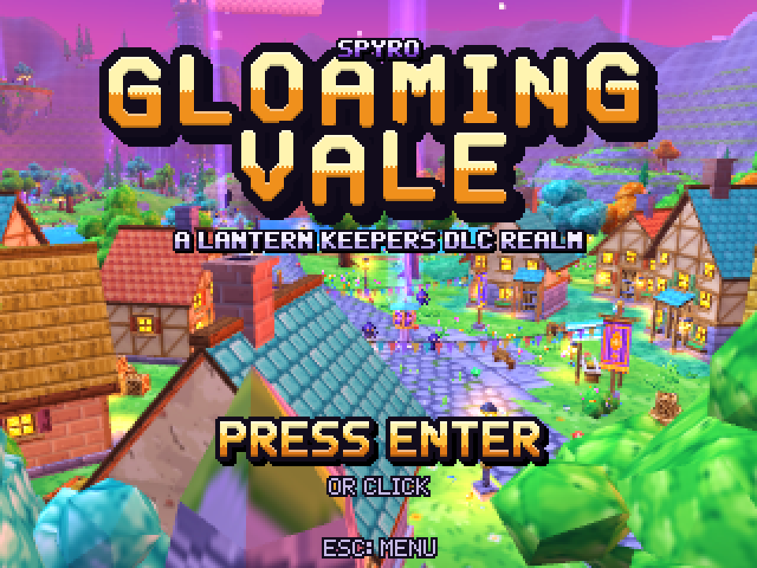
  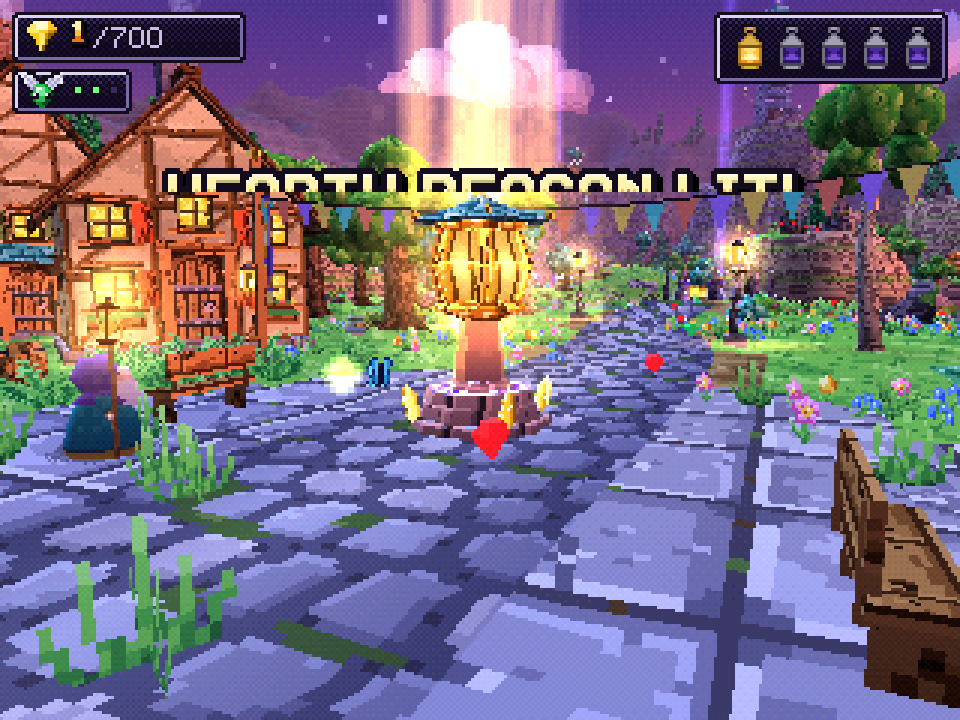
  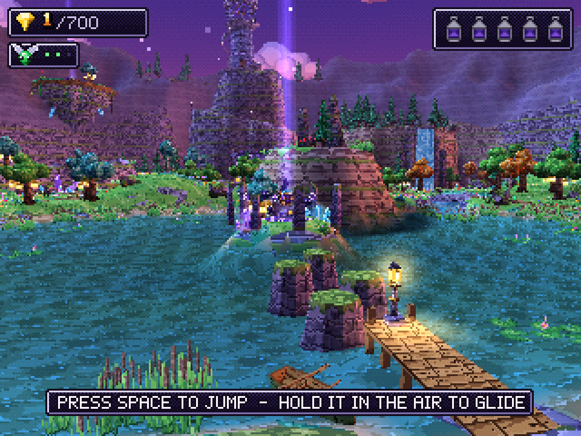
  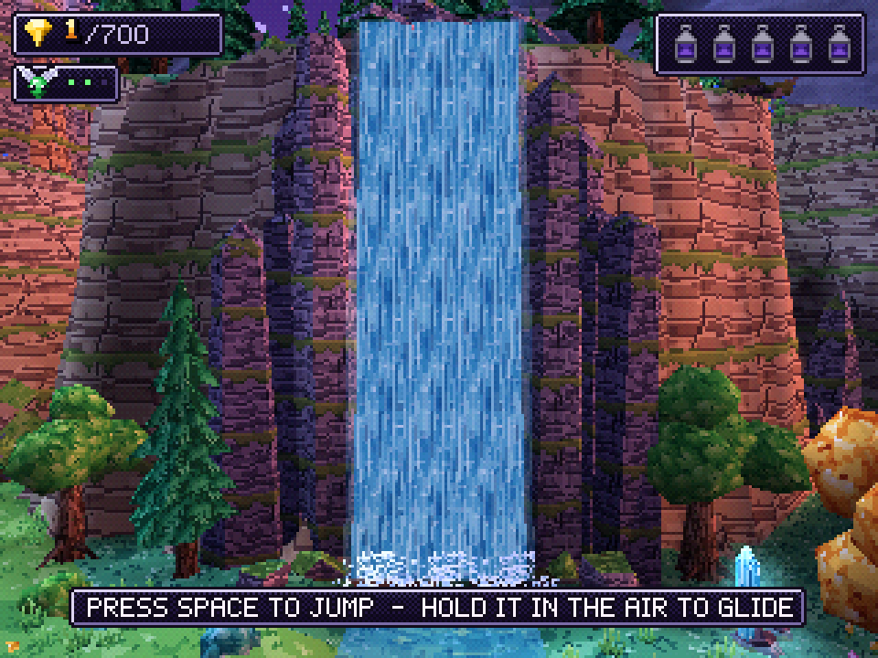
  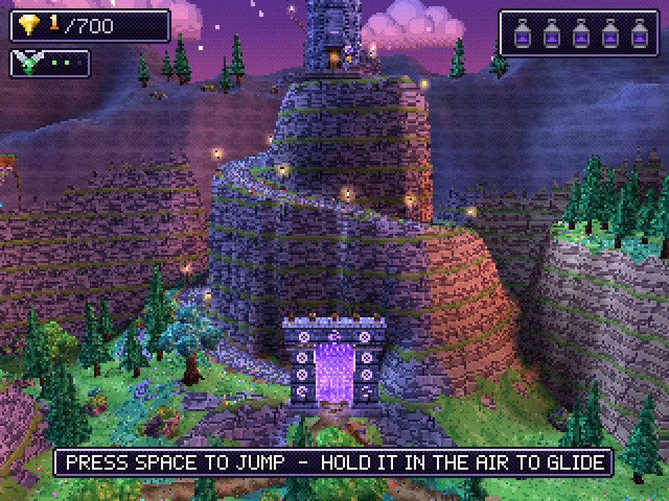
  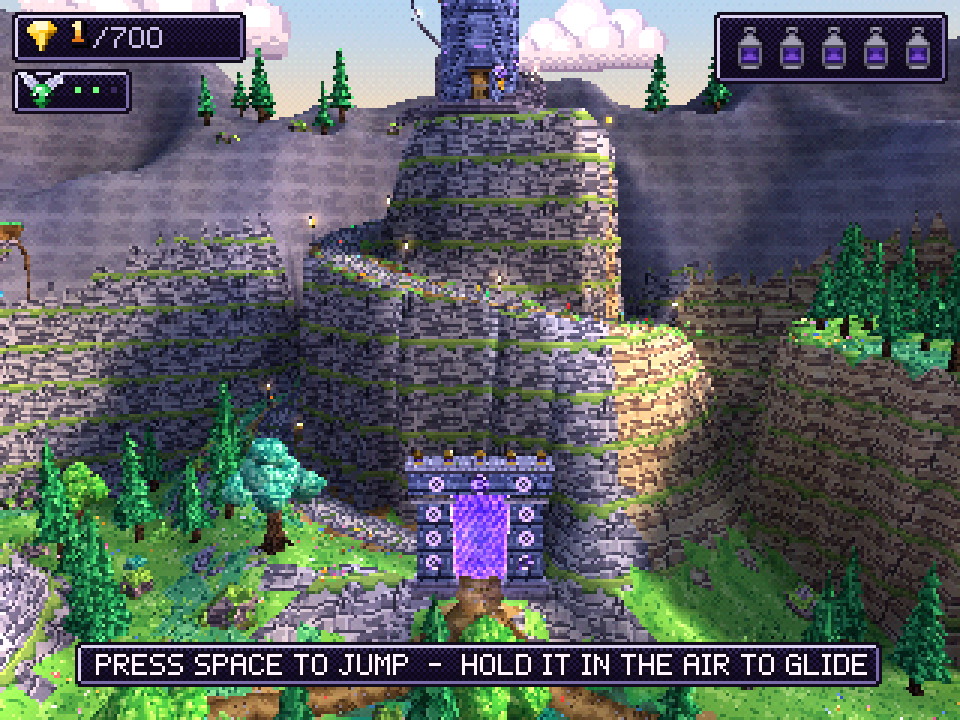
  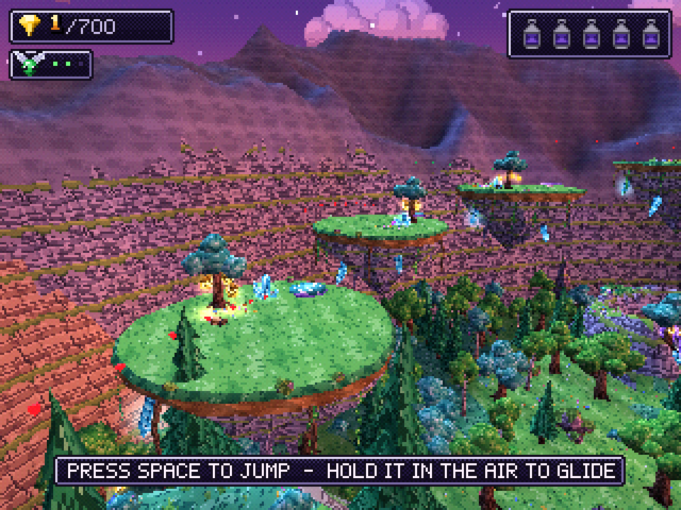
  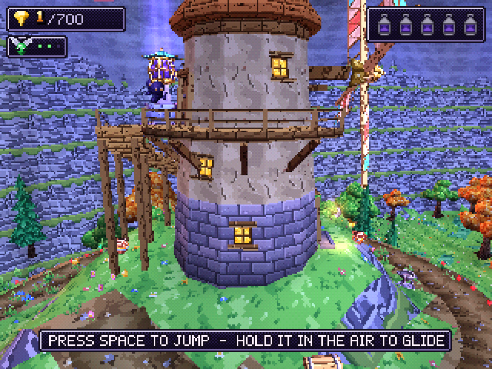
</p>
<p align="center"><sub>Frames captured from the game's own 320×240 output, nearest-neighbour scaled 3×. More in <a href="docs/shots">docs/shots</a>.</sub></p>

## Play it

* **Instantly:** open [`docs/index.html`](docs/index.html) in a desktop browser (it is one self-contained file;
  also works from GitHub Pages if you serve `/docs`).
* **From source:**

  ```bash
  npm install
  npm run dev          # http://127.0.0.1:5173
  npm run build:single # rebuilds docs/index.html (single file, three.js inlined)
  ```

Needs WebGL2. Click the game once to capture the mouse and start the audio. On phones and tablets touch controls appear automatically (the display defaults to
widescreen there; **Options → Graphics → Display** switches back to the 4:3 frame). Held sideways the picture fills the screen; held upright it sits at the top of
the screen (below the platform's top inset, if it reports one: a notch, or an app's header drawn over the page), with the **MENU** button just under it and the black
below it left for your thumbs.

### Controls

| Action | Keyboard / mouse | Gamepad | Touch |
| --- | --- | --- | --- |
| Move | `WASD` / arrows | left stick / d-pad | left thumb (virtual stick) |
| Jump · glide (hold in the air) | `Space` | `A` / cross | JUMP |
| Breathe fire | `J` / `F` / left click | `X` / square | FIRE |
| Charge (ram) — hold | `K` / `Shift` / right click | `B` / circle | RAM |
| Ram jump — hold the ram, tap jump | `K` + `Space` | `B` + `A` | RAM + JUMP (two fingers) |
| Camera | mouse (after clicking) · `Q`/`E` | right stick · bumpers | right thumb drag |
| Re-centre camera behind Spyro | `R` | `Y` / triangle | CAM button (tap) |
| Camera mode: active → smart → passive | `C` | Pause → Camera | CAM button (hold) |
| Menu (pause, options, controls) | `Esc` / `P` | Start | **MENU** button (top centre) |
| Debug mode: off → compact → full | `F3` / `` ` `` | Pause → Debug mode | Menu → Debug mode |

**Ram jump.** As in the original you can jump while ramming: hold the ram button and tap jump, and he leaps with the charge kept, so he carries his full ram speed through the air
(a ram jump clears about 18 m, a plain running jump 8.7 m) and lands still ramming for as long as the ram button stays down; letting go of it ends the charge at once, in the air too.
(He can't glide while ramming.)

**On a phone** the game has a labelled **MENU** button, on the title screen and in play: centred under the picture when the phone is held upright (it covers none of the view), on the picture's top edge
when held sideways (below whatever the platform covers there: a notch, or an app that shows the page under its own header, `env(safe-area-inset-top)`). It opens the pause menu (resume, camera, debug mode,
options, travel, restart, quit: on a phone the controls page is a row of Options, so that the menu's six rows stay finger-sized); while a menu is open the button reads **RESUME** / **BACK**, and tapping outside the panel goes back too. The menu rows are finger-sized
(about 40 px each): Options is a short list of sub-pages (Camera & aim, Graphics → More graphics, Debug), and the thumb controls (move circle, JUMP, FIRE, RAM, CAM)
hide while a menu or a cutscene is showing.

**Camera modes** (also under **Options → Camera & aim**, saved with the other options), after the original games' *Active* / *Passive* setting:

* **Active** (default): the original's Active camera: it swings after Spyro quickly, on even a small lean of the stick, so he always runs into the view.
* **Smart**: a calmer Active. It ignores a thumb that wanders a little off straight, a strafe and a step back, and swings after him only when you push clearly
  forward-and-to-the-side, the harder the faster.
* **Passive**: the original's Passive camera: it follows Spyro's position but never turns by itself; you turn it (mouse, right stick, Q/E, right-thumb drag)
  or press `R` / tap CAM to swing it back behind him.

In every mode the camera stays put next to trees, lamp posts, fences and small rocks (it slides through them), climbs instead of zooming in when the ground rises behind
Spyro, and is only held back a little (never closer than about 60 % of its distance) by big things: houses, towers, gate pillars, boulders, or a cliff too steep to climb.

**Options → Camera & aim → Camera speed** scales every way of turning the camera by hand (x0.4 to x1.6). **Fire aim assist** (on by default) turns Spyro towards a
brazier, beacon, Snuffer, vase or chest that is up to about 65° off his nose while he breathes fire; the stick always has the last word. On a touch screen
the move stick's circle appears where the left thumb lands, has a small dead zone, and follows the thumb when it slides past the rim.

### Debug mode

Something looks wrong (a floating chest, a torn texture, an invisible wall)? Turn debug mode on and send a screenshot: the readout says where it is and what it is.
**`F3`** (or the backquote key) cycles off → compact → full; on a phone use **Menu → Debug mode** (also **Options → Debug**, which has *Show colliders* and *Text size*).
The setting is remembered. A crosshair marks the middle of the screen, and **on a touch screen you can tap the screen to pin the aim to that spot** (a ring marks it; tap the ring
again to let go): tap the thing that looks wrong and the `PIN` line gives its coordinates and what it is.

Coordinates are the level's own, in metres: **X = east, Z = south, Y = up** (Spyro faces south when his yaw is 0), the same numbers `src/game/level.js` and the layout scripts use.

| Line | What it says |
| --- | --- |
| `POS` | Spyro's X / Y / Z |
| `FACE`, `AREA` | compass heading, speed, what he is doing; the named place (Hearth Village, Windmill Hill, Sky Isle 2 ...) and the nearest road ribbon (`road east`, or how far from it in metres: a road ends in a flat edge, so past its end the distance is to that edge) or stream |
| `FLOOR` | the ground texture and the rule that chose it (`cliff (steep, slope > 0.74)`), the slope and the ground height — the rules are the ones the terrain mesh is built with; on a road it says so first (`cobble road main, over cobble (under a road)`), since a road is a ribbon drawn over the ground |
| `AIM` / `PIN` | where the crosshair (or the tapped spot) points: X / Y / Z and distance, and what is there (ground texture with its rule and grid cell, water, or a collider and the prop it belongs to; over flat ground, the nearest prop). Aim at the glitch itself, not only at Spyro: this is the point to fix |
| `PROP`, `OBJ`, `COLL` | the nearest props, gameplay things (chest, vase, Snuffer, beacon ...) and collision shape, each with its distance, clock direction (12h is straight ahead) and X / Z, and **`[layoutVillage]`**: the function in `src/game/levelgen` that placed it |
| full mode | game state (beacons, gems, checkpoint), camera, input, performance, view size and touch support, and the last errors |

The top line is the **build id** (a hash of `src/` and the build date; `node tools/build-id.mjs` prints the id of the source as it is now), so a screenshot also says which
version was running. *Show colliders* draws the collision shapes near Spyro as wireframes: green = solid, cyan = can be stood on, magenta = big enough to hold the camera
back, yellow = the nearest or the one the crosshair is on. The last errors and warnings the page logged are listed in full mode.

### Travel menu (to look at any part of the game)

**Travel** is a row of the title menu (`Esc`, or the **MENU** button on a phone) and of the pause menu. It lists the worlds (Gloaming Vale, Dawnhaven, Frostbloom Hollow, Emberfall Crags, Skyweaver Spires), then groups of places (the vale, the heights, sky and
summit; the country, lake and canyon, inside the crag, up and away; the goals, the country, the secrets), then the places: 85 of them in all (Mirrormere dock, Windmill Hill, the four sky isles, the observatory, the Great Beacon's room,
Dawnhaven's cove, the Echo Hall, the Frost Grotto, the crystal vault, the Forge, the summit, Frostbloom Hollow's Thaw Gate, its frozen lake, the glacier's heart chamber, the ice vault, the Hollow, Emberfall Crags' Cinder Flats, the stack in the lava, the Maw, the Furnace, the caldera, Skyweaver Spires' Skygate, the Lowfield, the Kite Isle, the Spindle Spires, the Loom ...). A place asks **ARE YOU SURE? YES / NO** (the cursor starts on NO; `Esc`, the BACK button or a tap outside the panel is NO too),
and YES takes the hero there:

* **in the world he is in** the screen blinks white and nothing is rebuilt: what he did there stays (gems, broken vases, lit lanterns);
* **in the other world** it is a trip like a portal's: this world is let go of (what was done in it is not kept: the prompt says so) and the other is built as the game generates it, fresh;
* **from the title menu** a place in the vale starts play there at once (no intro, with the line of controls PLAY would show); a place in Dawnhaven builds Dawnhaven.

He arrives on the floor the place names, facing the way it says, the camera behind him, the place's name on the banner, and the place is his checkpoint (a fall or a death brings him back there). He blinks untouchable
for 3 seconds, as after a respawn, so a Snuffer that notices him on arrival gets no free blow (nor one while the old place fades out). The vale's summit is sealed by a ward until the Dawn Gate opens, and the ward would
throw him out of the observatory and the Great Beacon's room again: a place inside it opens the Dawn Gate for him, and a hint says so (a place beyond Frostbloom Hollow's ice gate, the Hollow, or beyond Emberfall's ward of fire, the Furnace and the caldera, opens that gate the same way). `tools/travel-check.mjs` holds every place to a standard (headless: a floor under it, clear of
props, rock and colliders, out of the water and off a slope he would slide down, 6 m from the Snuffers and from a door that is awake, in no pocket, and in the walkable country with the realm's gate open); `tools/travel-test.mjs`
goes to every one of them through the real menu pages, then does it with the mouse and with taps on a phone held either way.

## The realm

Gloaming Vale is a valley that has been stuck in twilight ever since the Snuffers stole the sunrise. Elder Wick, the last
Lantern Keeper, asks you to relight the five Beacon Lanterns. Each one you ignite pushes the sky a step towards dawn —
the whole valley is lit twice (dusk and daybreak) and the world cross-fades between the two as you progress.

| # | Beacon | Where | What it asks of you |
| - | --- | --- | --- |
| I | Hearth | Hearth Village, spawn | Tutorial: jump, glide, fire. |
| II | Isle | Mirrormere lake | Run off the end of the dock and hop the three big lily-pad stones across to the shrine island. |
| III | Mill | Windmill hill (spiral road) | Light the three braziers to raise the portcullis. |
| IV | Sky | Floating isles | Bounce off the mesa mushroom, then glide island to island. |
| V | Dawn | Observatory at the top of the spiral mountain | The Dawn Gate only opens once four beacons burn; until then a shimmering violet ward wall seals the whole mountain. |

* **Snuffers** come in three kinds: plain ones (fire or charge), *bell* Snuffers (armoured — fire bounces off, charge them)
  and *thorn* Snuffers (spiked — don't ram them, burn them). Every one goes down in a single hit of the attack that works on it, as in the original.
* **Sparx** the dragonfly is your health bar, as in the original: he starts at full health, **gold**, and every hit that lands turns him down a colour, **gold → blue → green →
  gone**; with him gone the next hit is lights out. Bunnies you scorch or ram (and often a Snuffer you defeat) release a healing butterfly: a white 3D butterfly with a soft glow that
  flutters up and flies to Sparx, who eats it and gets one colour back (with him gone it flies to Spyro instead, and he pops back). **Every tenth bunny** (the 10th, 20th and 30th of the level's 37) leaves a
  rare **blue butterfly** instead, as in the original: bigger, deep blue and shining, with a sparkle trail and a chime, that brings Sparx **all the way back to gold** at once, from any colour and from gone;
  with him already full it waits a minute and a half (an ordinary one 25 s). A new life starts with gold Sparx again.
  He is a real 3D dragonfly (big goofy eyes, antennae, a swishing tail and four glassy wings, flapping as he hovers), not a flat sprite, and a small one: about half a metre long. While he is with you he grabs the gems that are near (a little flick towards each); **with him gone nothing pulls gems in: you have to touch them**.
* **Butterflies** are real 3D models too (`src/game/models/creatures/butterfly.js`): a slim banded body with clubbed antennae and, on each side, a pointed forewing and a rounder hindwing with a
  little tail. The wings are two-sided sheets, deep blue on top with a bright sheen and a dark rim of white spots, dusty pale blue underneath, so a butterfly flashes blue and dull as it beats; they beat in
  bursts with short glides between. A flock of 18 smaller ones in every shade of blue (azure, cyan, sky, violet) drifts about the dry meadows near you; the ordinary healing ones are white and the rare full-heal ones the deepest, brightest blue.
* **Gems** are worth 1 / 2 / 5 / 10 / 25 (red, green, blue, gold, purple): cut stones whose facets flash as they spin. Vases, chests, cracked walls and enemies drop
  them, plus hand-placed trails and a few well-hidden treasures. Total: **700**. While Sparx is with you (and only then), gems within a few metres are drawn in
  on a curved lob (up, then down into Spyro, like the original), and every pickup makes a chunky yellow gem count hop and float in the corner
  for a couple of seconds.
* Ending the level shows a results screen (three stars) and drops you back into free roam, with a portal open above the lantern (below).

### The portal home

The last beacon does two things: the sun comes up, and a **portal pops open on top of the lantern**: a swirl of violet light that blooms in the lantern room's dome, right above the Great Beacon, while the camera slips in
under it to watch. It hangs far out of any jump's reach, so the light carries you: a **ring of light on the lantern room's floor** marks where the beacon's beam comes down, and **a jump made inside the ring** lifts Spyro up the beam, spiralling round the
lantern, into the portal and out of the realm (the screen fades to white, the next world is built behind a loading bar, and he steps out of the Gloaming Vale door in Dawnhaven). The results screen mentions it, and a hint appears as you walk up to the ring.
(From outside the observatory's dome hides the portal; the beacon's golden beam rises through it all the same.) Going back through Dawnhaven's door finds the vale **restored**: the sun up, every lantern and brazier burning, the mill's portcullis and the Dawn Gate open, and the portal over the Great Beacon open from the start (no finale plays again).
The rest is as on the first visit, so the gems, vases, chests and Snuffers are there to be had again and the best gem count can be bettered (it is kept when you leave by the portal).

## The homeworld: Dawnhaven

In the series a *homeworld* is the hub that connects the levels (the *realms*): a place of its own with a portal to each realm, secrets to find, and someone to talk to. **Dawnhaven** is that for the Lantern Keepers, and it is built the way the PlayStation hubs were
(Artisans Home, Peace Keepers, Magic Crafters): not a plaza with five doors on spokes but **a country of connected parts** joined by long, winding roads: caves and a mountain with a way through it, villages on terraces, a lake with a pier, a canyon, and every door in a place
of its own, some of them well hidden. A sunlit valley (always daybreak) of 432 m by 432 m, with 700 gems of its own and five secrets. You arrive through the portal over the Great Beacon and come out of the Gloaming Vale door in the first part; the others you have to find.

| Where | What it is |
| --- | --- |
| **The Landing Cove** | A lawn walled in by cliffs, with a fountain, a market, a hamlet, an enormous old tree and the **Gloaming Vale door** in a niche of its west wall. **Elder Wick**, who came ahead to look after the place, waits on the lawn and talks (it follows your progress: the realms restored, a hint towards a secret you have not found, how many you have). A signpost where the cove's road leaves. |
| **The Heartlands** | A meadow of two levels with a standing-stone ring, a ruined arch and a farm, crossed by the cobbled trunk road (130 m of it climbing to the Crag); roads branch off west (the terraces) and east (the lake). |
| **The Hearth Terraces** | A hillside village: a road that climbs west and north in long switchbacks (about 250 m of it), a yard at every turn with a fountain square, houses, wells and gardens, up to the **windmill** on the ridge. **Secret:** the wooden stair up the mill leads to a lookout with a chest and a purple gem. |
| **The hidden garden** | Off the terraces, a round glade ringed by 16 m of rock and open only along a narrow strip closed by a **cracked wall**. **Secret:** ram the wall (hold RAM and run at it); the garden has a chest, flowers and a purple gem. |
| **Mirror Lake** | A lake with a waterfall, reeds and lily pads, boats at the foot of **a 41 m pier** that runs out over the water to the **Tideglass Reach door**, standing on its own dais at the end of it. **Secret:** stepping stones lead west from the pier to a little islet and its chest. |
| **The Ember Canyon** | A red-walled canyon that winds north from the lake's far shore (about 300 m of road, braziers every 24 m, rock arches across it) to the **forge**: a smithy with a glowing furnace, a smoking chimney and an anvil, and the **Emberfall Crags door** in the cliff behind its court (awake: a swirl of ember orange). |
| **The Crag** | A mountain in the middle of the country with **a way through it**, a hundred metres of tunnels and halls inside and a road round it outside. The **south mouth** (a lane in front of a cliff, torches and banners at its foot) leads down a tunnel lit by torches and crystals to the **Echo Hall**: a round room with a skylight whose beam of daylight falls on a ring of runed standing stones. From the hall: the **winding way** goes down (70 m, turning three times) to the **Frost Grotto**, a dome of ice and glowing crystals with the **Frostbloom Hollow door** at its far end; a passage north leads on out to the Ascent; a passage east comes out on the road to the canyon; and in the hall's north wall a **cracked wall** shuts the **crystal vault**. **Secret:** ram the wall; the vault has a chest and a purple gem. |
| **The ledge road** | A cobbled road that begins under a rock arch on the Crag's west side and **winds once and a bit round the mountain, climbing 26 m over 238 m**, past lamps, benches and viewpoints, to the **summit** and the **Skyweaver Spires door** (awake: a rose swirl). **Secret:** the chest on the summit, with a view of the whole country. |
| **The Ascent** | North of the Crag, a road that climbs in a long curve to the **Guardian's Gate**: two colossal runed pillars and a violet field between buttresses of rock, closing the gorge. It is sealed for now (the Elder says it will open when the lanterns of every realm burn, and one of the five realms still sleeps): the teaser for a guardian to come. |
| **Five doors** | Each a stone arch with a banner on each pillar, a rune plate and torches, each in a different kind of place: a cove, **inside a mountain**, **out on a lake**, in a **canyon's head**, **on a summit**; and at very different walks from where you arrive (the first door 11 m away, then 210 m, 300 m, 370 m and 390 m of walking). **Gloaming Vale**'s, **Frostbloom Hollow**'s, **Emberfall Crags**' and **Skyweaver Spires**' are awake (a swirl of violet light, an icy one for the second, an orange one for the third, a rose one for the fourth; each turns **gold** once you have restored its realm: a lantern lights on the HUD for each one). The last, **Tideglass Reach**, still sleeps: a slab of stone and a dim swirl, and what it is called when you come near. Walking into an awake door's light changes the world. |

What the hero keeps between worlds is saved in the browser (`localStorage`, key `gloaming-vale/progress/v1`: which realms are restored with their best gem counts, and which of the five secrets were found; where storage is unavailable the game plays the same and forgets).
The title menu offers **VISIT DAWNHAVEN** once a realm is restored, and `?world=home` opens the page in Dawnhaven (and `?skip=1` skips the title in the realm as before).

### How the Crag's caves are made

A heightfield cannot have a cave, an arch or an overhang, so the Crag is not part of the terrain: it is a **rock mass** (`src/game/massif.js`), one function of (x, y, z) that is negative inside the rock: a few overlapping mounds for the mountain, from which are cut tunnels (an arched section along a polyline), domed halls, a skylight shaft and a notch for the ledge road (and under that road a retaining wall is left), all joined with smooth maxima so that the junctions are rounded, and a little 3D value noise on top. The terrain draws the cave floors
(under the mountain it is level, following the tunnels' floors: `home/crag.js`), the rock is meshed by **surface nets** over a 1.5 m grid with the vertices drawn onto the exact surface, and the same function is the collision: the hero is pushed out of the rock by a ring of samples round his body, stands on the rock's own ground (the ledge road, the summit), and the camera is held back by it and comes closer inside a cave.
The light inside is worked out per vertex like the rest of the world's baked light: how much sky a point sees (nine rays through the field), the corner shadows, the sun where a mouth or the skylight lets it in, and the glow of the crystals and torches placed in the caves, so the walls near a torch are warm and the hall under its skylight has a beam of daylight; at a mouth it fades into the outdoor light.
The borders between the rock's textures (cobble on the ledge road, grass on the gentle ground, cliff for the rest) are **cut, not chosen**: a texture chosen for a whole triangle draws a staircase of teeth, so each texture has a score read at the vertices and every triangle the zero line crosses is cut along it, which makes the borders smooth lines. The mountains of the heightfield between the parts get the same treatment where rock meets grass (the border follows the contour of the steep slope, `cutByContour` in `terrain-mesh.js`).
Gloaming Vale has no rock mass, names no steep slope, and its world is byte-for-byte what it was (its terrain mesh has the hash it had).

## The second realm: Frostbloom Hollow

The door in Dawnhaven's Frost Grotto that slept now opens on **Frostbloom Hollow**, the first realm made with the foundry (described below). *An endless winter has frozen the blossoms of the Hollow asleep.* Five **Frostblooms** — flowers of ice
with a flame inside, a new model — must be thawed by fire. Each one that blooms moves the realm a step from its **frozen night under the aurora** (ice teal and snow white, a cold moon, a green glow in the north) towards a **blossom dawn** (a low rose-gold sun,
pink-lit snow, a cornflower sky): the same two lit states as the vale's dusk and daybreak, in other colours. The **ice gate** across the gorge to the Hollow melts when four have bloomed, and the **Heartbloom** in the Hollow brings back the spring:
a ring of light opens over it and carries the hero home. A country of 408 m by 408 m, 650 gems, three secrets, 24 Snuffers (8 plain, 9 in bells, 7 with spikes), and a journey to each Frostbloom of a different length (31, 120, 201, 283 and 413 m of walking).

<p align="center">
  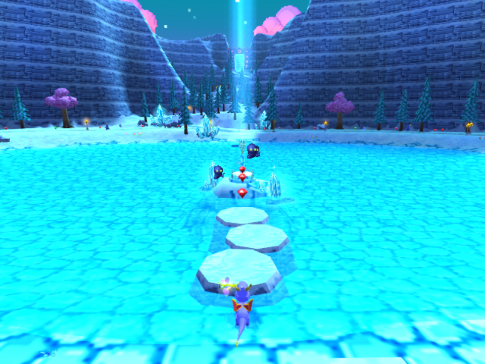
  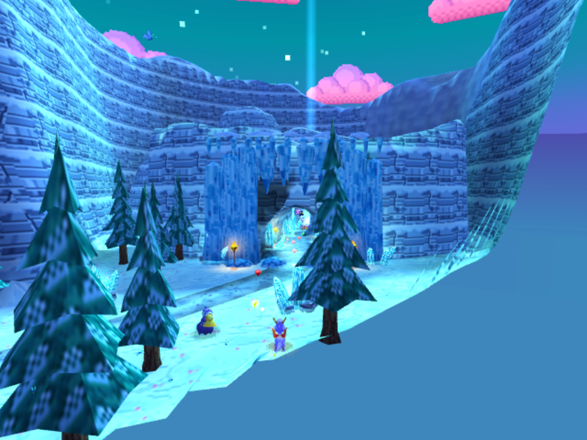
  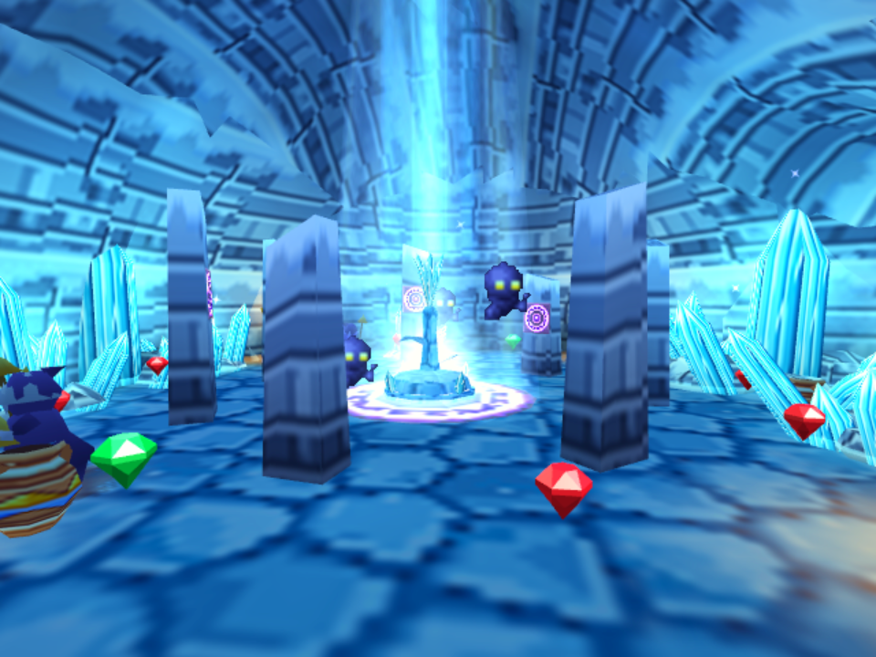
  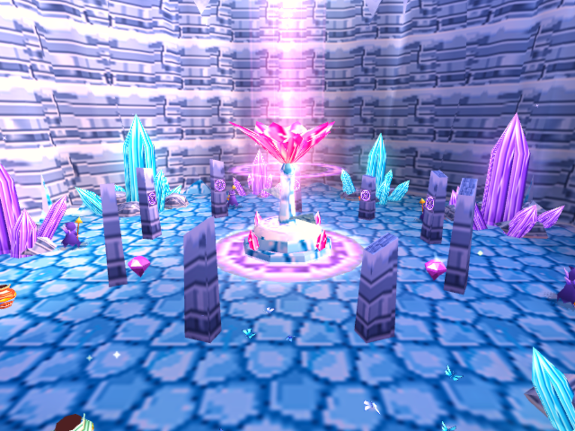
</p>
<p align="center"><sub>Frostbloom Hollow, from the game's own pipeline (a free camera for the frames that are not from where the hero stands). More in <a href="docs/shots">docs/shots</a>.</sub></p>

| Where | What it is |
| --- | --- |
| **The Thaw Gate** | Where the door of Dawnhaven stands (an arch with torches and crystals) and the first lawn: the first Frostbloom is 31 m away, on a landing in plain view, with a fire hint beside it; a signpost where the cobbled road forks. |
| **Glasswater** | A frozen lake (104 by 72 m) with a 417 m ring road round it (a loop: the way back is not the way there), standing stones, torches and crystals along the shore, and **ice floes** to hop from the south shore to the islet where the second Frostbloom stands (**an island**). |
| **Rimewood** | West: a forest of pines under snow and bare trees in blossom, a trail to a **clearing** with a ring of runed stones where the third Frostbloom sleeps, and off the clearing the **frozen glade**, a round room walled in by rock and shut with a **cracked wall**. **Secret:** ram the wall. |
| **The Icefall** | East: a road that climbs to the foot of the **glacier**, a wall of ice 22 m high with a **frozen waterfall** hanging over the mouth of a cave (long icicles, flows of ice with the waterfall's own streaks, a frozen splash at its foot). Inside: a **tunnel** lit by torches and crystals leads to the **heart chamber**, a dome under a skylight whose beam of cold light falls on a ring of runed stones and the fourth Frostbloom (**a cave**), and a passage west shut with a cracked wall leads to the **ice vault**, a little round room of crystals and a chest. **Secret:** ram the wall. |
| **Aurora Ridge** | North: 215 m of cobbled switchbacks that climb 30 m through Snuffers that get harder (bells and spikes), with a side trail to the **Aurora Lookout** and its chest (**secret**, a hint on the way), up to the gorge of the Hollow. |
| **The ice gate and the Hollow** | The gorge is shut by two pillars and a field of ice-teal light until four Frostblooms have bloomed (the field is the Dawn Gate's, recoloured). Beyond it the **Hollow**: a crater 48 m across, walled in by 24 m of rock, a ring of crystal spires on its rim, runed stones, five guardians, and the **Heartbloom** (the finale: **a crater**). |

It looks like a frozen country because everything it is made of is: the ground is **snow** (with petals blown over it in drifts), the lake and the caves **ice**, the roads **frosted** (stone with snow in the gaps; trodden snow), the cliffs and the far mountains
**frost-blue rock**, and the props wear a **skin** (`kit.skin`): rocks are snow-capped where they were mossy, pines stand under snow, the meadows flower in one colour (blossom pink) and no green tuft grows. Nine textures are new (snow, snow petals, frost cliff, frost far rock, frosted cobble, trodden snow, snowy pine, blossom and frost
canopies); every one of the 66 that existed is pixel-identical, and the generated world of Gloaming Vale is byte-identical to what it was, Dawnhaven's too apart from the door that woke (`tools/world-hash.mjs` pins their heights, records and counts; a render fingerprint of every geometry in both scenes agrees). The glacier is a **rock mass**
like the Crag, made from data (`src/game/realm/rockmass.js`, `src/game/frostbloom/glacier.js`: four mounds, two tunnels, two chambers and a skylight on a plinth of level ground), and the Icefall is a new prop. The whole realm is `src/game/frostbloom/brief.js` (the design as data) plus a level script of
eight functions, and passes all 41 rules of the checker without a single waiver.

## The third realm: Emberfall Crags

The forge at the head of the Ember Canyon, a smithy with its fire out, now has a door that wakes: **Emberfall Crags**, the second realm made with the foundry and the first whose lake is not water. *The forges of Mount Emberfall went cold the night the Heartforge went out.* Five **Emberstones** — standing stones with a coal inside, a new model —
are kindled by breathing fire at them. Each one that burns moves the realm a step from an **ember dusk** (a low red sun going down behind the hero as he walks east, a sky that runs from near-black violet through ash-red to a burning horizon, smoke-dark clouds lit orange from below, the lava's glow thrown back from every face that looks at the volcano, embers
drifting where the vale has fireflies) to a **forge glow** (a golden afternoon, ash-pink cloud, an amber horizon). The mountain's **Maw**, a stone dragon's mouth, is shut by a **ward of fire** until three have burned, and the **Heartforge** in the caldera, the finale, opens a ring of light that carries the hero home. A country of 432 m by 432 m, 800 gems, three secrets,
28 Snuffers (10 plain, 10 in bells, 8 with spikes), and a journey to each Emberstone of a different kind and length: 27 m of walking, 105 m, **a glide of 36 m across the lava** (there is no way on foot), 387 m through the mountain, 686 m to the caldera.

<p align="center">
  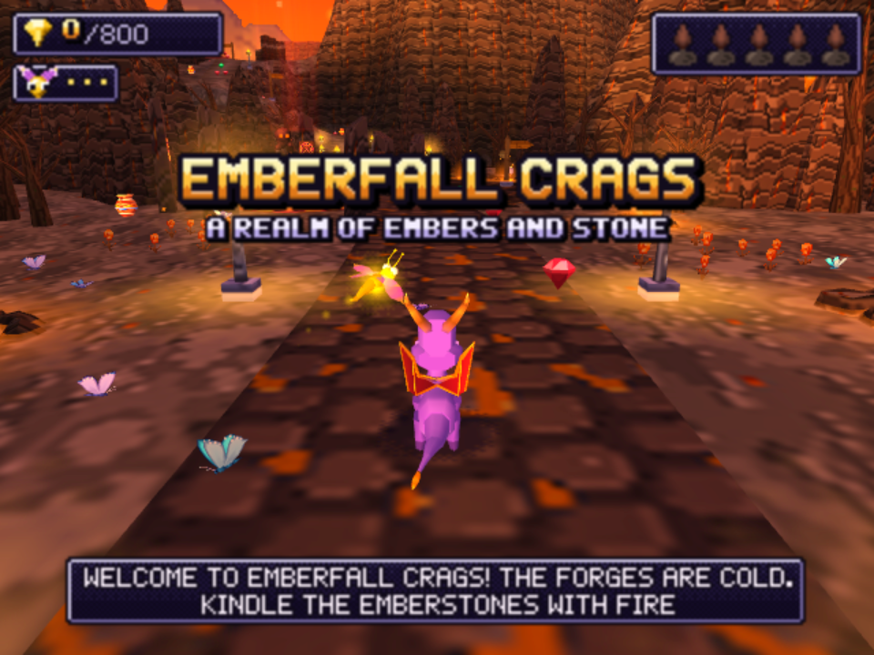
  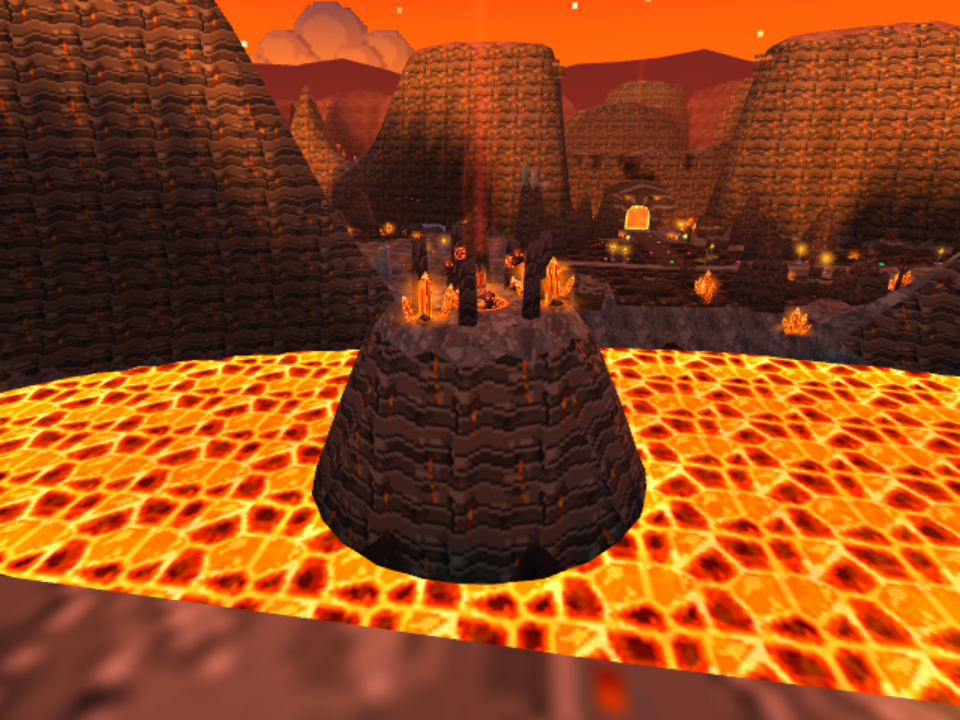
  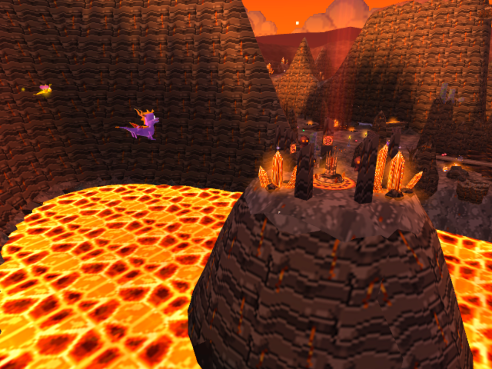
  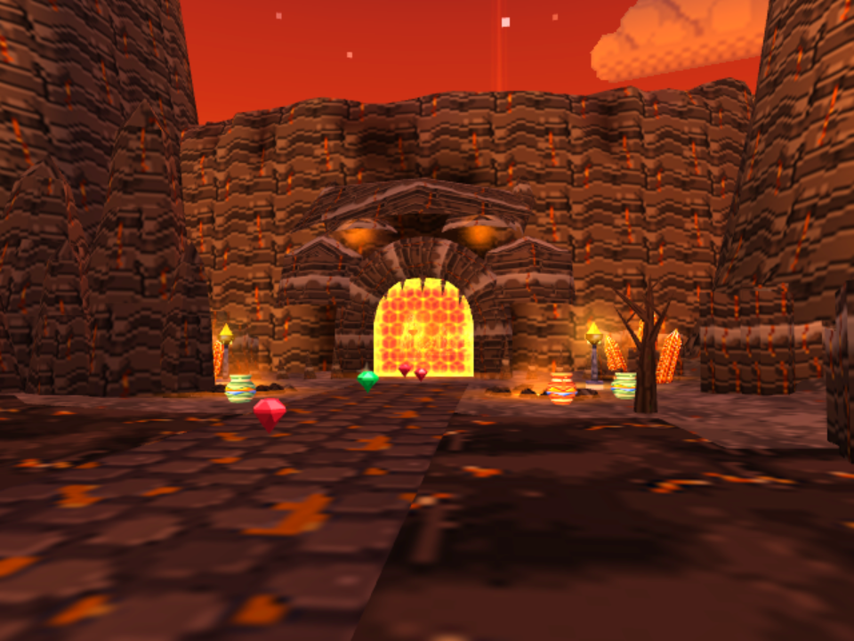
  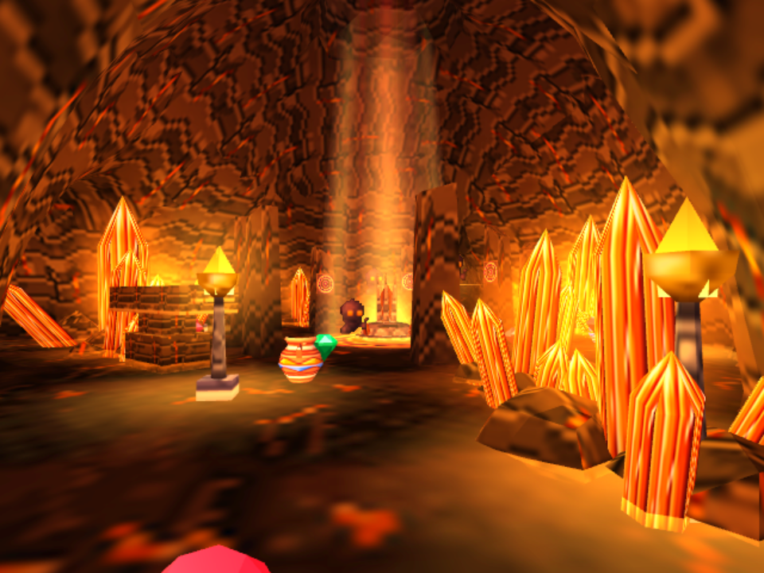
  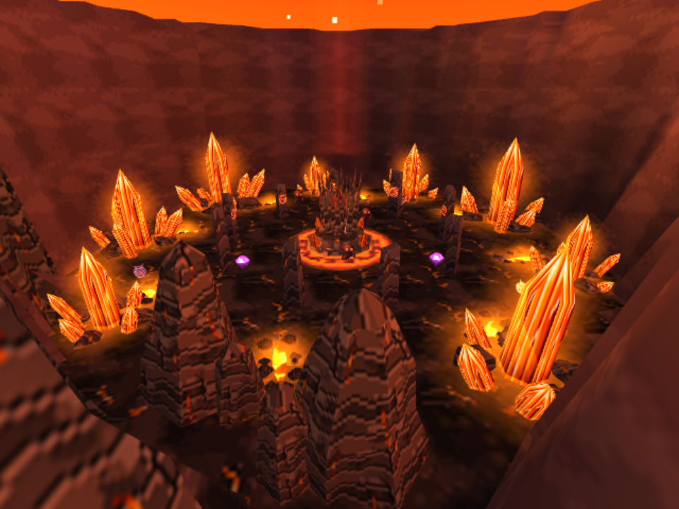
</p>
<p align="center"><sub>Emberfall Crags, from the game's own pipeline (a free camera for the frames that are not from where the hero stands). More in <a href="docs/shots">docs/shots</a>.</sub></p>

| Where | What it is |
| --- | --- |
| **The Forge Gate and the Cinder Flats** | Where the door of Dawnhaven stands (an arch with torches, the forge's furnace glowing behind) and the first plain of black ash: the first Emberstone is 27 m away on a landing in plain view, with a fire hint beside it, and the cobbled road (basalt with embers glowing in the gaps) forks at a signpost. |
| **The Cinder Grove** | South-west: charred trees round a **clearing** with a ring of runed stones (burning orange, not the Lantern Keepers' violet) where the second Emberstone waits; off the Flats, the **ash glade**, a round room walled in by rock and shut with a **cracked wall**. **Secret:** ram the wall. |
| **The Basalt Stair and the Rim** | A road that climbs in four switchbacks (23 m) to the rim of the **Ember Rift**: a river of lava 56 m wide and 150 m long (the lake of this realm, drawn with a texture of its own and lit from within), seen from a rim of basalt columns with torches and a bench. **The third Emberstone burns on a stack of rock in the middle of the lava**: run off the edge and **glide** (hold jump in the air) 36 m across, and, from the stack, glide 28 m on to the far bank. A gem arc shows the way. **The lava burns at a touch.** |
| **The North Causeway, the Ashway and the Lookout** | The two roads round the ends of the rift, one over the high rim, one along the cinder beach at its south end, to the **Anvil Plateau** (a giant anvil, a ruined forge) on the far bank: a loop, so the way back is not the way there. A side trail off the Ashway climbs to the **Ember Lookout** and its chest (**secret**). |
| **The Maw and the Smelter** | On the plateau the road comes to a bastion of black rock 24 m high with a dragon's head over a mouth of fire. Once three Emberstones burn the ward opens, and a tunnel leads in to the **Furnace**: a chamber 30 by 26 m under a skylight (a shaft of orange light on a ring of runes) where the fourth Emberstone burns cold (**a cave**); an exit tunnel north under the mountain, and a third passage east that climbs 7 m to the **Smelter balcony**, a little round room with a chest and a purple gem (**secret**; a hint says where the passage goes). |
| **The Cinder Gorge and the Caldera** | The way out of the Furnace winds up a gorge between walls of rock to the **caldera**: a crater 48 m across and 36 m up, walled in by 22 m of black rock, a ring of crystal spires on its rim, three guardians, and the **Heartforge** (the finale: **a crater**). The country's highest ground, 38 m. |

It looks like a country of ash because everything it is made of is: the ground is **ash** and **cinder** (embers in the cracks), the roads **scorched**, the lake **lava**, the cliffs **bare basalt**, the far mountains **ember rock**, the props wear a **skin** (charred pines, fire lilies for every flower, no moss, bare black rock with a warm lip) and the sky has smoke-dark clouds and its own distant ridges. Eleven textures are new (ash, cinder, lava,
basalt cliff, banded and bare, and far rock, scorched cobble, trodden ash, charred pine, fire lily, ember crystal); every one of the 75 that existed is pixel-identical. The Smelter is a **rock mass** like the Crag and the glacier, from data (`src/game/emberfall/smelter.js`), and the whole realm is `src/game/emberfall/brief.js` (the design as data) plus a level script of fifteen functions. It passes all 41 rules of the checker without a waiver.
What it needed that the foundry did not have is now in the kit: a **liquid** that is not water (`level.liquid`: its texture, tints, light, splash, and how deep it must be to burn), mountains that stay **walls** (`mountain.margin`), a glide goal that must have **a way off** again, sky clouds and distant ridges with the realm's own colours, the dusk's embers, and a realm walker that **glides**.

## The fourth realm: Skyweaver Spires

The summit of the Crag, at the end of the ledge road, has a door that wakes: **Skyweaver Spires**, the third realm made with the foundry and the first that is not a country at all but **islands in a sea of cloud**. *The Skyweavers wove the winds into the spires of the sky and kept them there with five great Windbells; when the bells fell silent the winds fell slack, and the clouds have lain still ever since.* Five **Windbells** — a bell of bronze in a frame of two marble pillars, silent and dull blue-grey until fire is breathed at it, then gold, swinging, with a heart of light in it and a ring of runes turning on its plinth, and a bell's ring, a new model and a new sound — are rung with fire. Each one that rings moves the realm a step from a **windless rose dusk** (a low rose-gold sun, a sky that runs from indigo through violet and rose to a peach horizon, a lavender sea of cloud the colour of the fog) to a **bright morning** (a golden-white sun in a blue sky, white cloud, the sea white and pale blue). The last, the **Loom Bell** at the top of the world, opens the ring of light that carries the hero home. A country of 480 m by 480 m with ten islands, 550 gems, three secrets, 14 Snuffers (3 plain, 6 in bells, 5 with spikes), and a journey to each bell of a different kind and length: 24 m of walking, **a row of slabs** (128 m), **a glide of 41 m** with no way on foot (181 m), **a whirlwind and the spires** (523 m) and the Loom (619 m).

**The clouds cannot hold the hero.** The ground that is not an island lies 28 m under the surface of the cloud, and what falls into it is set back on the last firm ground with a hint (THE CLOUDS CANNOT HOLD YOU! GLIDE, OR RIDE A WHIRLWIND), gently: a puff of white and a breath of wind, no hurt. The islands are far apart. The way from one to the next is **a row of slabs** to hop (twenty of them, 5 to 6 m across, hanging in the air 2 to 4.6 m apart, a gem over each: a run's jump is 8.7 m, so he walks them and jumps at the edge), **a glide down** from a ledge to a lower island, or **a whirlwind**: an updraft, a funnel of streaked wind that widens as it rises, which lifts the hero who walks into its foot up to its top (36, 38 and 40 m), hovers him there, and lets him glide out of it to the next island; a hero who runs through one at full speed is slowed, lifted and let go at the far side, not thrown.

<p align="center">
  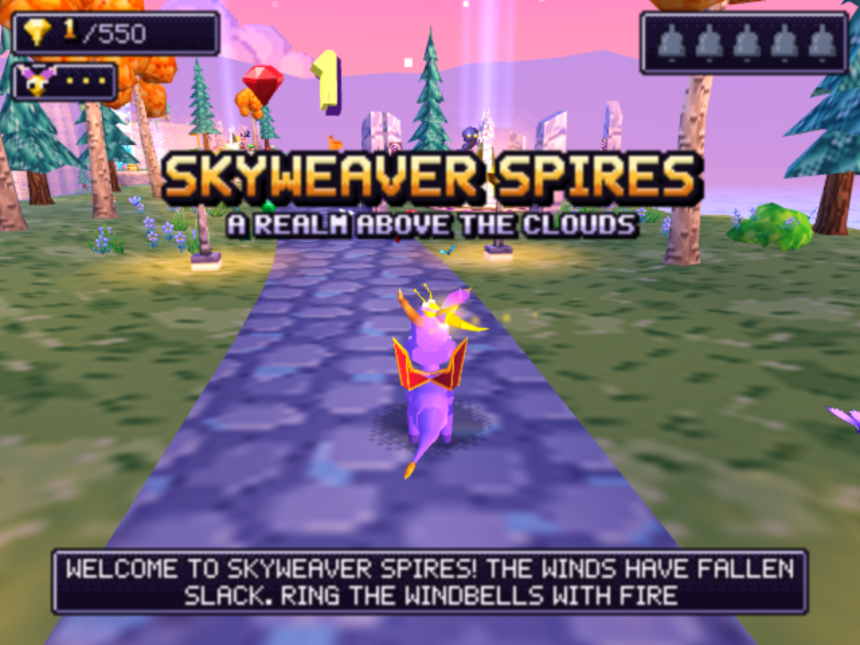
  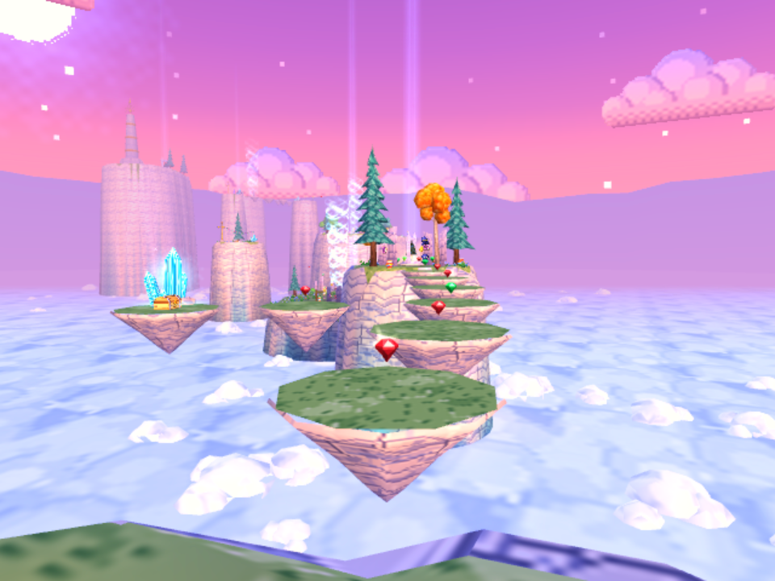
  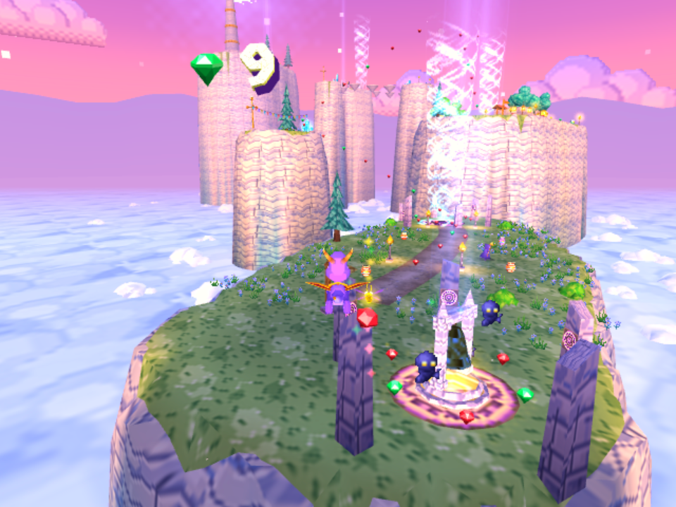
  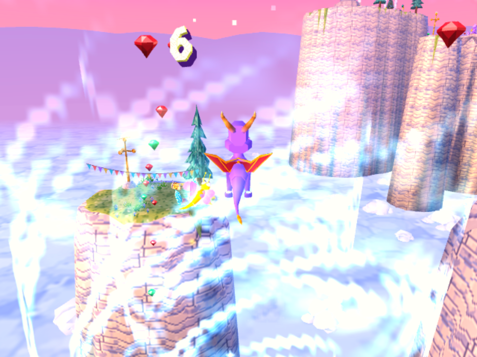
  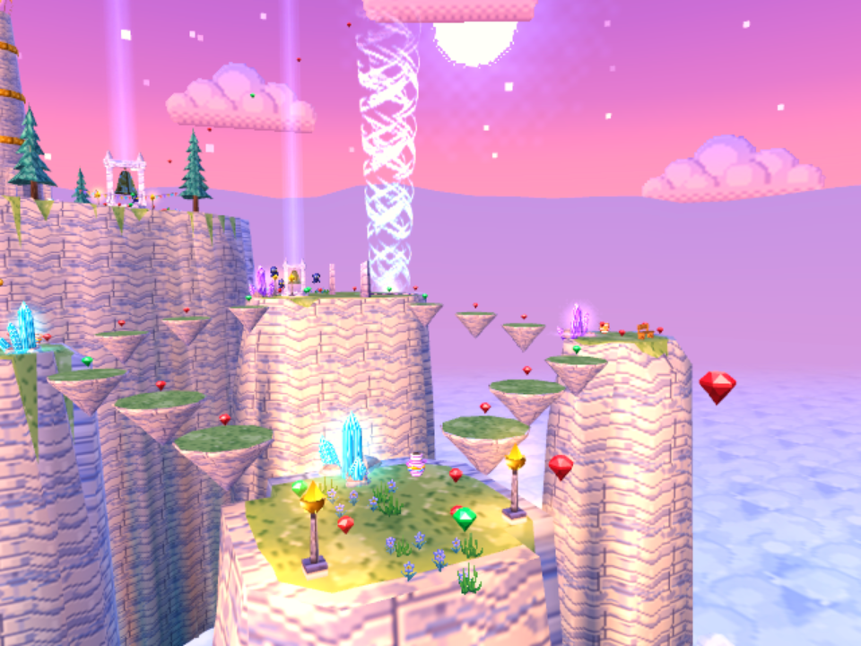
  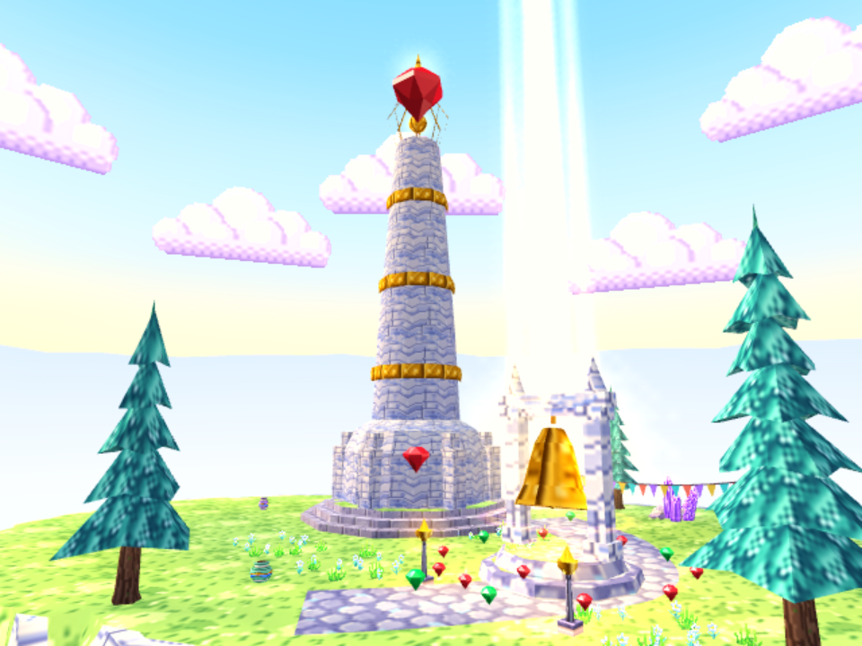
</p>
<p align="center"><sub>Skyweaver Spires, from the game's own pipeline (a free camera for the frames that are not from where the hero stands). More in <a href="docs/shots">docs/shots</a>.</sub></p>

| Where | What it is |
| --- | --- |
| **The Skygate** | Where the door of Dawnhaven stands (an arch with torches and blue crystals at the west end of the island, 11 m in front of where the hero comes out): a lawn of sage turf on cliffs of cream marble with pines and birches, a cobbled road, and the first Windbell 24 m away in a ring of standing stones with gold runes (**a landing**). The road runs out at the island's edge: a signpost, a bench to look at the view from, and a hint. A wind vane stands that has not turned since the winds fell slack. |
| **The slabs and the Cloud Islet** | Six slabs of marble hang in the air across 59 m of cloud (a gem over each: the way across is shown) to the **Cloud Islet**, a little island 19 m across, where the second Windbell hangs in its ring of stones with water all round it (**an island**) and a hint says to run off the edge and glide. A branch of two more slabs leaves the row to the **lonely slab** and a chest on it (**secret**). |
| **The Lowfield** | The glide: 41 m down to a meadow in the cloud, the third Windbell on it near where he lands (**a glide**: there is no way on foot, and the way off is up a whirlwind). Windflowers, pines, rocks, the first Snuffers, and at the far end the **first whirlwind** between two great cliffs: the Kite Isle above to the north-west, the Orchard Terrace's cliff to the east. A ring of standing stones in the colour of wind marks its foot, and a ring of gems. |
| **The Kite Isle** | A tiny isle 30 m over the cloud, off the first whirlwind: a string of pennants, a wind vane, crystals, a pine and a **chest** (**secret**: reached only by the ride and a glide from its top, left by a glide down to the Lowfield). |
| **The Orchard Terrace** | The other way off the first whirlwind: an island 34 m over the cloud, about 95 m long and up to 48 m wide, of lantern trees, gardens, a well and a scarecrow, and two roads that make a **loop** round the **Weavers' vault**: a courtyard of marble walls with one doorway, shut with a **cracked wall** (**secret**: ram it; the chest, a purple gem and vases are inside). Snuffers with bells and spikes. The **second whirlwind** stands at its far end. |
| **The Spindle Spires** | The second whirlwind carries the hero 38 m up to **four needles of marble**, 56 to 62 m up and 12 to 24 m across, joined by slabs: two ways from the first to the highest (a loop in the air). The fourth Windbell hangs on the highest, with the **third whirlwind** at its edge (**a lift**: no way on foot, the ride is the only way up, and the ride on is the way off). |
| **The Loom Isle** | 76 m over the cloud, the highest ground. **The Loom**, a tower of cream marble 42 m high with three bands of bronze and a crown of threads round a golden spindle that shines, is in sight from the first step; the **Loom Bell** hangs before it, more than twice the size of the others, with guards round it (**a summit**: the finale). Its ring of light opens the way home. |

It looks like a country above the clouds because everything it is made of is: the ground is **sage turf**, the cliffs and the towers **cream marble**, the roads **cloudstone flags** with sky-blue moss in the joints and a pale trodden path, the sea **cloud** (large soft billows, lit from within so that the dusk does not darken it), the far hills a faint **mist** (the sky has its own clouds, rose-gold in the dusk and white in the morning, and the ridge is no darker than the fog), the props wear a **skin** (windswept pines, windflowers for every flower, marble where they would wear stone, gold runes) and the whirlwinds are drawn as two additive veils of streaked air that scroll round a funnel in opposite directions. Nine textures are new (turf, marble, cloudstone, trodden path, far mist, windswept pine, windflower, cloud, wind); every one of the 86 that existed is pixel-identical, and so is every one of the HUD's icons (two are new: a bell rung and a bell still silent). Gloaming Vale, Frostbloom Hollow and Emberfall Crags are byte-identical in what they draw (a render fingerprint of every geometry in their scenes agrees); Dawnhaven is the same but for the door that woke. The whole realm is `src/game/skyweaver/brief.js` (the design as data: islands, rows of slabs, whirlwinds, air links, goals) plus a level script of twelve functions, and passes all 45 rules of the checker (41 and four for the air) without a waiver.

What it needed that the foundry did not have is now in the kit: a **sea** instead of a lake (`brief.sea`: no basin, the fill under it far below the surface, a disc of cloud drawn out to the horizon with per-vertex fog, a hint for a hero who falls in, and `rockLine` so that high islands wear their own ground and not far rock), **whirlwinds** (`src/game/realm/whirl.js`: one pure module shared by the player, the object system and the tools, a funnel model, the particles that rise in it, and a loop of wind whose centre swings round), a new situation, **a lift** (a goal reached by riding an updraft: no way on foot, and a way off), and the **air journey**: a brief declares the links between islands as data (`brief.air`: a glide from a ledge, or a ride up a whirlwind and a glide from its top), the checker holds every link to the numbers (the reach of a glide from a standing start or from a hover, the line of sight, an island to land on), works out the journey (walks, glides and rides) and judges every rule about distance by it, and the realm walker plays the legs of it with the real controller (`tools/lib/air.mjs`). A goal may name its own **ignition sound**.

## The realm foundry: how the next realms get made

After Dawnhaven the question was how to make more worlds like it without starting from nothing each time, so what had been learnt was written down as a **kit**, a **generator**, a **checker** and a **skill** (`.claude/skills/new-realm/`, where a person or an AI assistant is
told how to work: the workflow, the principles, the engine's contract, the recipe, the gates and the pitfalls). The principles come from looking at what made the PlayStation games' homeworlds and levels good: a place is **a country of parts** with a character each, joined by roads long enough to be a journey; it has **levels**
(a way down under a mountain, a way up its flank) and height as the reward; its goals stand in **different kinds of place** (a landing, a clearing, an island, a summit, a cave, a glide, a puzzle, a crater) and at very different walks; its secrets are **off the path** and ask something of the hero; the danger **grows** with the
journey; a trail of gems **leads the way**; and a place has **a theme of two or three colours**, not a handful.

* **The kit** (`src/game/realm/`): the ground made of ribbons of open ground between mountains (`country.js`, with the landforms a realm wants: a lake's bowl, a mound, a shelf, a glade walled in by rock, a ravine), the level descriptor made from a **brief** (`level.js`), the brief itself, which is a design written down as data and **refused** by `defineBrief` when it is not one (too few parts, goals alike, no secrets, a goal's colours in the wrong shape...) (`brief.js`), the stages of a level script and the three every realm has (its goals, the ring of light, the treasure) (`populate.js`), the situations a goal can stand in and how each is checked (`situations.js`), the placement helpers (`helpers.js`), and caves from data (`rockmass.js`).
* **The generator** (`node tools/new-realm.mjs <id> --name ... --tagline ... [--door <id> --wake-door]`): copies the starter, a small complete realm that passes every rule, renames it all through, gives it a noise seed of its own, registers it (and its TRAVEL places, found and validated, and, with `--wake-door`, the door of Dawnhaven that leads to it) and runs the checker.
* **The checker** (`node tools/realm-check.mjs <id>`): 41 rules, none of them a vague one. **Hard:** the build is deterministic (a level script runs twice, dry and wet), the hero starts on firm level ground in the open, every goal can be reached (on foot, by a jump, through a broken wall, through an open gate; a glide goal by gliding), the ring of light has a level floor, the treasure adds up to a round number and is placed where it can be collected, no prop stands in a road, no road is steeper than the game draws one, every banner it puts up fits the screen, its HUD icons and every texture it uses exist. **Design:** the situations of the goals are what the brief says (an island has water all round it, a cave a roof over it, a crater a rim), they differ, the walks to them differ, the country has levels and height worth the climb, every part can be walked along, the roads make a loop and none runs out into nothing, the secrets are off the road and one is behind a wall, danger grows by thirds of the way, the gem trail leads along the roads, and the ground is made of few textures. A rule that a realm cannot yet meet is a **waiver** written in its brief with a reason: a to-do the checker prints on every run until it is deleted. The two worlds that came before the rules are held to them with their departures written down (`tools/lib/realm-rules.mjs`).
* **The rest:** a map of any world (`realm-map.mjs`), the TRAVEL places (`realm-travel.mjs`), the realm played end to end in the real game (`realm-test.mjs`), the whole foundry tested (`foundry-test.mjs`: it generates a scratch realm, checks it, finds its places, plays it in a scratch dev server, and checks that the generator refuses what it should), and the pins that keep the old worlds from changing by accident (`world-hash.mjs`).

Frostbloom Hollow took the foundry from a design to a playable realm; what it needed that the foundry did not have became part of it (own textures for roads, lake and far mountains, the props' skin, caves from data, a cave goal under a skylight, places beyond a gate, a recoloured gate, a validated goal look).

Emberfall Crags was the second made with it, in one pass, and what it needed that the foundry did not have became part of the kit in turn: a **liquid** that is not water (`level.liquid`: the lake is drawn lit from within with a texture of its own, splashes sparks, and burns from a depth the realm says), **mountains that stay walls** (`mountain.margin`: a mountain stays well above the ribbon floor beside it, or a hero walks up its slope), a glide goal that must also have **a way off** again (the situation check looks for a ledge in reach on the other side, so a hero is never stranded on the stack), the sky's **clouds and distant ridges** in a realm's own colours, the dusk's **embers**,
a gate that is a ward of fire, and a realm walker that can **glide** (`tools/realm-bot.mjs` plans the legs with `tools/lib/glide.mjs`).

Skyweaver Spires was the third, and it asked for a country that is not ground: a **sea** (`brief.sea`, `rockLine`), **whirlwinds** (`realm/whirl.js`), a goal that is a **lift**, the **air journey** (`brief.air`, `tools/lib/air.mjs`: links as data, held to the numbers, a walker that rides them, TRAVEL places on islands that cannot be walked to), the walk map's hops for **slabs** that hang in the air, and a goal's own ignition sound. The skill's table of realms still to make now lists one.

## The hero

Spyro is built in code like everything else (`src/game/models/creatures/spyro.js`): about 2 k vertex-coloured, Gouraud-lit
triangles on a pivot rig (no skinning). The proportions follow the classic PS1 character sheet: a boxy head with a broad flat muzzle
and large glossy eyes on the forehead wall, two thick ringed horns swept back and a flat orange crest fin behind the crown, a tall
upright chest with banded orange plates from the throat down to the belly, four short columnar legs with flat three-toed feet,
wings held up like triangular sails (dark red membrane, broad orange leading edge; they roll out flat for the glide) and a long tail
that tapers to a ringed orange tip. It is modelled by hand as original geometry, measured off orthographic views of the character
(every size is authored in "sheet units" and converted with one scale constant): no ripped model, texture or animation data is used.

**The ram.** When he charges, the head tucks steeply down (its front 65 to 70° below level, chin toward the chest; it used to dip about 34°) and the horns bend forward along their
length until they point ahead like a bull's, tips level, instead of standing straight up; the crest fin and the wings stay up behind. The horns are a mesh of their own that is bent in place
while the charge comes and goes (a smooth bend along the tube, not a swing of the whole horn), and every other pose keeps them exactly as they were. The same goes for a ram jump.

<p align="center">
  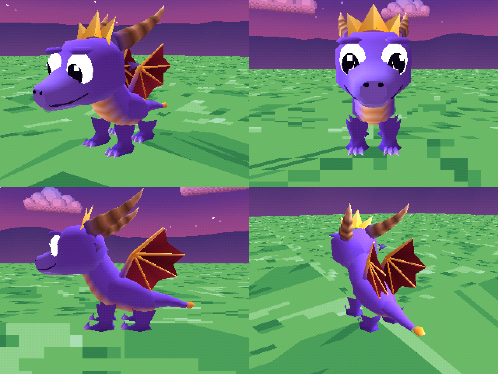
</p>
<p align="center"><sub>The four camera angles of <code>node tools/model-sheet.mjs</code>, rendered at the game's 240 lines (nearest-neighbour ×2).</sub></p>

<p align="center">
  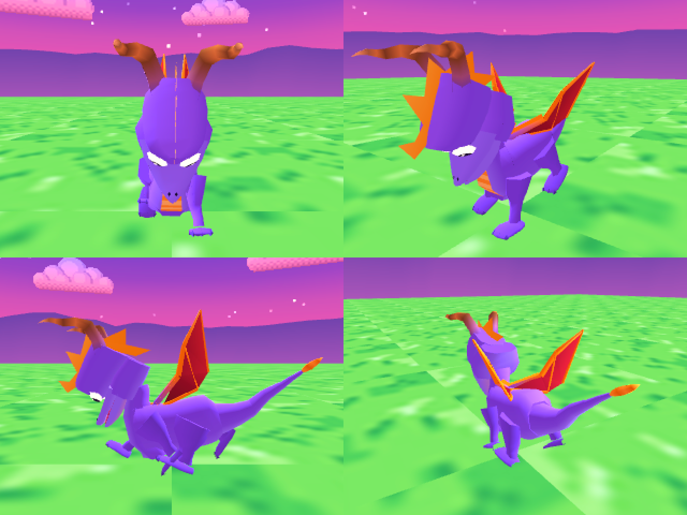
</p>
<p align="center"><sub>The same angles in the ram pose (<code>--pose charge</code>): the head tucked down, the horns bent forward to point ahead.</sub></p>

## How the PS1 look is made

| Hardware trait | How it is reproduced here |
| --- | --- |
| 320×240 frame buffer | Scene renders into a 320×240 target (optional wide / 480-line modes), integer-scaled or "sharp bilinear" to the window. The HUD is drawn at that same internal resolution. |
| Integer vertex coordinates ("jitter") | Clip-space vertices are snapped to whole pixels in the vertex shader (`ps1Snap`). |
| No perspective correction | UVs are interpolated affinely (`uv * w` trick), so big near polygons swim exactly like the original. Toggle in options. |
| Gouraud shading only | All lighting is baked into vertex colours. Static geometry stores irradiance for **both** moonlit-gloaming and daybreak (heightfield shadow ray-march + prop shadow stamps) and the shader blends them by the current time of day. Dynamic models use one directional + ambient term evaluated per vertex. |
| `texture × colour × 2` blending | 0.5 vertex colour is neutral, values above brighten — the GPU's modulate mode. |
| Per-vertex fog | Fog is computed in the vertex shader and interpolated, so it bands across large triangles. |
| 15-bit colour + ordered dither | Final pass quantises to 5 bits per channel after adding the PS1 4×4 dither matrix (offsets −4…+3). |
| Nearest filtering, no mipmaps | Textures are tiny (16–64 px), palette-limited, point sampled. |
| 1-bit / 50 % / additive transparency | Cut-outs are alpha-tested; water and glass use the 50 % blend; glows are additive. |
| 30 fps | Optional lock: simulation keeps running while every second frame is presented. |

Honest caveat: the *rendering artefacts* are faithful, the *budgets* are not — the terrain is a ~52 k-triangle heightfield,
far more than a PS1 could push. A frame submits roughly 200 k triangles and 250–300 draw calls (the static world meshes are
not frustum-culled), which integrated graphics and recent phones handle at 320×240; **Options → Graphics → 30 FPS lock** helps older devices.

## Repository tour

```
src/engine/          renderer + PS1 pipeline (shaders, materials, gfx, builder, lighting)
  textures/          procedural pixel-art toolkit: 95 world textures, sprites, bitmap font, UI atlas
  audio/             procedural PS1-SPU-style synth: music (dusk + daybreak variants), ambience, stingers, ~60 sound assets
                     (the gem chimes are the exception: clean 48 kHz stereo, see sfx-gems.js)
src/game/
  level.js           the design source of truth for Gloaming Vale: landmarks, roads, hills, beacon order
  realms.js          the worlds: a realm (Gloaming Vale) or a homeworld (Dawnhaven), each a level + the script that populates it + its hour
  progress.js        what the hero keeps between worlds (realms restored, secrets found): localStorage, sanitised
  realm/             the realm foundry's kit: a country made of ribbons of open ground, the level descriptor built from a brief, a brief that is validated, the stages of a level script, the situations a goal can stand in,
                     a rock mass with caves made from data (rockmass.js), and starter/, the small complete realm the generator copies
  frostbloom/        Frostbloom Hollow, the first realm made with the foundry: brief.js (its design as data), level.js, glacier.js (its rock mass), layout.js, environment.js, travel.js (its menu places, generated)
  emberfall/         Emberfall Crags, the second: brief.js, level.js (a lake of lava, a caldera, ash and cinder), smelter.js (its rock mass), layout.js, environment.js, travel.js
  skyweaver/         Skyweaver Spires, the third: brief.js (islands, rows of slabs, whirlwinds, the air links), level.js (a sea of cloud), layout.js, environment.js (a windless dusk and a bright morning), travel.js
  home/              Dawnhaven: level.js (its own heightfield made of ribbons of open ground, the five doors, roads, secrets), crag.js (the Crag: its mounds, tunnels, halls, ledge road and summit as data and functions), layout.js
                     and layout-crag.js (the hand-authored placement: the parts of the country, and the Crag's tunnels, hall, grotto, vault, ledge and summit), dialogue.js (the Elder)
  massif.js          rock that is not a heightfield (caves, arches, overhangs): a field function meshed by surface nets, with its own collision, camera and light (see "How the Crag's caves are made" below)
  terrain*.js        analytic heightfield, road/river carving, per-triangle texturing, water
  roads.js drape.js  the cobble and dirt roads, draped exactly on the terrain mesh (cut against its triangles, so they never hover or sink) and merged where they meet (one texture, one worn-edge shading)
  river.js water.js  the river's drawn surface (it meets the lake without a step) and its water, cut to the banks so it stops exactly at the waterline
  props/  models/    procedural scenery, architecture, hero, creatures and interactive objects
  levelgen/          deterministic placement of props, enemies, gems, hints (islands.js plans the floating isles' decor clear of what stands on them)
  player.js camera.js collision.js   kinematic controller, chase camera, heightfield + collider world
  gemcounter.js      the floating, bouncing 3D gem count: extruded numerals drawn as a second little scene over the world
  systems/           gems, Sparx, beacons, enemies, critters, NPC, objects, ambience, portals (the doors and the ring above the Great Beacon: pop-up, trigger, the ride up the beam)
  app.js hud.js menu.js cinematics.js   title → intro → play → finale → results, HUD, menus (finger-sized rows on touch), options, the travel menu's pages and warp
  travel.js          the places of the TRAVEL menu (85, in the five worlds): name, spot, facing, floor, `opens` for a place beyond a realm's gate
  debug.js debuginfo.js   debug mode: the readout / crosshair / collider wireframes, and the pure functions behind the readout
tools/               QA + dev tooling (see below)
.claude/skills/new-realm   the realm foundry as a project skill: the workflow, the principles of the PlayStation worlds it is built on, the engine's contract, the recipe, the gates, the pitfalls
docs/index.html      the built single-file game
```

### Tooling

```bash
npm run qa                    # prop lint + reachability bot + full story playthrough (needs the dev server running)
node tools/bot.mjs            # headless reachability bot: drives the real controller along every road/route (hops the dock's lily-pad crossing from a standing start, checks every Snuffer dies to one hit, that the ward wall round the Dawn Gate stands where it blocks, that a ram jump from the dock's end reaches the second lily pad, the Sparx rules: starts gold, gold → blue → green → gone, butterflies, the gem magnet only while he is there, and the 3D butterflies: they share one material, beat their wings, and a healing one flies to Sparx, or to Spyro when he is gone, and waits when he is full; and the rare blue butterfly of every tenth bunny heals him completely)
node tools/playthrough.mjs    # every beacon, the brazier puzzle, sky-isle glide chain, Dawn Gate, finale
node tools/monkey.mjs [runs] [secs]   # random-input soak test: exceptions, NaNs, players escaping the world
node tools/terrain-map.mjs    # top-down map of the realm with slopes and paths -> terrain-map.png
node tools/prop-lint.mjs      # builds every prop, fails on NaN / degenerate geometry
node tools/camera-test.mjs    # camera modes, obstacles (trees ignored, ground climbed, big things pull in a little), camera speed, settings migration (real Player + camera + collision, no server); --table prints the metrics
node tools/camera-input-test.mjs   # R / pad Y / the touch CAM button / C through the real game loop at 30-240 fps (browser; needs the dev server)
node tools/spyro-pose-test.mjs # the hero's ram pose, headless: the head points 55° or more below level, the horns bend forward to point ahead (every edge keeps its length, the splay stays, it comes and goes smoothly and leaves the rest shape exactly), every other pose keeps the horns as they were, two heroes do not share horns, bad input
node tools/butterfly-test.mjs # the blue butterfly model, headless: finite two-sided wings in every look, a shared material, the wing beat (about 4.4 Hz, quicker when it flies fast, still in a glide), bad inputs
node tools/control-test.mjs   # touch stick maths, the fire aim assist and the ram jump (hold RAM, tap JUMP) through the real Player; no server needed
node tools/debuginfo-test.mjs # debug readout, headless: ground texture = the terrain mesh's texture under 1500 points, aim ray, nearest props / colliders vs brute force, provenance of every prop / collider / record
node tools/debug-test.mjs     # debug mode in the browser: F3, X/Y/Z = the player's, aim on the camera's ray, collider wireframes, errors, phone layout (needs the dev server)
node tools/menu-test.mjs      # menus: the phone MENU button and finger-sized rows through real touches, sub-pages, thumb controls hiding, the upright layout (the picture at the top, the button under it, no "turn your phone sideways" text) with the platform's safe-area inset emulated, keyboard and mouse on a desktop (needs the dev server)
node tools/touch-layout-test.mjs   # where the picture sits in a window (centred; at the top, below the platform's inset, on an upright touch screen: 30000 window / setting combinations compared with the old layout) and where the MENU button goes (under the picture, clear of the thumb controls, or on its top edge), in every window size (no server)
node tools/touch-ram-jump-test.mjs   # ram + jump on an emulated phone through real touches: a finger held on RAM, another tapping JUMP, then lifting RAM (needs the dev server)
node tools/home-check.mjs     # Dawnhaven, headless (no server): five doors each level on its own dais and in five different kinds of place (cove, inside the mountain, out on the lake, canyon's head, summit) at very different walks from the arrival, the arrival the spawn and clear of the door's trigger, five secrets (a chest each, on firm ground), a layered walk map (tools/walkmap.mjs: 1.2 m cells, the real slope limit, colliders and rock, several layers of ground over one spot) over which every part of the country is reachable along its line, the tunnels can be walked end to end and along their own line with 3.4 m of roof, the placement rule keeps out of every spot under a roof, the ledge road climbs from the forecourt to the summit, the hidden garden and the crystal vault are sealed while their walls stand and open once broken, the Guardian's gate holds, nothing is planted under the Crag's roof but its own dressing, no gem or vase inside a solid prop or the rock, no prop on a road, the Crag's rock a clean skin (no folded or oversize triangles) with cobble only on the road and its borders cut along smooth lines, no piece of rock or grass lying across the steep contour of the terrain, the courts paved, the gem total a round number
node tools/home-bot.mjs       # Dawnhaven with the real controller (needs the dev server): the trunk road, every other road end to end, the gate tunnel into the hall, down the winding way to the grotto, out the north and east passages, the whole ledge road to the summit, the long pier, the canyon to the forge, the awake door's trip event, the sleeping doors stopping the hero, the gate held from six sides, the stepping stones, the windmill stair, the garden and the vault sealed and opened by a ram, each of the five chests opened by fire and its secret kept, the Elder's talk
node tools/portal-test.mjs    # the whole round trip in the browser: light every lantern, the portal pops open above the beacon, a jump outside the ring does nothing, a jump inside it carries the hero up the beam, the white fade, Dawnhaven (progress saved, the door gold, the Elder), back through the door to the restored vale, no GPU memory left behind after two trips, and the title menu's VISIT DAWNHAVEN (needs the dev server)
node tools/travel-check.mjs   # the 85 places of the TRAVEL menu, headless (no server): the lists fit a phone's menu (a few groups of a few places, names that fit the panel), every place has the floor it says, is clear of props, rock and colliders, out of water, off a slope he slides down, 6 m from the Snuffers and awake doors, in no pocket, in Dawnhaven in the walkable country, and the places inside the ward of the vale's summit are the observatory's
node tools/travel-test.mjs    # the travel menu in the browser, through real input (needs the dev server): the title and pause menus with the keyboard (NO is the cursor's start, Enter / Esc / a click outside are NO, YES goes; a hop keeps the world, a trip builds the other one fresh, a double YES is one trip, the Dawn Gate opens for the observatory, the grace after arrival), every one of the 38 places gone to through the pages (grounded, unhurt, facing right, camera behind, checkpoint, banner), the mouse, and taps on a phone held either way (finger-sized rows, tap outside is NO); node tools/travel-test.mjs pause runs one part
node tools/new-realm.mjs <id> --name "NAME" --tagline "..." [--door <id> --wake-door]   # the foundry's generator: the foundation of a new realm, registered, with its places found and its checks run
node tools/realm-check.mjs <id>     # the 41 rules a realm is held to (45 when its islands are joined in the air: every link flyable, none a trap, every whirlwind used), no server: the hard ones (deterministic build, firm start, every goal reachable, treasure placed) and the design principles (varied situations, a journey of different lengths, levels, loops, no dead ends, secrets, danger that grows, a trail of gems, a small palette); `waive` in a brief is a visible to-do
node tools/frostbloom-check.mjs     # the same rules for Frostbloom Hollow, and its own checks: frosted roads and ice caves, the props' skin, the Icefall over the glacier's mouth, the ice vault behind its wall, the gate's colour, the awake door
node tools/emberfall-check.mjs      # the same rules for Emberfall Crags, and its own checks: scorched roads and the cinder floor, the props' skin and the orange runes, the lava (it burns, it is deep from bank to bank), the stack with no way on foot, the Maw and its ward, the mountain shut until the ward opens, the Smelter's floors and the balcony, the mountains as walls, the sky, the TRAVEL places, the awake door
node tools/skyweaver-check.mjs     # the same rules for Skyweaver Spires, and its own checks: the sea of cloud (nothing to wade on, a fill 25 m down), the way on foot from the start (the Skygate and the Cloud Islet and no other island), the journey (two glides, four rides), every hop across the cloud a fair one (a gap of 2 to 4.6 m, a slab 4.6 m across or more, a step of 0.9 m or less, a gem over each), the shaft of every whirlwind clear, the Loom in sight from the start, turf on every island, the Windbells and their ring, the sky, the TRAVEL places, the awake door
node tools/whirl-test.mjs        # the whirlwind's physics through the real Player, headless (no server): a hero at its foot is carried up and hovers at the top, a run through it at full speed is slowed and not thrown, a jump at the top starts a glide that reaches as far as the checker says, one standing outside it is not touched
node tools/realm-map.mjs <id> map.png   # a top-down map of a world as built: ribbons, roads, water, goals, Snuffers, chests, hints, gems
node tools/realm-travel.mjs <id>    # finds and validates the realm's TRAVEL places (and which lie beyond its gate) and writes them
node tools/realm-test.mjs <id>      # a realm played end to end in the real game (needs the dev server): the sky wearing the realm's own palette, a lake of lava drawn as lava and burning at a touch (and the deep taking the hero out of it), a sea of cloud drawn out to its radius with its hint for a hero who falls in, every whirlwind carrying a hero to its top and a jump there starting a glide, a goal that rings (its own sound, not the lantern's), embers at dusk, every goal lit with fire, the day climbing, the gate, the finale, the ring of light, Dawnhaven, back in restored, the door behind him, a place beyond the gate
node tools/realm-bot.mjs <id>       # a realm walked by the real player controller (needs the dev server): from the start to every goal in the order of the brief along the routes the walk map finds (jumps, floes, tunnels, the gate that opens when its goals are lit), breathing fire at each; the way, as a person walks it. A goal he cannot walk to (a glide goal) is reached as a person reaches it: he walks to the ledge the glide check found, runs off it and glides, lights the goal, and glides off again towards the next one (36 m across the lava of Emberfall Crags, 45 m back off) In a country of islands joined in the air the walk is a list of legs (`tools/lib/air.mjs`): he hops the slabs with care (a jump at a run is 8.7 m, so he walks them), glides from a ledge to the island a link lands on, or walks into a whirlwind, stands until it has carried him to the top and glides out of it (a glide of 41 m down, rides of 36, 38 and 40 m and glides of 30, 28 and 48 m out of them, in Skyweaver Spires)
node tools/foundry-test.mjs         # the foundry as a whole: generates a scratch realm from the starter, checks it, finds its places, plays it in a scratch dev server, and refuses what it should refuse
node tools/world-hash.mjs           # hashes of the generated worlds of Gloaming Vale and Dawnhaven (Dawnhaven's moved for its door that woke): they must not change by accident (an intended change is pinned with --write in the same commit)
node tools/where.mjs X Z   # what is at a spot (X = east, Z = south, as debug mode shows them): area, ground texture + rule, nearby props / gameplay things / collision shapes with the layout function and file:line that placed them
node tools/build-id.mjs       # the build id debug mode shows: a hash of src/ plus the date
node tools/level-check.mjs    # populates the level headlessly: gem economy (700), counts, and placement checks (shrine chest seated on its island, Dawn Gate forecourt dry and gentle, sky-isle decor clear of the mushroom / chests / enemies / beacon, nothing solid standing on a chest, vase, brazier, mushroom, NPC or enemy spawn, Mirrormere's short wide dock with a clear run-off and its lily pads: big, spaced, easy hops, the pier's landing lawn: one calm grass, sand and the roads' dirt instead of a mosaic of textures, the roads draped on the terrain (every vertex on the surface, cobble over dirt where they meet) and merged (same texture point and shading where two lie on top of each other, no ragged dirt beside a road or past its end, every ribbon whole up to its flat end), the ground textures laid on without smearing (no grass stretched more than 1.75 times on a steep bank) with rock and grass in patches rather than a coin toss per cell, and the river: its water stops exactly at the waterline, meets the lake at its level, and its banks are sand and grass, never rock)
node tools/shot.mjs / play.mjs / probe.mjs   # Playwright screenshots, scripted play-throughs, state probes
node tools/model-sheet.mjs out.png --only spyro --poses idle,run,glide --views side   # contact sheets of an actor from any angle / pose
node tools/charge-test.mjs | gem-flight-test.mjs | gem-counter-test.mjs | gem-sound-test.mjs
                              # focused checks: charge only while held, the gem lob, the floating count, the pickup chimes
node tools/audio-render.mjs   # renders every sound to WAV and prints diagnostics
node tools/build-single.mjs   # esbuild -> one HTML file
```

The bot scripts need the dev server (`GV_HMR=0 npm run dev`) and Playwright with Chromium.

Dev-only scenes (not in the single-file build) are reachable through `?test=`: `props` (scenery gallery), `models`
(hero, enemies and objects with their test poses), `world` (the realm with a scripted camera), `pipeline-test` (every PS1
effect on a test scene) and `play` (bare world plus controller, for tuning movement). Example: `http://127.0.0.1:5173/?test=models&only=spyro&pose=run`.

## Credits

Design, code and procedural art/audio: written for this project. three.js is © its authors (MIT).
