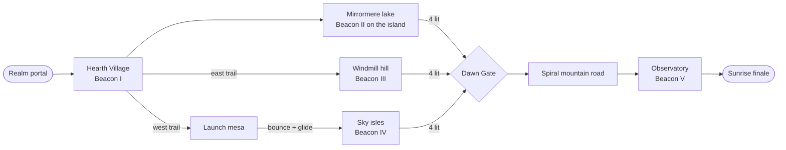

# Lantern Keepers Pack — design notes for *Gloaming Vale*

A one-realm DLC for a PS1-era 3D platformer. This file is the pitch and the level design; the README covers how to run it and how the renderer works.

## Pitch

The Snuffers, small hooded pests that eat light, have swallowed the sunrise over a valley that is kept alive by five Beacon
Lanterns. You relight the lanterns one by one and the sky answers: every beacon pushes the valley a step from a violet
gloaming toward daybreak, and the last one lifts the sun over the rim.

**Design goals**

* One hub-like valley that you can read from any hill: every beacon has a beam of light you can see from the spawn.
* Five beacons, five different verbs: walk-and-burn (tutorial), hop, puzzle, glide, climb.
* The world itself is the progress bar. The lighting is baked twice (dusk and daybreak) and blended by how many beacons burn.
* Nothing is gated by anything but movement skill and one visible puzzle. No fetch quests, no menus.

## Flow

| # | Beacon | Skill it teaches | Obstacle |
| - | --- | --- | --- |
| I | Hearth | fire breath | none; the elder explains the premise |
| II | Isle | jumping | a reef of stepping stones across the lake (or glide from Heron Point) |
| III | Mill | fire on a target, stairs | three braziers along the spiral road raise the portcullis to the tower stair |
| IV | Sky | bounce, glide | a launch mushroom on the mesa, then a chain of floating isles that bob |
| V | Dawn | endurance | the Dawn Gate stays sealed until four lanterns burn (a ward around the mountain, shown by drifting violet motes, stops anyone walking or gliding round the arch), then a cobbled road spirals up to the observatory |

The two long trails leave the village on opposite sides of the lake and meet again at the Dawn Gate, so the valley is a loop
and no route is a dead end. Heron Point, a red-rock headland on the lake's north shore, has its own trail: it is the launch
pad for the long glide out to the island shrine.

## Enemies

| Snuffer | Looks like | Beats it |
| --- | --- | --- |
| Plain | hooded, amber eyes | fire or charge |
| Bell | brass bell shield on a pole | charge (fire bounces off) |
| Thorn | crystal spikes on the back | fire (charging hurts you) |

Sparx, the dragonfly, is the health bar: three hits, shown by his colour. Scorched bunnies turn into butterflies that heal him.

## Collectibles and economy

* Gems are worth 1, 2, 5, 10 and 25. **700** in total: 319 laid out as road trails, arcs over gaps and a few hidden purples and golds, 381 inside vases, chests, a cracked wall and Snuffers.
* The HUD total is computed from the same drop tables the game uses, and a test collects everything to check the numbers match.
* The results screen awards up to three stars by gem percentage (60 % and 95 % thresholds).

## Art direction

* **Palette:** violet sky, teal water, warm window light. Gold is reserved for lit things, so a lit lantern is the brightest object on screen.
* **Time of day:** one moon-lit *gloaming* light and one *daybreak* light. Vertex colours store both; a uniform blends them.
* **Textures:** 62 tiny tiles (16–64 px), drawn in code from a limited palette, sampled with nearest filtering.
* **Geometry:** hand-built from primitives in code. Chunky silhouettes, few vertices per model, texture detail does the work.
* **Camera:** chase camera at a fixed distance that pulls in when something blocks it, plus authored cinematic shots for the title, intro and finale.

## Audio direction

Everything is synthesised at start-up to imitate a 22 kHz sample-playback chip with ADPCM grit and a hall reverb. The score is
one 16-bar theme in two colourings: D dorian on celesta and music box for the gloaming, D major with marimba and flute for
daybreak. Both are the same length and time-aligned, so the game crossfades between them as beacons are lit.

## Testing

`tools/bot.mjs` walks every road with the real player controller; `tools/playthrough.mjs` completes the whole story
(every beacon, the puzzle, the glide chain, the gate, the finale). Both run without rendering, so they take seconds.
