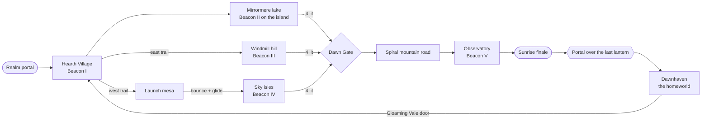

# Lantern Keepers Pack — design notes for *Gloaming Vale*

A one-realm DLC for a PS1-era 3D platformer, with the homeworld its portal leads to. This file is the pitch and the level design; the README covers how to run it and how the renderer works.

## Pitch

The Snuffers, small hooded pests that eat light, have swallowed the sunrise over a valley that is kept alive by five Beacon
Lanterns. You relight the lanterns one by one and the sky answers: every beacon pushes the valley a step from a violet
gloaming toward daybreak, and the last one lifts the sun over the rim.

**Design goals**

* One hub-like valley that you can read from any hill: every beacon has a beam of light you can see from the spawn.
* Five beacons, five different verbs: walk-and-burn (tutorial), hop, puzzle, glide, climb.
* The world itself is the progress bar. The lighting is baked twice (dusk and daybreak) and blended by how many beacons burn.
* Nothing is gated by anything but movement skill and one visible puzzle. No fetch quests, no menus.

## Flow

| # | Beacon | Skill it teaches | Obstacle |
| - | --- | --- | --- |
| I | Hearth | fire breath | none; the elder explains the premise |
| II | Isle | jumping | from a short, wide dock, three big round lily-pad stones across the lake, each an easy hop (2 to 3.4 m of open water) from the last (or glide from Heron Point) |
| III | Mill | fire on a target, stairs | three braziers along the spiral road raise the portcullis to the tower stair |
| IV | Sky | bounce, glide | a launch mushroom on the mesa, then a chain of floating isles that bob |
| V | Dawn | endurance | the Dawn Gate stays sealed until four lanterns burn (a ward around the mountain stops anyone walking or gliding round the arch; it is drawn as a tall, semi-translucent violet wall in the gate's own hex lattice, brighter as you near it, with drifting motes and a shower of sparks where you lean on it, and it dissolves with the gate's field), then a cobbled road spirals up to the observatory |

The two long trails leave the village on opposite sides of the lake and meet again at the Dawn Gate, running into the two
sides of its paved forecourt (a flagstone apron that climbs gently to the threshold), so the valley is a loop and no route is
a dead end. Heron Point, a red-rock headland on the lake's north shore, has its own trail: it is the launch
pad for the long glide out to the island shrine.

## Worlds: realms and the homeworld

In the series a **homeworld** is the hub that connects the levels (a portal to each, secrets to find, someone to talk to) and a **realm** is a standalone level entered through one of its portals. The pack keeps the split.
`src/game/realms.js` lists the worlds, each a level descriptor plus the script that populates it: **Gloaming Vale**, a *realm* (its hour follows its lanterns), **Dawnhaven**, the *homeworld* (always daybreak), **Frostbloom Hollow**, **Emberfall Crags**, **Skyweaver Spires** and **Tideglass Reach**, four realms made with the foundry (below), and **the Guardian's Court**, a world of kind `arena` (the last place: one fight, no goals to find; below). Every world is a `Game` of its own,
built on the page's shared `Input` (the touch controls and the listeners belong to the page, not to a world), `Assets` and audio. Nothing of Gloaming Vale's level generation changed (the same random draws in the same order: a dump of every prop and
gameplay record and a hash of the terrain's triangle textures are identical to before the homeworld), so the portal's records are the only new thing in it.

**The portal.** The last beacon lights the sun and, 3.4 s into the finale, a portal pops open on top of the lantern (`models/objects/portal.js`: a swirl of violet light in a ring, a spring that overshoots as it opens, a spark burst and a chime), while the camera
slips into the lantern room and looks up. It hangs 16.5 m over the room's floor, far out of a jump's reach (about 3 m), so the light carries the hero: a ring of light on the floor (5.4 m round the lantern's axis) marks where the beacon's beam comes down, a hint appears
2.5 m before it, and a **jump made inside the ring** starts `Player.carry`, a scripted ride (no control, no damage): a spiral round the lantern (it stands on the axis, a straight ride would pass through it) of one and a half turns, 1.6 s plus 0.06 s per metre of rise, the hero
vanishing into the light just before the end, the camera staying down in the room and tipping up after him with the view widening. A jump anywhere else on the floor is only a jump, and before the last lantern burns there is no ring. (From outside the observatory the dome hides the
portal: it is drawn back-face culled, opaque from outside and invisible from inside; the golden beam still rises through it.)

**A trip.** At 62 % of the ride the portal raises the `'portal'` event and `App.travelTo` takes over: the state becomes `traveling`, the screen fades to **white** (a portal; everything else fades to black) while the old world keeps running under the fade, then the old world is
let go of (`Game.dispose`: every geometry of the world and the counter's overlay, the effects' materials, the sprite atlas texture and the counter's materials; the shared textures and materials stay), the new one is built the real way behind the loading bar, adopted (menus, events, debug readout) and arrived in:
the white clears away on the hero where the way from the old world comes out (`gameplay.arrivals[from]`: 11 m in front of the door of the realm he came from, at the height of the floor there - a pier's deck, a summit's pad - off its trigger and with the doors near him already announced), the name of the place comes up and a chime sounds. A door is the same trip the other way: walking into an awake door's light (crossing the plane of the swirl)
raises the same event.

**The way back is restored.** A realm the hero has saved is found **restored** when he returns through the homeworld's door (`Game._restore`): the day is 1, every lantern burns (no `beacon` events, so no banners and no finale), the braziers are lit, the mill's portcullis and the Dawn Gate stand open with their models at rest (not sliding open under the fade-in),
and the portal over the Great Beacon is open from the start, so the way home is always there. The rest is as on the first visit (the gems, vases, chests and Snuffers), the mode is free roam, and the best gem count is kept when he leaves by the portal. A realm started from the title is played afresh.

**Dawnhaven** (700 gems of its own; a world's gems are counted by that world, the realm's economy is still 700). It was a plaza with five doors on spokes and was rebuilt in round nineteen after the first thing said about it: *an open field, everything at an equal distance, nothing of the feel of the PlayStation homeworlds, which have caves, several sections and long paths.*
What the series' hubs do, and what Dawnhaven now does: a homeworld is **a country of parts**, each with a character of its own (a village, a lake, a canyon, a cave), **joined by paths long enough to be a journey** and winding enough that the next place is out of sight until you are in it; it has **levels** (terraces, a mountain with a summit, a way down under it); the doors are **in places**, not in a row, at the end of
a walk and each in a different setting (so that the first thing you do is not to count five equal arches); the secrets are **off the path** and need something of the hero (a ram, a hop, a climb); and there is something to talk to near the start. The design source of truth is `home/level.js` (the parts as ribbons of open ground, the roads over them, the doors, the secrets) and `home/crag.js` (the mountain and its caves).

| Part | What it is |
| --- | --- |
| Landing Cove (south) | a lawn walled in by cliffs: a fountain, a market, a hamlet, the Gloaming Vale door in a niche of the west wall, **Elder Wick** on the lawn (`home/dialogue.js`: a welcome that knows whether a realm is restored, the lie of the land, the doors that sleep (none now: "ALL OF THEM ARE AWAKE") and the gate; on later visits how many realms are restored; then a hint towards a secret not yet found, one by one, and how many of the five are) |
| Heartlands | the trunk road (140 m) through a pass into a meadow of two levels (a standing-stone ring, a ruined arch, a farm) and on to the Crag's forecourt; the roads west and east leave it |
| Hearth Terraces + windmill ridge | a hillside village of 16 switchback legs (250 m) climbing to a windmill on the ridge: its wooden stair to a lookout with a chest is **secret 1** |
| Hidden garden | a round glade ringed by a 16 m crest of rock, open only along a strip shut with a cracked wall: **secret 2** (ram it) |
| Mirror Lake | a lake with a waterfall, boats, reeds and lily pads, a **41 m pier** to the Tideglass door (its dais is the landing), three stepping stones (hops of at most 5.2 m, a jump carries 8) west to an islet and its chest: **secret 3** |
| Ember Canyon | a red canyon that winds (300 m), braziers every 24 m, rock arches, to the **forge** (a smithy with a glowing furnace, chimney smoke, anvil and trough) and the Emberfall door |
| The Crag | the mountain in the middle (see below): 4 tunnels (gate 46 m, winding way 71 m, passages north 37 m and east 45 m), the **Echo Hall** with a skylight and a ring of runed stones, the **Frost Grotto** (a dome of ice and crystals, the Frostbloom door), the **crystal vault** behind a cracked wall (**secret 4**), and a **ledge road** round the outside (238 m, 26 m of climb) up to the **summit** and the Skyweaver door; the summit chest is **secret 5** |
| The Ascent | north of the Crag, a long curve up to the **Guardian's Gate**: two colossal runed pillars and a violet field between buttresses of rock that join the mountains: sealed until every realm burns, then a door of light to the Guardian's Court (below) |

The five doors stand in five kinds of place (a cove, inside a mountain, out on a lake, in a canyon's head, on a summit) and at walks of 4, 210, 300, 375 and 395 m from the hero's arrival (measured by the layered flood fill of `tools/walkmap.mjs`, which `home-check` asserts: the nearest under 120 m, the farthest over 350 m, no two within 15 m of each other). All five are awake (each turning gold once its realm is restored); a door that slept would be stone in the opening and a dim swirl, and none does now.
The country's heights run from the lake's bed to the summit (a walkable climb of 35 m); the roads wind (the trunk, the terraces' switchbacks, the canyon, the ledge) and the mountains between them are walls the hero cannot walk or glide over (the border of the world is not what shuts him in).

The hero keeps between worlds (`progress.js`, `localStorage`, sanitised on load; the game plays the same where storage is unavailable): which realms are restored with their best gem counts and which secrets were found. The title menu offers **VISIT DAWNHAVEN** once a realm is restored,
and `?world=home` opens the page there.

### Rock that is not a heightfield: the Crag (`massif.js`, `home/crag.js`)

The terrain is a heightfield (one height per 2.4 m), which cannot hold a cave, an arch, an overhang or a ledge with the mountain over it. A level can therefore list **massifs** (`level.massifs(grid, level)`): rock masses that are a function `field(x, y, z)` (negative inside the rock) over a box, with a mesh, a collision and a light of their own. The world builds them after the terrain and before the props
(`world.massifs`: the field sampled on a 1.5 m grid, 90 x 34 x 103 cells for the Crag, about 0.5 s), and the props' placement asks them (`ctx.ok` refuses a spot in the rock or under a roof: the caves are dressed by hand).

* **The field** (`home/crag.js`): the body is a smooth union of five mounds on a level plinth at 9 m (the main mass, a summit tower, a west shoulder, the southern bastion whose cliff the south mouth is cut in, a north-west spur) with a rough crust that fades out low down; the airs are tunnels (an elliptic section of half width and height interpolated along a polyline, with the carve 0.5 m below the floor), domed chambers (half an ellipsoid on a flat floor), a skylight shaft and the notch of the ledge road, united with a soft minimum (so a tunnel meets a hall in a fillet, not a crease) and subtracted from the body with a smooth maximum; under the road a retaining wall of rock is left and the rock round the road's surface and the summit pad is not roughened (the hero walks on it); 3D value noise (0.9 m at a 5 m wavelength, 0.3 m at 1.8 m) roughens the rest.
* **The ground follows the caves**: `cragTerrain(x, z)` gives the floor under the mountain, so the terrain itself is the cave floor (level inside every tunnel and hall, easing into the plinth over 3 m beyond their edge), the roads, props, gems and the walk map all read the floor from `ctx.h()`, and the rock's own surfaces that can be stood on (the ledge road, the summit) are the massif's.
* **The mesh**: surface nets (one vertex per cell the surface crosses, at the mean of its edge crossings, then one Newton step onto the exact surface, bounded by 0.35 of a cell outside its cell; quads cut along the better diagonal, with the field's gradient for normals), double-sided (a surface net leaves a few folded triangles in tight creases: 36 of 31750 in the Crag, none showing as a hole), one mesh per texture: `cliff_bare` everywhere (inside and out, so there is no seam at a cave's mouth), `cobble` on the ledge road, `grass_a` on gentle ground that sees the sky. **The borders between them are cut, not chosen**: a texture chosen for a whole triangle draws a staircase (a tooth of grass every 1.5 m along a road's edge and along every ridge), so the style gives each texture a *score* (positive where it is wanted: for the road, how far inside the road's width and height the point is, and how level and open to the sky; for the grass, how level and open) read at the vertices, on the smoothed normal (the rock's own roughness turns the normal by 45 degrees every two metres, and a border drawn on it would zigzag as much as before), and every triangle the zero line crosses is cut along it, with the new corners on its edges shared by the two triangles of the edge (about 1800 of them in the Crag), so a border is a smooth line. The texture is projected along the dominant axis of a **smoothed** normal (the field's gradient over +-3 m), because on a dome or an arch's haunch the surface's own normal changes between two axes from triangle to triangle at 45 degrees and the rock showed a checkerboard of flaps; with the smooth normal neighbours agree and the projection changes along one line.
* **The light** (`Massif.light`, hooked into `Lighting.sample` for points inside the box): per vertex, the sky's ambient shut out by how much sky the point sees (nine rays through the cached field out to 30 m), a corner shadow, the sun and moon through a soft 26-step march where a mouth or the skylight lets them in, the glow lights props register (crystals, torches, the beam's pool: `kit.glow(..., { lightR, lightK })`), a shoulder so overlapping glows cannot burn the rock out to white (about 1.15 at most), and a blend into the outdoor light by how much sky the point sees. The hero and the other dynamic things are lit like the rock round them (`world.updateEnvironment(..., indoor)`: the sun dimmed by 80 % and the ambient by 42 % inside), and the camera comes closer in a cave (`CAM.minPullCave`) and is held back by the rock whatever its minimum is (`Collision.solidFraction`).
* **The collision** (`Collision` asks every massif where it asks a collider): `push` (a ring of eight samples at three heights of the body, the body moved back by how far a sample reaches into the rock, with kerbs and slab edges below the step height not counted), `ground` (a march down the column from the feet plus the step height: the surface to stand on, with its normal, which the player's slope rule reads), `hitsPoint` (the camera and the gems), `enclosure` (nine upward rays: how enclosed the hero is, for the camera and the light).
* **Props in caves**: the crystals, torches, the hall's runed stones, mushrooms, vases and gems of `home/layout-crag.js` are placed by hand on the floor; `light_shaft` (a new prop: an additive column of daylight with a warm pool and drifting motes, from the skylight to the floor) and `forge` are new props. Glow lights inside a massif's box also light its rock; gems and vases that would hang inside a prop's collider (a crystal's is wide) are weeded out in the layout.

### The second realm, and the foundry it was made with (`src/game/realm/`, `src/game/frostbloom/`, `.claude/skills/new-realm/`)

**What was asked** (round twenty-one): to take the principles behind Dawnhaven, which had come from research on the PlayStation hubs, and make *a skill or a generative workflow to create the foundation for new realms*, and then to start on the next realm. The research findings had not been written anywhere but in the
session that did it, so the first act was to recover them (`reference/principles.md`: a themed place of two or three colours; panoramic with height as the reward; collectibles that lead; secret branches, visible loops, no dead ends; portals in very different situations; interiors with a character of their own; hubs that are safe and levels that harden) and to pair
each with the rule that holds a realm to it. A realm is the same data in a different shape, so what Dawnhaven's rebuild had worked out by hand became a kit.

**The kit** (`src/game/realm/`, pure JS so that Node tools run the same code as the game): `country.js` (ground made of **ribbons**: `[x, z, height, halfWidth]` polylines whose heights blend where two meet, between **mountains** that fill the rest; landforms `basin`, `mound`, `dryLand`, `flatten`, `glade`, `ravine`; Dawnhaven's own level was rebuilt on it and its generated world is byte-identical), `brief.js`
(`defineBrief`: the design as data, refused with every problem listed when it is not one: at least five parts, floors spanning 25 m, three to nine goals of at least four different kinds among five with the finale somewhere grand, three secrets, a palette of three, goal looks of the shape the engine reads), `level.js` (`makeLevel`: the descriptor from the brief, a level pad under every goal), `populate.js` (`makePopulate`: a level script as a list of named
stages, every record it makes labelled with its stage for the debug readout, and the three stages every realm has: its goals, the ring of light over the last of them, the treasure), `situations.js` (what each kind of place is and how the world proves it: an island has water round it, a cave a roof over it, a glide goal a ledge in reach of a glide and no short walk, a crater a rim), `helpers.js` and `rockmass.js` (a mountain with caves from data: mounds on a plinth, tunnels, chambers, skylights, the terrain following the floors, the Massif).
`starter/` is a small complete realm that passes every rule, and the generator (`tools/new-realm.mjs`) copies it, renames it throughout, gives it a noise seed of its own and registers it.

**The checker** (`tools/lib/realm-rules.mjs`, run by `tools/realm-check.mjs <id>`, 43 rules for a realm with a brief): the hard rules that say it works (the dry and wet pass place the same things; the hero starts on firm, level, dry ground in the open with a road at his feet; every goal stands on a floor and can be reached; the ring of light has a level floor; the gems add up to a multiple of 50 and none hangs in a solid or on a lake bed;
no prop stands in a road, no road is steeper than the game draws one; no Snuffer within 30 m of the start; every hint zone speaks in capitals and every goal has one; every banner (a goal lit, the finale, the gate, the portal, the saved realm, the results panel) fits the 320 px screen at the size it is drawn: a long goal name with `words.lit`, the saved line and the free-roam line all ran off the screen in Frostbloom Hollow's first screenshots) and the design rules that say it is good (the goals stand in the situations the brief names, differ, and are at walks that differ: the first under 140 m, the farthest over 300, no two within 15 m, the finale among the two farthest; the country has levels and height worth the climb; every part
can be walked along its line; the roads make a loop and none runs out into nothing; the secrets are 8 m off any road and one is behind a wall; the danger grows by thirds of the way and there are two kinds of Snuffer; a realm has a cast (five kinds of Snuffer, three of them the foes of round twenty-eight, and a Ramhog stands where he has room to step off its line); a trail of gems leads along the roads; the ground is made of at most seven textures). It was **calibrated on the two worlds that came before it**: Gloaming Vale (before the principles were written) and Dawnhaven (a hub) keep a few visible departures in `LEGACY`, each with its reason, and every other rule holds for both. A realm that cannot meet a rule yet says so in `brief.waive`: a to-do printed on every run, and a shipped realm has none.

**Frostbloom Hollow** is what came out of it. *An endless winter has frozen the blossoms asleep; five Frostblooms, ice flowers with a flame inside, are thawed by fire, each moving the realm a step from a frozen aurora night to a blossom dawn.* Its brief (`frostbloom/brief.js`: nine ribbons from the Thaw Gate by Glasswater, Rimewood, the Icefall and Aurora Ridge to the Hollow, five roads, five goals, three secrets, an ice gate that melts when four have bloomed) is the whole design;
`level.js` adds the two craters (the frozen glade, the Hollow) and the glacier, `layout.js` is eight functions that dress the parts. The goals are a **landing** (31 m of walking), a **clearing** in Rimewood (201 m), an **island** reached by ice floes (120 m), a **cave** (283 m) and a **crater** (413 m: the finale, the Heartbloom, with five guardians).
The glacier is the `rockMass` of `frostbloom/glacier.js`: four mounds on a plinth at 11 m (the bastion's wall is sheer, 22 m high, `flat: 0.9`), a tunnel from the mouth (the frozen waterfall, the new `ice_fall` prop of fused flows with the waterfall's own streaks, hangs over it, the flows over the opening ending in points above it) to the heart chamber (28 by 24 m, a skylight over the Frostbloom and a `light_shaft` in the realm's blue), and a passage west shut with a cracked wall to the ice vault. 62 by 36 by 72 cells of 1.5 m.
Its look needed no change to the engine's rules and a few additions that are in the kit for the next realm: **textures the level names** (`lakeTextures`, `roadTextures`, `farRock`: the picker and the road meshes read them from the descriptor), a **skin** for the props (`brief.theme.skin`: `kit.b` remaps the textures and the rocks, stepping stones, arches and pines read their tints from it, so rocks wear snow where they wore moss, the pines stand under snow and the meadows flower in one colour; `kit.skin` is `null` for the other worlds, whose props stay byte-identical), nine new
generated textures (snow, snow petals, frost cliff, frost far rock, frosted cobble, trodden snow, snowy pine, blossom and frost canopies: the 66 that existed are pixel-identical, checked against a worktree of the previous commit), the **frostbloom** goal model, a gate that can be recoloured (`gp.barrier.opts.tint`), and a skylight whose pool of light can be another colour. Frosted roads, the skin and the glacier have checks of their own in `tools/frostbloom-check.mjs`.
Waking the door in Dawnhaven (`target: 'frostbloom'`) changes the homeworld on purpose: its heights, props and gems are what they were and only its gameplay hash moved (`world-hash` re-pinned in the same commit).

**What the second realm taught the foundry**, each now in the kit and the skill: a goal under its own skylight is still in a cave (the cave rule looks round the goal); `defineBrief` checks the *shape* of a goal's look (the ignition burst is `{ c0, c1 }`, not a colour: the first browser run of the realm failed in `Fx.ignite` when the hero first lit a goal); the TRAVEL generator finds a cave's floor from a reference height (the highest surface under a cave's roof is the roof) and flags
the places that lie **beyond a gate** (`opens`: the app opens the gate for a hero warped there, as it opens the Dawn Gate for one warped into its ward; `travel-check` and `travel-test` hold the flags to the walk map with the gate shut); a place of another world that lies in the light of a door that is now awake moves; the realm's journey test walks back through the realm's own door.

### The third realm: Emberfall Crags (`src/game/emberfall/`)

**What was asked** (round twenty-two): *create the next level.* It was taken the way the skill says: the next realm, made with the foundry, waking another sleeping door of Dawnhaven. **Emberfall Crags** took the door at the forge at the head of the Ember Canyon (tag *A REALM OF EMBERS AND STONE*; the skill's direction was a country of ash and stone with fire in it, a glide goal across a chasm, a cave, a crater finale, embers for the air), and it asked for things the first two realms had not needed:
a lake that is not water, a goal that cannot be walked to at all, and mountains that must be walls beside ground that is itself 34 m up. *The forges of Mount Emberfall went cold the night the Heartforge went out; five Emberstones, standing stones with a coal inside, are kindled by fire, each moving the realm a step from an ember dusk to a forge glow.*

**The country** (`brief.js`, 432 m square): fourteen ribbons: the **Forge Gate** (the door, a landing) and the **Cinder Flats** (black ash, a cobbled road), the **Cinder Grove** (charred trees round a clearing; off it the sealed Ash Glade), the **Basalt Stair** (four switchbacks, 23 m of climb), the **Basalt Rim** over the **Ember Rift** (a river of lava 56 by 148 m and 5 m deep with a stack of rock standing in it), the **North Causeway** and the **Ashway** (the two roads round the ends of the rift: a loop), the **Lookout Trail**,
the **Anvil Plateau** on the far bank, the forecourt of the **Maw**, a plinth under the **Smelter**, the **Cinder Gorge** and the **Caldera**. The five goals: a **landing** (the Forge Stone, 27 m of walking), a **clearing** (the Grove Stone, 105 m), a **glide** (the Anvil Stone on the stack, 15 m over the lava: a glide of 36.1 m from the rim, 7.3 m down, with **no way on foot**, and off again by a glide of 28.2 m, 14.2 m down, to the plateau),
a **cave** (the Smelter Stone in the Furnace, 387 m) and a **crater** (the Heartforge in the caldera, 686 m: the finale). The Maw (a stone dragon's mouth over the mouth of the cave, `dragon_maw`) is shut by a **ward of fire** (the Dawn Gate's field, recoloured gold, `gp.barrier` with `opts.tint`) until three Emberstones burn (`gate.at: 3`: the three of the open country), so the mountain, which holds the last two, is not walked into before the hero has met the lava; three secrets
(the **Ash Glade** behind a cracked wall, the **Ember Lookout**, the **Smelter balcony** 7 m over the Furnace); 24 Snuffers (9 plain, 2 in bells, 7 with spikes, 4 Fusepups, a Ramhog, a Lidwarden; danger 10, 20 and 15 by the thirds of the walk); 750 gems; the highest ground 37.9 m.

**The Smelter** is the realm's rock mass (`smelter.js`, `rockMass`): four mounds on a plinth at 6 m (the bastion on the west is a sheer wall 24 m high with the Maw cut in it), a tunnel in, the **Furnace** (30 by 26 m, 14 m high, a skylight over the Emberstone and a `light_shaft` in ember light), a tunnel north out through the mountain to the gorge, and a passage east that climbs 7 m to the balcony, a little round room with its roof 7.5 m over the floor.
The gorge climbs in switchbacks to the caldera, a crater 48 m across at 36 m, walled in by 22 m of black rock with a ring of crystal spires on its rim; the high ground the hero can walk to (81 cells over 30 m) is the gorge and the caldera and nothing else: the mountains are walls.

**What it looks like.** Everything it is made of is of the country: **ash** and **cinder** (embers in the cracks), **scorched cobble** (basalt with embers in the gaps) and **trodden ash** for the roads, a lake of **lava**, **bare basalt** for the cliffs and the rock mass, **ember rock** for the far mountains, a skin for the props (**charred pines**, **fire lilies** for every flower, no moss or tuft, dark ash caps on the rocks, orange runes on the standing stones), eleven new textures in all (the 75 that existed are pixel-identical), a goal model (`emberstone`: a standing stone with a coal inside, a ring of runes on its pad), five props (`basalt_columns`, `dragon_maw`, `ember_vent`, `dead_tree`, `giant_anvil`), embers in place of fireflies at dusk, and a sky of its own: the dusk (A) a low red sun in the west that goes down behind the hero as he walks east, near-black violet running to a burning horizon, smoke-dark clouds lit orange from below, the lava's glow thrown back from the east on every face that looks at the volcano;
the glow (B) a golden afternoon, ash-pink cloud, an amber horizon. The first screenshots found what the checks cannot: an orange that swallowed every colour (the dusk's light and fill were pulled down), lavender clouds and ridges over ash (the sky palette gained `cloudTop`, `cloudBot` and `ridge`), strata like a layer cake on the mountains (bare basalt), white caps on ash (a darker `mossTop`), violet runes on orange stones (`skin.palettes.rune`), and lava that read as honeycomb (big irregular plates).

**What it taught the foundry**, each now in the kit and the skill:
* **A liquid that is not water** (`level.liquid`): water physics are global (`WATER_LEVEL` = 0) and a lake is a basin below it, so lava is a lake with a different surface and a different depth at which it takes the hero (`burnDepth` 0.2 against water's 0.95): `water.js` draws it opaque and lit from within (`emissive`) under an additive layer of shimmer, `player.js` and `game.js` burn the hero and throw sparks and a hiss, `ambient.js` splashes where he wades, `walkmap.mjs` treats the burning depth as not walkable (the shallows of a lava lake are not ground to stand on).
* **Mountains that are walls** (`mountain.margin`, opt-in in `makeCountry`): with a rim at 24 m and a gorge at 34 the noise's mountains of 35 m stood beside floors of 34, and the walk map climbed out of the gorge over them (ground from 2.7 to 63 m, `design.height` failed). With a margin the mountains rise to stand that far over the floors of the ribbons beside them; the other worlds' ground is byte-identical.
* **A glide goal with no way on foot needs a way off** (`situations.js`): ground of the walkable country lower than the goal, 10 m or more off, dry, within reach of a glide. A hero who falls in the lava comes back to the last firm ground, which is the stack: from there he must be able to glide on. (`tools/lib/glide.mjs` finds the ledges to launch from and the ground to land on; the TRAVEL generator marks such a place `shelf`.)
* **The realm walker glides** (`tools/realm-bot.mjs`): for a goal the walk map cannot reach it plans a leg of its own: walk to the launch ledge, run off it, hold the glide, check he came down on firm ground near the goal, face it and breathe fire, then glide off to the walkable country nearest the next goal. The real controller made the glide at 99 % of the checked reach: the check's margin is a person's.
* **A realm's sky** (`cloudTop`, `cloudBot`, `ridge` in the palette, `atmosphere()` interpolates them), **a skin with a rune tint**, a dusk of embers (`level.ambient.dusk`), a gate that is a ward of fire.
* Smaller: the road grade is measured along the road, not as a chord (a hairpin made the old rule fail a gentle road); the `atCave` rule (a road may end at a cave's mouth); the goal check for `dragon_maw` as a reward; the TRAVEL generator pages a lone leftover place into the previous page, names a part and a goal that share an id (`-part`), and marks shelf places.

### The fourth realm: Skyweaver Spires (`src/game/skyweaver/`)

**What was asked** (round twenty-three): *start Skyweaver Spires*, the realm recommended over Tideglass Reach, the last door that sleeps (its tide would move the engine's global `WATER_LEVEL`, which some 80 places in 21 files read: a change that wants a round of its own). It was taken the way the skill says and took the door on the summit of the Crag (tag *A REALM ABOVE THE CLOUDS*; the skill's direction: islands above the cloud, gliding between them, whirlwinds that lift the hero, a tower; the sky is the theme). It asked for what none of the three before had: ground that is not ground. *The Skyweavers wove the winds into the spires of the sky and kept them there with five great Windbells; when the bells fell silent the winds fell slack, and the clouds have lain still ever since. Each bell that rings moves the realm a step from a windless rose dusk to a bright morning.*

**The country** (`brief.js`, 480 m square): ten islands (ribbons of two or three points, a `fall` of 4-7 m) standing in a sea of cloud at the waterline, the fill under it at -28 m: the **Skygate** (22 m over the cloud: the door, the lawn, the first bell), the **Cloud Islet** (24 m, 19 m across), the **Lowfield** (12 m, a meadow 60 m long), the **Kite Isle** (30 m), the **Orchard Terrace** (34 m, about 95 by 48 m, with the walled vault), the four **Spindle Spires** (56, 59, 62 and 59 m) and the **Loom Isle** (76 m, the highest ground, with the tower). The way from one to the next is air: a **row of slabs** (`ROWS`: six from the Skygate to the Cloud Islet, three between each pair of spires; 20 `sky_slab`s in all with the two of the lonely branch, 5-6 m across, a gap of 2-4.6 m, a gem over each), a **glide** (the Cloud Islet to the Lowfield, 41 m across and 12 m down; the Kite Isle to the Lowfield), or a **whirlwind** (36, 38 and 40 m: the Lowfield to the Orchard and the Kite Isle, the Orchard to the first spire, the highest spire to the Loom). Six links in `brief.air`, each held to the numbers. The five goals: a **landing** (the Gate Bell, 24 m of walking), an **island** (the Isle Bell on the Cloud Islet: water in 8 of 8 directions within 14 m, 127 m of walking, across the first row), a **glide** (the Field Bell: 42 m from the nearest launch ledge and 11 m down, **no way on foot**, off again by the two rides from the Lowfield; 181 m), a **lift** (the Spire Bell on the highest spire: reached only by the ride up from the Orchard, no way on foot, off again by the third whirlwind; 523 m) and a **summit** (the Loom Bell, 54 m over the start and the highest ground within 60 m; 619 m: the finale). Three secrets (the **Weavers' vault** behind a cracked wall, the **Kite Isle** chest, only reached by a ride, the chest on the **lonely slab**); 11 Snuffers (3 plain, a bell, 2 spikes, 3 Dusk Moths, a Slinger, a Smokecaller; danger 1, 7 and 19 by the thirds of the way); 550 gems; the highest ground 76.2 m, the lowest he can walk 9.8 m; 2417 cells of ground on foot from the start, which reaches the Skygate and the Cloud Islet and no other island.

**What it looks like.** Cream marble (the cliffs, the tower, the monoliths and the frames of the bells), sage turf, cloudstone flags with sky-blue moss in the joints, and a sea of large soft billows, lit from within (`emissive` 0.55) so that the dusk does not darken it; nine new textures (the 86 that existed are pixel-identical, and so are the 28 entries of the HUD's atlas: two are new), a goal model (`windbell`: a bell of bronze in a frame of two marble pillars, a lintel and a plinth with a ring of runes; silent it is verdigris, rung it is gold, swings, and has a heart of light, a turning hoop of runes and a halo), the whirlwind object (a funnel of two additive veils of streaked air scrolling round it in opposite directions, a bright core, a ring of wind on the ground), five props (`sky_slab`, `cloud_puff`, `wind_vane`, `vault_walls`, `loom_tower`), two sounds (a loop of wind whose centre swings round, and a bell's strike), and a sky of its own: the dusk (A) a low rose-gold sun in the south-west behind the hero as he climbs, indigo running to violet, rose and a peach horizon, lavender cloud and sea; the morning (B) a golden-white sun, a blue sky, white cloud, a white and pale blue sea. The tower is in sight from the first step (a check holds the line of sight over every island). The first screenshots found what the checks cannot: a turf that read as water (a teal ramp under the cool dusk: now a sage green), a silent bell of electric blue (a blue multiplier of 2.0 on bronze: 1.25), marble blown out by the twilight lift the moonlit vale needs (1.12), mountains in the distance over a sea of cloud (the ridge is now a faint mist, no darker than the fog), puffs of cloud that read as heaps of white rock (smooth normals and a rounder big lump), and a vault wall that was blue-grey (warmer).

**What it taught the foundry**, each now in the kit and the skill:
* **A sea instead of a lake** (`brief.sea = { name, deepHint, radius }`, opt-in): `makeLevel` gives no basin and no `dryLand`, the descriptor carries `sea { x, z, r, name, deepHint }`, `water.js` draws the surface as a disc of 72 by 32 rings out to the horizon (the per-vertex fog needs the tessellation), `game.js` puffs and hints for a hero who falls in, the ground that is not an island is the fill (`mountain.base`) 28 m under the surface and every touch of the cloud sets him back on the last firm ground (`level.liquid` with `burnDepth` 0.1 and `splash: 'cloud'`). `rockLine` (default 42, the picker's far-rock line) lets high islands wear their own ground; `ctx.ok`'s default minimum height keeps props off the sea floor; `ctx.put(..., { y })` stands a puff on the surface or a slab in the air.
* **Whirlwinds** (`src/game/realm/whirl.js`: pure, shared by `player.js`, `systems/objects.js` and the tools): a column that widens to 1.7 of its radius, lifts a hero inside it at 11 m/s eased to a hover over the last 6 m, lifts one who stands in its foot off the ground, takes his speed away (35% of a run: the first test threw a hero who ran through with the stick held 23 m out of it), draws him to the axis, skips gravity, and sets `jumpsUsed` so that a jump at the top starts a glide. `gp.whirlwinds` is made lazily, so the other worlds' gameplay data has no such key and their hashes stand. `tools/whirl-test.mjs` runs the real `Player` over a flat stub: lifted to the top in about three seconds, no overshoot, caught at the edge, not thrown, untouched outside and above, a glide from the top that carries as far as the situation check says.
* **A lift** is a situation (`situations.js`): a goal on the island a ride sets the hero down on, with no way on foot and a way off by another link. **The glide situation** asks of a country of islands what it asked of a lake of lava (a way off), answered by a link that starts on the island.
* **The air journey** (`brief.air`, `tools/lib/air.mjs`): the links are data (`{ id, kind: 'glide', launch, land }`, `{ id, kind: 'lift', whirl, land }`); the checker holds each to the reach of a glide from a standing start (`glideReach`) or from a hover (`liftReach`, 13.5 m/s for as long as he falls at 3.1) with the situation check's margin, a line of sight with nothing in the way and an island to land on, floods the ground of every landing he can get to and presents the whole as a map with the walk map's interface (the distance is walking, riding and the width of a glide), so every rule about walking (goals, gems, parts, secrets, the journey, the danger, the ring's floor) is judged by the journey; `air.links`, `air.reach`, `air.trap` (no island without a way off but the last goal's) and `air.whirls` are four rules of its own (45 in all). `spawn.firm` asks of an island's own ground what the brief says (`startCells`), the dead-end rule counts a whirlwind as a reward, and the aerial-gems rule judges a gem by the floor under it only where there is an air journey (Gloaming Vale's sky isles were calibrated on the terrain's).
* **The walker plays the legs** (`tools/realm-bot.mjs`): `airTools.path` searches the links, fewest first, with a flood rooted where the hero stands; he hops the slabs with care (the first run jumped off the far edge of a slab 4.6 m across at a run, 8.7 m, and flew over the next: the slabs are now 5-6 m across and he walks them at 0.7 of a run and jumps at the edge), glides from a ledge, walks into the foot of a whirlwind (the route ends 2.4 m from its axis, and a first run stopped about 4 m from it, outside the column), stands until it has carried him to the top, and glides out.
* **TRAVEL** (`tools/lib/air.mjs` `journeyMap`): the walkable country of a country of islands is the whole journey; a small island is not a pocket (hops count in the pocket test: a spire is 78 cells); and two places of Dawnhaven within 6 m of the door that woke (`north-passage`, `summit`) moved.
* **A goal that rings** (`sfx` on a goal of the brief, copied by `goalsStage`, played by `BeaconSystem` in place of the lantern's whoomp), the **HUD icons** (`bell_on`, `bell_off`: the first browser run crashed in `Hud.draw` for lack of them: the `hud.icons` rule had been written for that), and one sentence of the Elder, which said "1 STILL SLEEP".

### The fifth realm: Tideglass Reach (`src/game/tideglass/`)

**What was asked** (round twenty-four): *Tideglass Reach: the realm behind Dawnhaven's door at the end of the pier on Mirror Lake (A REALM OF TIDES AND GLASS), the last sleeping door; its tide first, as a foundation proved against the other four worlds.* The skill's direction for it: water and glass, a tide that rises and falls over the road, a goal behind a waterfall, one reached by glass bridges, teal and sea-green, a dusk-to-dawn tide. The tide was the hard part (`WATER_LEVEL` was a constant read in some 80 places in 21 files), so it was made first, opt-in, committed on its own (with its own tests) and proved against the other worlds before a realm used it; then the realm. *The Tideglass is the great lens of the lighthouse on the headland: sea-glass the Reachfolk blew and set in the lantern, and it kept the tide to its hours. When its light went out the tide lost its way: it comes in and goes out in a minute and a half, drowns the roads on the flats and floods the sea cave under the Weeping Fall. Each Tide Lens that shines moves the realm a step from a teal dusk to a green dawn.*

**The country** (`brief.js`, 480 m square): a ring of ridges round a bay, standing in a sea cut out to 360 m at the mean level with the fill at -7 m. Eleven ribbons (`fall` 5-8 m): the **Harbour** (4 m), the **Strand** (3.8 down to -0.2 m: the beach onto the flats), the **High Road** (the west shore, 4 up to 14 m), the **Cliffwalk** (14-15 m, about 250 m along the north cliff), the **Headland** ridge (14 up to 38 m, with the **neck** level at 20.2 m and 12.8 m wide where the Sea Gate stands), the **Weeping Stair** (-0.3 up to 14 m), **Pearl Rock** (top 8.5 m) and the four **Glass Stacks** (11-13 m, radii 5, 5, 4.5 and 8.5 m: the first, the second, the Lone Stack and the Glass Court). The **Salt Flats** are not a ribbon but a **shoal**: the sea fill raised along a 240 m line to -0.5 m, 20 m each side, with sandbars of 0.55 m and ripples, an arm 22 m wide under the Weeping Cliff and one for the tide pool, so that rocks can stand in the sand; the **cairns** are banks (`bank()`: raised to 2.7 m, never lowered) in six pairs 11 m either side of the Low Road, one for the pool and two on the beach (15 in all). The Weeping Cliff is a **rock mass** from data (`weeping.js`: four mounds of 16 to 31 m, a tunnel from -0.3 m at the mouth to 2.7 m, a grotto at 2.8 m under a skylight). Five goals: a **landing** (the Quay Lens, 14 m of walking), an **island** (the Pearl Lens: water in 5 of 8 directions within 14 m, 183 m, over the flats), a **bridge** (the Court Lens on the Glass Court: 372 m, 42 m of it on glass, water in all 8 directions), a **cave** (the Weeping Lens in the grotto: 349 m) and a **summit** (the Tideglass: 33 m over the start, 460 m, the finale past a gate that opens when the **fourth** lens shines). Three secrets (the **salvage store** behind a cracked wall at the quay, the **tide pool**'s chest on its cairn, the chest on the **Lone Stack**, 47 m of glass from the road); 10 Snuffers (1 plain, 3 spikes, a Dustmole, 2 Slingers, 2 Lidwardens, a Smokecaller; danger 1, 5 and 18 by the thirds of the way), none on the sand and none on the first two stacks; 550 gems; the highest ground 39 m, the lowest he can walk -1.9 m.

**The tide** (90 s round, 1.4 m either side of the mean, `start` 0.75: the world begins at the mean level going out, low water at 22.5 s, high at 67.5 s). What the checker finds true of it: the **Low Road** over the flats is bare at the low tide in 100 % of its points, wading at the mean in 99 %, deeper than he can stand in at the high in 100 %; the high tide takes **52 % of the ground he can walk at the low tide**; two of the five lenses are cut off at the high tide (Pearl Rock, which becomes an island, and the cave, whose mouth is 1.7 m under water while the third bend of the floor is dry and the grotto is 1.4 m over the high tide), the first and the last are open at every hour; the longest the sea shuts a way is 41 s (to the cave); nowhere he can walk at the low tide is more than 21 m from ground the high tide does not drown him on (the rise allows 35 m); the 33 things he finds standing (goals, chests, doors, vases) all stand on floors of 2.5 m or more (1.1 m over the high tide).

**What it looks like.** Pale rippled tide sand (wetter where the tide goes), dune turf, slate-teal strata for every cliff, flags of sea-stone with salt in the joints and a shell-sand path, a sea floor seen through the water, and a sea of its own (a ramp from near-black teal to pale aquamarine, a crest, a shimmer layer that moves over it, tinted vertex by vertex with the depth under it and tinted again as the tide moves); ten new textures (the 95 that existed are pixel-identical; so are the 30 entries of the HUD's atlas: two are new), a goal model (`tidelens`: a disc of sea-glass in a ring of brass on a post with a stem and a halo), five props (`glass_bridge`, `lighthouse`, `tide_post`, `tide_cairn`, `cave_fall`), two sounds (a glass bell, the surf as a loop) and a sky of its own: a teal dusk (a cool moon high in the south-west, a faint glow from the dark lighthouse) and a green dawn (the sun risen over the headland, gold on the glass). Glass is drawn half-blended (the PlayStation's 50 % blend) so that the sea shows through the deck; nothing that stands over the sea receives the terrain's shadow map (the ground far below would smear dark streaks over it). The first screenshots found what the checks cannot: a gate in violet stone (the skin now remaps the Dawn Gate's `tower_stone` and `brick` to the realm's strata), bridges in orange iron (a teal-tinted iron), a sand that read as scales (softer troughs), and a sea too bright (a darker texture, tint and shimmer).

**What it taught the foundry**, each now in the kit and the skill:
* **The tide, opt-in** (`brief.tide = { period, amp, start, hint, tint: { shallow, deep, scale, shimmer, texture } }`, validated by `defineBrief` through `tideProblems`; `src/game/realm/tide.js` is pure and shared by the game and the tools: `tideLevel`, `tideLow`, `tideHigh`, `tideRate`, `tideDir`, `tideAbove` (the share of a round the water stands over a height), `tideNext`, `drownDepth`, `refugeReach`). `Game.waterY` is the live level (`WATER_LEVEL` for ever in a world without a tide), `waterLo` and `waterHi` its extremes. Everything that is decided **now** reads `waterY` (the player's drowning, wading and splashes, the surface that is drawn, the ambience, the Snuffers and the critters, the debug readout), and everything made **once** reads the mean level, which is `WATER_LEVEL` and does not move (the ground's shape and textures, where props stand, the roads, the baked light). The player's **safe spot** is a collider (a deck) or ground over the HIGH tide by 0.6 m, so that a drowned hero is set back on ground the sea never reaches. `water.js` lifts the whole surface to `waterY - WATER_LEVEL` and tints again, in place, only the vertices whose tint can change between the low tide and the high (4566 of the surface's, when the water has moved 0.03 m: the deeps and the high ground keep what they were baked with). The HUD draws a gauge under the lenses. A world without a tide has no gauge, no `setLevel` on its water and `waterY === WATER_LEVEL`: proved against the other worlds before any realm used it (below).
* **Seven rules for a tide** (`realm-rules.mjs`): `tide.dry` (everything he finds standing is over the high tide: hard), `tide.refuge` (nowhere he can walk at the low tide is further from ground the high tide does not drown him on than half what he covers wading while the water rises over his head: hard), `tide.shore` (ground over the high tide, where a drowned hero is set back, is within 130 m of all of it), `tide.gates` (the tide shuts at least one way), `tide.open` (the first goal and the last are open at the high tide), `tide.wait` (no way is shut for more than 45 s), `tide.takes` (4 % or more of the ground at the low tide goes under at the high). Every other rule that asks about the water asks about the low tide or the high (`sea0`, `sea1`): a Snuffer is dry at the high tide, a gem on a bed is under the low.
* **The walk map at any water level** (`flood(start, { water })`: the low tide by default, `tideHigh` on request) **and from many places at once** (`{ seeds }`: the refuge rule floods from all safe ground and asks how far each wet cell is from it); the TRAVEL generator and `travel-check` refuse a place the high tide covers.
* **A bridge** is a situation (`situations.js`): out over the water (water in at least five of eight directions within 14 m), and the walk to it crosses 12 m or more of a span of the realm's own making (a prop surface more than 3 m over the ground). `glass_bridge` is the prop: panes of half-blended sea-glass between brass girders on stone aprons and a lantern post every 4 m, and under it **three box colliders to a pane, each as high as the highest of the pane's glass over it** (the hero stands a hair above the glass, never in it, and the staircase he walks down is 0.1 m a step).
* **What playing it found**, and fixed (the realm walker is the only thing that can find these: the walk map's cells could not, and the checker had passed every one):
  * **A gate that did not shut.** The neck of the headland ridge was 15 m wide and the Dawn Gate's pillars stand 3 to 7.7 m either side of the middle, so a hero walked round them on the edge (the walk with the gate shut was 467 m to the lighthouse against 460 m with it open): the neck is 12.8 m wide now, no wider than the plinths, the sea the wall on both sides, and `tideglass-check` measures it. **And a gate that did not open**: the road is carved to its own profile, which is the ground smoothed over 13 m, so the flat pad under the gate was tilted along the road and the threshold, a flat slab, stood 0.63 m over the ground in front of it, a hair more than the 0.62 m a hero can climb: the road is pinned level at five points along the neck (`neckRoad()`, controls with a third element are honoured exactly), and the check asks for no step over 0.45 m.
  * **A bridge that stood him still.** `player.js` stops a runner climbing a steep face by reading the terrain's normal under him and `heightAt`, which counts a prop's top: a deck that rises a few centimetres over the crest of a stack's rim (the terrain under it steep, and rising towards the stack) read as a steep face being climbed, and the hero stood still on it with a full stick (first at the end of a deck laid on the rim, then, when the decks were moved 2 m inside, at the crest under the deck for some positions across its width: two runs of six). The rule skips a hero who is walking on a prop that rises (`player.js`; `control-test` holds it with the real `Player`: on a deck he walks on, on the bare face he is still stopped, and the first fails without the change), and the decks land 2 m inside the rim a hair over the ground each end lands on (`+0.08`: a stack is flat only to a metre or so short of its radius), the check looking for steep terrain under or beyond the ends along three lines (the axis and 1.5 m to either side, where a hero drifts to).
  * **Snuffers on the bridges' ends** (the stacks are 8 m across): there are none on the first two stacks, which also gives the TRAVEL menu a place to put a hero (a place must be 6 m from a Snuffer).
* **The walker learned the sea** (`realm-bot.mjs`): in a realm with a tide each leg is set out as the water ebbs into the last quarter of its fall (the walk map is the low tide's: it lets the water rise past the window if he is in it, then waits for it to go down to it), and the routes are planned for the water as it stands at the START of that window (0.5 m over the low tide: a route that cuts across ground only wadable at the very bottom of the tide drowned him); every cell of a route is a point of it (a straight line between points three cells apart cut the corner and walked off the rim), routes keep 3 m (or the most the country allows, 2.5 or 2) from the rim of a cliff into the sea and a metre of deck round them on a bridge, **the roads before the jumps** (a hop-free route first: the walk map's shortest path jumped a notch at the stair's corner and the real controller fell into the sea), and a leg on which the sea drowns him fails with the place and the water's height. A realm with a gate has the gate **tried with the real controller** first: 32 runs (seven lines straight at it and round the pillars, from 6, 9 and 14 m before it, with jumps and glides), each ended four seconds later, none standing beyond it.
* **`realm-test`** follows the tide (generic: any realm with `level.tide`): the sea rises and falls on the game's clock (the water, the surface drawn and the tint of its shallows, at the start, at low water and at high water), the high tide drowns a hero on flat sand once and sets him back on dry ground with the realm's words, and a hero on dry ground at the high tide stays dry.
* **Dawnhaven**: the last door wakes, so the Elder says **ALL OF THEM ARE AWAKE** (and keeps the words for one and for two, held by `home-check` with a door put to sleep for a moment), `home-check` counts five awake doors, `home-bot` holds its run of the sealed doors for the day a sixth is cut and walks the trip event of all five, `portal-test` expects five awake doors, the TRAVEL menu's `home/pier-end` moved from 5 m to 11 m from the door (it stood in the awake door's light), and Dawnhaven's gameplay hash moved once, on purpose (below).

### The last place: the Guardian's Court (`src/game/guardian/`, `src/game/systems/boss.js`)

**What was asked** (round twenty-six): *start the Guardian*, after "What's next" found that the game promises an ending it does not have: with all five realms restored the Elder said the Guardian's Gate "will open when the lanterns of every realm burn" and, with 5 of 5 burning, said "STAYS SEALED UNTIL ALL 5 BURN"; nothing in the code opened it (`gp.barrier` of Dawnhaven's Ascent: "sealed for good: nothing opens it (yet)"). The Gate was always the teaser for what comes after the realms. *The design was written before any code (`b9f8489`); this section says what was built, and where the building changed the design.*

**The idea.** The Guardian is the warden the Lantern Keepers set at the end of the world to keep the Dawn. When the gloom came it put out the three lanterns on its crown and it has walked dark since, striking at anything that comes near. It is not a villain: it is the one lantern in the game that is not a goal on a map but a person, and lighting it is the same act the hero has done for five realms (breathe fire on a lantern), made harder. The gate opens when the lanterns of every realm burn because the light of all of them is what the Guardian is struck with.

**The fight** (three phases: 49 s for the bot that sees everything, 54-61 s for the imperfect ones, longer for a hero who is hit and set back). The hero's own tools, each doing the job it does elsewhere: **run and jump** to dodge, the **ram** to break what is armoured (as the bell Snuffers and the cracked walls), the **flame** to light a lantern. The fight is a pure state machine (`guardian/brain.js`, `GuardianBrain`: no three.js, no DOM, its own seeded random numbers): `step(dt, hero, { flameHits })` gets the hero as a position and the Player's own flame test as a question, `ramFist(i)` is told when the ram struck a fist, and what happened comes out as events (`wake`, `phase`, `slam-telegraph`/`slam-lock`/`slam`, `hit { what }`, `crack`, `stoop`, `window`, `contact`, `lit`, `window-lost`, `rise`, `bolt-charge`/`bolt`/`bolt-burst`, `gloom`/`gloom-burst`, `freed`, `sleep`, `reset`). `systems/boss.js` plays it in the game (the models, the floor's circles, the colliders, the hurt, the sounds, the dawn); neither ever does the other's job, which is why the same file of rules is played in Node by `boss-test`, by `duel`'s model of a hero and by the real controller in the browser.
* *The fists.* Two floating fists of dark runed stone round the dais slam in turn: one every 3.4 s (2.6 and 2.1 in the later phases). A fist rises (0.45 s), follows the hero for 0.9 s (a violet circle of 4.2 m on the floor follows it, **slower than he runs**: 8, 9 and 10 m/s by phase against 11.5), locks for the last 0.55 s (the circle turns red) and drops in 0.22 s: 2.12 s from the first sign, 0.77 s of it locked. It hurts what is inside the circle, and a **shockwave** (11 m/s, 1.4 m thick, **0.8 m high**: a jump of 2.9 m is above it for 0.65 s and the ring crosses him in 0.23 s; it reaches 9, 14 and 16 m by phase) hurts what it runs into on the ground. A fist that has landed is **stuck** for 4.2 s (3.8 and 3.4 later): a solid in the world with a crystal on its back, a ring and a lamp over it and an arrow on the HUD, safe to touch. A **ram** into it cracks it (the collider's `onCharge`, as a wall's): it breaks to pieces (0.9 s) and is gone until the phase is over. Both cracked: the Guardian is spent.
* *The stoop.* With both hands gone the Guardian stoops: the crown comes down from 15.9 m over the dais to 3.2 m (1.6 s: reachable from the top of the dais) and stays for **9 s**. The crown holds three lanterns on a ring round his axis (2.4 m wide on his head, 6.2 m when it has come down round his body: outside the 4.6 m his body fills); the next one in turn pulses. **Flame** it for 1.4 s in all (touch by touch, the contact adds up) and it lights: the Guardian stands with a roar (1.4 s), the dawn climbs a third, Sparx is healed to gold, the Snuffers are gone. If the window runs out first the Guardian rights itself, new hands form and the phase begins again (`window-lost`).
* *Phase two* adds the **rune bolts**: the visor charges for 1.2 s (it glows, the sound rises) and a bolt flies at where the hero was, 11 m/s (a run is 11.5), one every 4.5 s; pillars burst it, a jump or a step aside beats it. And **two plain Snuffers** come out of the floor between the pillars (their butterflies are the healing of the fight). *Phase three* adds **gloom circles** (five runes of 3.2 m within 8 m of the hero, red for 1.4 s, one every 0.25 s, then they burst: a hero standing on one is hurt; the whole pattern can be left at a run in the time), a bell and a thorn Snuffer to the plain one, bolts every 5.5 s, and everything a little faster again.
* *Fair on a phone.* Every attack is shown at least a second before it can hurt (two seconds for the slam). Dying sets the hero back at the mouth of the court with Sparx full and the current phase begun again (the lanterns already lit stay lit). The arena is not shut: walking 50 m from the dais puts the Guardian to sleep (the phase begins again on return), so that nobody is trapped. The fight needs the ram and the flame and nothing else: not gems, not a perfect run (Sparx takes three hits and the fourth sets him back; the bots' fights count them).
* *Where playing it changed the design.* The design ramped the cadence (3.4, 2.8 and 2.4 s); the build ramps three things (cadence 3.4/2.6/2.1 s, the circle's speed 8/9/10 m/s, how long a landed fist stays 4.2/3.8/3.4 s) because a bot that reads the floor was not touched in any phase. The crown rests at 15.9 m over the dais (on the head of the finished model), not the design's 13. **The first telegraph could not be seen**: a circle that follows the hero is behind him under a camera that follows him from behind, and the court's additive floor runes were brighter than the circle laid over them. Now the floor's runes are dimmer, the circles are amber and red rings on a dark crimson pad with an inner ring, and the HUD draws **an arrow at the edge of the screen for each danger that is not in front of him** (`Hud._drawThreats`: amber while it comes, red and blinking when it lands). The stuck fist wears a cyan crystal (the weak point), a pulsing ring, motes and an arrow, so that the one to ram is told from the one to dodge at a glance.

**The Court** (a world of its own, kind `arena`: it has no lanterns to find, no journey or secrets, so the realm foundry's 41 design rules do not apply and its own checks do). A round court of flagstone 38 m in radius at 4 m that is flat within 8 cm (a hero who runs circles and jumps rings must be able to trust the ground), in a bowl of cliff; at its heart the **dais** (10 m across, 1.4 m high with a flank he can walk up everywhere: he climbs it to reach the crown); eight runed **pillars** at 24 m (r 0.9 m, 9 m high: cover from the bolts and the places a bolt bursts, none on the way in: the nearest is 18 m from the mouth); torches and crystals at its four gates of stone. South, the **Gorge Road**, a cobbled way of 96 m between cliffs (an 85 m walk from the door to the mouth), with a pair of runed warden statues every 24 m, torches and crystal spires, climbs from the door to a crest where he first comes into view and drops into the bowl. A violet storm-light that the three lanterns turn to a golden dawn (the world's `day` is lanterns lit over three, as in every realm). The Guardian himself (`models/objects/guardian.js`): a skirt of stone, a torso with a plate of brass and a rune on the chest, two arms that hang and end in a ring of light (the hands were taken from him: they are the fists that float, each with a crystal on its back), a helm whose visor glows when he charges a bolt, and over it the crown, a ring of brass with three lantern cages that comes off his head and down round his body when he stoops; his runes turn gold when he is freed, he leans towards the hero, shudders when he roars and bows at the end. Where the helpers come out of the floor and where the pillars are is data (`gp.boss`), so the check and the brain read what the layout wrote. **Reaching it by the TRAVEL menu** (a debugging tool, but a tester's way to the fight): a hero put on its floor is not noticed for the first two seconds (`ARRIVAL_QUIET`: he reads the name of the place before the roar takes the banner), and **THE FIGHT AGAIN**, a place of the menu, builds the Court as it was before he was freed (`rematch`: once he is free the Court is quiet, and a fight is a thing a tester wants again; what is saved stays saved, and winning it again keeps the best of the visits). Seven worlds do not fit the worlds page of a phone held upright at 34 px a row (32.9), so that one page is `dense` (a smaller title block: 28 lines instead of 34).

**What it costs at start-up.** The Guardian's 13 sounds are 564 ms of the 2.9 s of synthesis every launch used to pay (`guardian_freed`, five seconds of choir and bells, is the heaviest single job of the whole set), and only a hero who has restored every realm ever hears them: they are made by `audio.load('guardian')` when the Court is built, behind its loading bar (`assets.js` `LAZY_GROUPS`; `guardian_stoop`, the gate's rumble in Dawnhaven, is small and stays in the start-up set; `sfx()` of a lazy name that is not made yet is silence, not a warning; `audio-smoke` holds all of it in a real browser; `audio-render` still renders every sound).

**The gate.** When the last of the five is restored and the hero comes home from a realm, Dawnhaven's Guardian's Gate opens *as a moment* (`App._gateCeremony`, 19 s: he is held where the door put him, the screen goes dark under a rumble and comes up on the gate 150 m away; the field between the pillars dissolves, a door of light is lit in its place, a beam of light climbs out of it into the sky and the camera climbs it; a banner; then his place is given back with a line of words). The beam is the one landmark visible from all of Dawnhaven: "you see where you are going before you can get there". From then on the gateway is a **door of light** (a portal like the five others, `gate: true` so that it is not counted among them) to the Court, `progress.home.gate` remembers it and the ceremony is never played again (from the title's VISIT DAWNHAVEN or the TRAVEL menu with every realm burning, the gate simply stands open). The Court's own door at the foot of the gorge leads home, and a hero who comes out of the Court's door is 11 m in front of the gate, on the ground. The Elder's words follow the state of the game (they used to promise): the five burn, the gate stands open, the Guardian is free. **What the build found**: the prop's `threshold` slab collider stands 0.14 m over the prop's own height, and the Ascent's ground in front of the gate falls away, so the threshold stood 0.66 m over the ground he walks up from (a hero climbs 0.62): the door was open and nobody could walk into it. The gate is now seated on the lowest ground of its front edge (`layoutAscent`: 0.56 m lower than before, the one change to Dawnhaven's world besides the door and its hint, and it is why Dawnhaven's hash moved).

**The ending.** The third lantern lit (`startEnding`): the dawn climbs, three columns of light go up from the crown, the camera (`ending.js` `endingShot`: low in front of the dais, round to his side and up, 13 s) watches him bow, a banner says THE GUARDIAN IS FREE, and he speaks (four pages of dialogue, the box's size); then the credits (27 lines, 28 s: the game's own story in a few lines, the six places in the order of the doors, what it is made of; skipped with the confirm button), a results panel (the six places' gems, times set back, hits taken, the fight's time, 1-3 stars) and **free roam in the Court**: the Guardian sits quiet on his dais with his crown alight, the door at the foot of the gorge leads home. It is remembered at once (`progress.guardian`: freed, gems, time, deaths, hits): the gate's beam is gold from then on, the Elder says the Guardian is free, and a hero who comes back to the Court the next day finds him quiet and the dawn up.

**What holds it** (`tools/guardian-check.mjs`, `tools/boss-test.mjs`, `tools/boss-bot.mjs`, `tools/guardian-test.mjs`, `home-check`, `arrival-test`, `travel-check`): the arena (a flat firm floor, one way in, the dais walkable, the road an 85 m walk, pillars clear of the way in and of the ram's run-up to wherever a fist can land, the helpers' places, a checkpoint nothing hurts, the gem trail); the fight as numbers (a telegraph of two seconds for a slam and 1.2-1.4 s for the rest, the circle slower than a run in every phase, the ring jumpable with time to see it, a bolt slower than a run, the whole gloom pattern leavable in the warning, a window six times the flame it needs); the fight **played** (`tools/lib/duel.mjs`: a model of a hero with a look-ahead over 24 headings and a jump that sees the floor's circles, the rings, the bolts and the gloom, rams the fist that landed and flames the lantern: a player who reads the floor wins every time in 49 s with no hit, one who reacts a third of a second late still wins with at most one death, one who looks away a second in four and sees late is hit now and then and wins; and the fights that must *not* be won are not: a hero who stands still is set back again and again, who never rams cannot go on, who never flames cannot win, who only keeps moving without sidestepping or jumping is hit by every ring); **the real controller in the real game** (`boss-bot`: the stick turned by the camera's yaw, the jump, the flame and the ram, from the door of Dawnhaven up the gorge to the freed Guardian and on through the ending to free roam; `guardian-test`: the whole last chapter in the browser, from the last realm's ring to the Court the next day and the way home); the gate (shut with four realms, open with five, shut with none, the Elder's words true in each state); and the old worlds as they were (`world-hash`: Gloaming Vale untouched, Dawnhaven moved on purpose and says by what; geometry hashes of the other four realms identical).

## Enemies

The game began with three Snuffers; there are twelve kinds now (round twenty-eight, below, says how they were designed and held). The three of old and the Rimeling are one melee state machine (the EnemySystem's own: it chases at the hero's speed, winds up 0.66 s and swings 2.7 m); the other eight have a brain of their own in `src/game/foes/` (a table of what each kind is, `kinds.js`, and a pure state machine for each behaviour).

| Snuffer | Looks like | Beats it |
| --- | --- | --- |
| Plain | hooded, amber eyes | fire or charge |
| Bell | brass bell shield on a pole | charge (fire bounces off) |
| Thorn | crystal spikes on the back | fire (charging hurts you) |
| Rimeling | a Snuffer in a shell of pale ice, a crown of icicles | three ticks of fire melt the shell (it grows back 5 s after the last); then fire or a ram; a ram on the shell only slides it |
| Slinger | a little Snuffer with a sling and a satchel | keep moving or jump as the ring on the floor turns hot; close in and flame or ram it |
| Ramhog | a boar with a brow of bone | step aside and strike its side or back; lead it into a wall (stunned, it falls to anything) |
| Dustmole | a mound of loose earth, then a mole | keep moving, leave the cracking ring or jump the burst; strike it dazed |
| Lidwarden | a Snuffer behind a tower shield with a glowing rim | go round it and strike its side or back, or strike it open after a bash |
| Fusepup | a round Snuffer sitting on a keg of powder | flame it from 4 m or more; outrun it (the keg takes the Snuffers round it, and the hero if he rams it) |
| Dusk Moth | a moth of violet dusk-grey with an amber eye-spot on each forewing | jump and breathe fire; strike it as it lands |
| Smokecaller | a tall Snuffer in a long hood with a staff and an orb of violet fire | rush it (what it called goes up in smoke with it) |
| Pilferling | a small thief with long ears and a sack that glows | flame it from 6 m, corner it, or ram it from the side (it sidesteps a ram that comes straight at it) |

Every Snuffer has one hit point: a single hit of an attack that works on it kills it (a breath of fire for plain and thorn ones, a ram for plain and bell ones), as in the original. They used to have two, so a
bell needed two rams and a plain or thorn one two ticks of fire (a single breath lands two, 0.3 s apart, so it usually did the job, but only just). The armour is what is left of the difficulty: fire bounces
off a bell and ramming a thorn hurts you, however hard you try. The new foes keep the one hit and ask *which* hit and *when*: from the side and not the front (the Ramhog's brow, the Lidwarden's shield), when it is dazed (the Dustmole, a stunned hog), from far away (the keg), from the top of a jump (the moth), after the shell is melted (the Rimeling), or only if it can be caught (the Pilferling).

Sparx, the dragonfly, is the health bar, after the original: Spyro can take three hits, shown by Sparx's colour. He starts at full health (**gold**), each hit that lands turns him down
a colour (**gold → blue → green → gone**), and with him gone the next hit is lights out. A scorched or rammed bunny (and a defeated Snuffer, six times in ten or whenever he is down to green or
gone) releases a white butterfly that flutters up for about a second and then flies to Sparx (to Spyro's chest when Sparx is gone, and he pops back when he is healed), and he eats it: each one heals one step (gone → green → blue → gold; with him full the
butterfly just flutters about and waits, 25 s at most). As in the original (Spyro 2 and 3: "every 10 fodder that Spyro flames or charges will release a shiny blue butterfly"), **every tenth bunny** flamed or rammed (`stats.bunnies`
counts them: the 10th, 20th and 30th of the 37) leaves a **blue butterfly** instead: `Sparx.healAll()` takes him from any colour, and from gone, straight to gold (the original's extra life has no place here: there is no life counter). It arrives in a burst of blue sparkles with a soft chime and, the first time,
a hint line; it is bigger (scale 1.05 against 0.75), the deep saturated `shiny` blue, with a double halo, a denser trail in blue and white with a twinkle of gold now and then, and climbs in a wider spiral for 1.3 s before it sets off (a little faster than a white one). It waits 90 s
for Sparx to need it (a white one 25 s), and he eats it to the new `butterfly_blue` sound: the butterfly chime run two notes further (A5 to E7) with a long A6 + E7 ring over a shimmer of glitter. A new life starts with him gold again.
The gem magnet belongs to him (see below): with him gone gems are only picked up by touching them.

## Ramming and jumping

The original lets you jump while ramming: hold the charge and tap jump and he leaps with the ram kept. The controller here used to ignore the jump button for as long as he was charging (a ram had to end first),
so a ram could not cross anything. `Player.update` no longer refuses the jump while `chargeT > 0`: the ram's own horizontal speed (`P.chargeSpeed`, 24 m/s, which drives both the ground and the air) carries him through the jump and the
charge goes on when he lands, for as long as the ram button stays down, so a ram jump clears about 18 m where a plain running jump clears 8.7 m. The jump's height is unchanged (`P.jumpV`: about 2.9 m), so nothing that was a wall
is now a step; only gaps are wider. Letting go of the ram ends it at once, in the air too (`_endCharge` brings the speed back to the run speed), and he still cannot glide while charging (the charge owns his horizontal velocity).
On a touch screen it is two fingers, one held on RAM and one tapping JUMP (the pads track their touches one by one); the Controls page lists it for every device.

## Collectibles and economy

* Gems are worth 1, 2, 5, 10 and 25. **700** in total: 319 laid out as road trails, arcs over gaps and a few hidden purples and golds, 381 inside vases, chests, a cracked wall and Snuffers.
* The HUD total is computed from the same drop tables the game uses, and a test collects everything to check the numbers match.
* The results screen awards up to three stars by gem percentage (60 % and 95 % thresholds).
* **Gems fly in on a lob.** With Sparx alive, a gem inside 5.2 m is launched towards Spyro's chest on a fixed-time arc instead of a straight
  slide: the position is `start + (chest - start) * u^1.35 + up * H * 4u(1 - u)` with `u` running 0..1 over `T = 0.32 + 0.05 d` seconds and
  a hump of `H = 0.55 + 0.4 d` metres (`d` is the distance at launch), so it climbs first and dives in at the end. The target is re-read every
  step, so a running Spyro is still caught; if he gets more than 14 m away the pull lets go (a placed gem goes back to where it hangs, a dropped
  one falls where it is). The gem tumbles and swells a little on the way and leaves a short trail of coloured sparkles. Gems within 1.55 m are
  collected directly, exactly as before, so the economy is unchanged.

## Art direction

* **Palette:** violet sky, teal water, warm window light. Gold is reserved for lit things, so a lit lantern is the brightest object on screen.
* **Time of day:** one moon-lit *gloaming* light and one *daybreak* light. Vertex colours store both; a uniform blends them.
* **Textures:** 62 tiny tiles (16–64 px), drawn in code from a limited palette, sampled with nearest filtering.
* **Geometry:** hand-built from primitives in code. Chunky silhouettes, few vertices per model, texture detail does the work.
* **The pier's landing lawn:** the ground where the main road, the west and east trails and the dock meet used to be a mosaic: every cell picks its own texture (moss, darker grass,
  flower meadow, pebble shoreline, cliff scraps on the road embankments), and with three roads in a few metres it read as a dozen textures colliding. `level.js` now has a `landing`
  zone (centre -4, 76; 20 m across, fading over 10 m more) that `terrainPicker` honours: inside it the grass is one calm `grass_a`, the shore is plain sand (no pebble scatter), and the road
  embankments are not called cliffs until they are really steep (1.05, not 0.74); the roads themselves stay dirt and cobble. Across the fade a growing share of cells keeps the usual
  mixture (chosen per cell by its own hash, so there is no visible seam), and past 30 m nothing has changed. The debug readout names the rule (`the pier's landing lawn`), since it reads the same picker.
  Only ground textures move: no random draw is added or removed, so every prop and gameplay record is where it was.
* **Sparx:** a real 3D dragonfly (`models/creatures/sparx.js`, modelled about 0.9 m long and drawn at `SIZE` 0.6 of that, a little over half a metre: he was first drawn at 1.2, which was too big next to Spyro, so the model, his glow and his sparkle trail are half what they were), not a flat sprite: a plump head with two big goofy eyes whose pupils wander and a grin,
  two curling antennae that sway, a thorax, a three-segment tail that swishes with a delay and curls up at the tip, and two pairs of translucent wings (a big pair in front, a small pair behind; root teal-grey, then lavender,
  magenta, violet, and a yellow tip; two-sided, in the half-blend pass after the water) that beat at 9 Hz, faster the quicker he flies, sweeping forward and back as they go. He bobs, noses down when he speeds along and rolls into turns.
  The body takes his health colour (gold, blue or green, eased over when it changes) and is lifted at dusk so he glows against the dark; the wings and eyes keep their own colours whatever his health, as in the original's art.
  A chomp squashes him when he eats a butterfly, a flick darts him at a gem he grabs, and a hit flashes and wobbles him. The HUD icon is drawn to match (pink-violet wings, yellow tips, big eyes) in the same three colours.
  The model viewer (`?test=models`) has his test poses: gold, blue, green, zoom, hurt, eat.
* **The roads are draped on the terrain** (`roads.js`). A road ribbon used to be three lanes (left edge, centre, right edge) that all stood at the height of the road's centre line: on flat ground fine, but on a slope the edges hovered above the
  ground on the downhill side and were buried on the uphill side, and where two roads overlapped each had its own height. At the pier's landing, where three roads meet on a bank, that read as planks sticking out of the hillside and as cobble eaten into
  ragged pieces by the dirt trails drawn over it: measured over the whole map 161 of 2066 edge samples stood off the ground by more than 25 cm, 88 by more than 50 cm, up to 2.8 m. Now every ribbon quad is cut against the terrain triangles under it (`drape.js`: two triangles a cell, split exactly as `grid.heightAt` and the render mesh split them, a Sutherland-Hodgman clip) and each piece is lifted a hair (4 cm for dirt, 6 for cobble, so cobble
  lies over dirt where two meet, plus a stronger polygon offset for the cobble material) off the plane it lies on. The road is the terrain's own surface in another texture: it follows every bump, can never float or sink, takes the terrain's smooth vertex normals so it is lit like the ground beside it.
  Collinear ribbon points are merged first (straight stretches become one 4.8 m segment) so the cuts stay few: 12.8 k triangles for all the roads, built in about 0.15 s.
  **Roads that meet are one surface.** Two roads of a kind that overlap (a trail joining the main road, a fork, a bend folding over itself) were two layers with their own texture directions and their own darker edges: the seam of one road's edge showed across the other's middle and, at the same height, the
  layers fought in a sawtooth (this is what the notch in the dirt at the Heron trail's fork was). Now the texture is mapped from the world (`u = x / 5, v = z / 5`, as the terrain's own) and the worn, darker edge comes from `makeRoadField`: how far inside the nearest road of the kind a point is (1 in the
  middle, 0 at the edge, a spatial hash of the paths' segments; a road ends flat, in a straight edge, not in a rounded cap). Two layers lying on top of each other then look the same at every point, so there is nothing to show; the shading differs by at most 0.07 between layers in the test.
  **What a road does not cover.** A piece on ground steeper than `ROAD_MAX_SLOPE` (0.64 rad, about 37 degrees) is left to the terrain, and so is a piece under the river's water or the lake: the river's carve bites into the side of the east ring road where they meet, and the ribbon used to slide down the bank in a wedge of dirt over a wall
  of rock (56 m2 of the 7000 m2 of road). **The ground beside a road is the ground:** a terrain triangle carries the road's texture (`dirt` or `cobble`, rule "under a road") only when a ribbon covers ALL of it (and the slope is gentle enough); the old rule painted whole cells within 0.3 m of a road, a ragged stair-step of
  dirt beside the ribbon's smooth edge (595 of the 1080 cells it painted were only partly under a road). The debug readout reports the road drawn over the ground ("cobble road main, over cobble (under a road)") with `drawnRoadAt`, the same test the ribbon pieces use.
  **The end of a road** (the foot of Windmill Hill, where the east road runs into the first wall of the hill; a screenshot of the debug readout there, "FLOOR cliff ... slope 38", "road east"). Three things made the spot look torn. (1) A road ends in a straight edge, but the carve's distance field (`grid.pathDist`) has a round cap
  past every end, and the terrain took its "under a road" texture from it: 25 triangles past the ends of roads were textured as dirt or cobble of the terrain's own look beside the ribbon's, one of them a big brown triangle in front of the wall. The terrain now asks `underRoadAt` (the road field with the same flat ends the ribbon is drawn with, a corner
  0.1 m past the ribbon's side still counting) for every corner of such a triangle. (2) The ribbon drops a piece lying on ground steeper than `ROAD_MAX_SLOPE`, and the corners of the east road's last row lie on 38 to 43 degree triangles: three scraps of 0.01 to 0.22 m2 were dropped, which bit a V out of the straight end of the ribbon and bared a thin
  wedge of the grass beneath. A scrap smaller than `STEEP_SCRAP` (0.6 m2) is drawn all the same (the pieces that slid down a bank are 1.7 to 2.8 m2 or more; 68 of the 104 dropped pieces of the whole map were smaller, 7.4 of the 55.8 m2): the 24 pieces of 1 m2 and more stay dropped, and every ribbon is whole up to its flat end (10230 samples across the last 1.2 m of both ends of every road, none missing; 21 missing at the east end before).
  (3) The readout said "road east (on it)" 2.5 m past the end, where nothing is drawn, because it too used the carve's round cap: `nearRoadAt` measures the distance to the ribbon's footprint (flat ends) and the AREA row says "road east 1.4 m" there; the paved forecourt (not a ribbon) still comes from the carve's field.
  **Ground textures and slopes.** (4) Rock is projected like a wall from 0.35 rad on (its strata are horizontal), but everything else was projected like a wall from 0.62: a grass bank of 36 degrees dropped the sideways direction of the slope from its texture coordinates and was smeared over it (the thin smooth green wedge of the screenshot; 120 triangles of the realm stretched more
  than 1.8 times, 23 more than 3, one 407 times). `uvProjection` now gives every texture but rock the projection its plane is most nearly parallel to (the dominant axis of the triangle's own normal: planar, wall along x, wall along z), which bounds the stretch at 1.73 (measured: 1.66, none above 1.8); rock keeps its rule, so the strata of every cliff are as they were.
  (5) On slopes of 0.5 to 0.74 rad (29 to 42 degrees) the old rule made a hillside part rock and part grass by a coin toss per cell (a hash of the cell: 0.095 between neighbouring cells on average), so a flank of 33 degrees was a salt-and-pepper of cliff and grass triangles (623 cliff triangles of the realm). Rock now begins where the slope passes `rockLimit(x, z)`, a limit between 0.5 and 0.74 that wanders slowly with the
  position (2 octaves of value noise, about 15 m between highs and lows, 0.017 between neighbouring cells), so the rock lies in patches and outcrops with ragged but connected edges. Together, 571 of the 51200 triangles (1.1 %) change texture, spread over every steep slope of the realm and the ends of the roads. No height changed (the level dump of every prop, gem and enemy is identical: the level generation never reads the texture rules).
  (6) **A level can have hills of its own** (round eighteen: Dawnhaven; the realm has none of these fields, and the picker's answer for all 51200 triangles of the realm has the hash it had before). `noRockPatches` turns the patch rule of (5) off, so a slope is grass right up to the steep limit (0.74 rad) and the rock is the
  cliffs, the mountains and what the level's own `groundRule` names; `roadBanks: { zone, steep }` keeps the banks a road is cut into a hillside with (within `zone` metres of the road's edge) grass until they pass `steep` (the landing at the pier's foot does the same with 1.05; the rebuilt Dawnhaven no longer uses it, `steepSlope` of (7) replaced it); and the level's `groundRule`, called after the generic ones, gave the hidden garden's ring rock down to its foot (slope over 0.3 within 21 m of it).
  (7) **A level can name its own mountains** (round nineteen: Dawnhaven; the realm has none of these either, and the hash is the same): `steepSlope` is the one limit of rock and ground for all the level's ground (0.85 rad; no extra limit for the banks of a road and none lower up the mountains, the two rules that drew the border on different contours depending on a road's distance and the height), `cliffs: { cool, warm }` names the textures of its tall faces (`cliff_bare` and
  `cliff_warm_bare`: the same strata with no moss lip on every band, which up a 60 m wall reads as stripes), `warmRock(x, z)` where its sandstone begins (a ragged edge, so the change from grey to red rock is not a ruled line across a cliff), and `noGrassPatches` drops the patches of the second green that read as blots in its daybreak; with `steepSlope` the border of the rock is also **cut along the contour of that slope** read at the vertices (the grid's smooth normal, over four metres) instead of chosen per triangle, so a triangle that straddles it is cut in two, one part rock and the other what the rules give a gentle slope there (`cutByContour` in `terrain-mesh.js`; 8776 more triangles for the homeworld's 64800, and the realm's terrain mesh has the hash it had: it names no `steepSlope`); the rock of its Crag is a massif (below) and its mountains between the parts are the heightfield's
  (`mountain(x, z)`: 34 m and up, ridged), which the open ground rises into in 12 to 15 m (`fall`) at the edge of every ribbon of the level (`REGIONS`).
* **The river, and its banks** (`river.js`, `water.js`, the river rules in `terrainPicker`). The river's water was a flat ribbon 7.9 m wide over a channel that is 12.5 m wide with its shoulders: on 107 of its 110 edge samples its edge hung 0.2 to 1.3 m above the bank (translucent sheets floating in front of the banks, seen
  from the bridge as angular planes), and over the last 15 m before the lake it floated over a dry hollow and ended 0.1 to 0.5 m above the lake. Now `buildRiverWater` lays the water like a road: a ribbon as wide as the carve reaches (`riverReach`: half the width plus the 3 m shoulder, plus a margin), cut against the terrain triangles
  (`drape.js`) and kept only where the ground is BELOW the flat water surface (`clipScalar`: exact, the water height and the terrain plane are both linear over a piece), so its edge is the waterline wherever the bank is and no sheet ever hangs over lower ground. Vertex tint and alpha follow the depth (lighter over the deeps, darker and more
  transparent in the shallows). The drawn surface is the profile the channel was carved from minus 0.12 m, and over the last stretch (from 1.36 to 1.12 lake-ellipse radii) it eases down to the lake's own level (`riverSurface`), so the river meets the lake without a step, and its water ends where the lake's disc begins. The heightfield is not
  touched (the level dump of every prop, gem and enemy is byte for byte the same): `grid.riverSurf` only records the drawn surface height round the river for the textures. The banks are textured by it: sand on the bed and in a thin band (0.6 m) along the water's edge (a few pebbles), `grass_b` on the banks (slope over 0.45) however
  steep the carve makes them (it used to turn them into walls of purple rock: 100 of 428 triangles by the river), and rock only where the ground is all but vertical (over 1.35 rad).
* **Butterflies:** the flat 16 px sprites (pale blue with a dark outline, a four-frame flap) are gone; every butterfly is a model (`models/creatures/butterfly.js`, registered as `butterfly`, in the model viewer with the poses
  flutter, glide, spread, vee, folded, down, dart). The body is a banded tube behind a furry thorax, a small head with dark eyes and two antennae with clubs. Each side has a forewing (an outline of 13 points, pointed at the tip) and a hindwing (13 points,
  rounder, with a short tail), a shallow cup (they rise 5 cm towards the tip, so the light rolls across them). A wing is a dark rim band, a bright middle that shades from a deep root blue through the main blue to a cyan sheen, and six white dots just
  inside the rim; every triangle has a twin facing the other way in the pale underside colours, so a butterfly flashes blue and dull as it beats (one lit material, front faces only). Five looks, one set of vertex colours each: azure, cyan, violet and sky for the
  ambient ones, and the brighter, more saturated `shiny` for the healing ones. The wings pivot on the thorax: a beat is `0.36 + 1.0 (sin p + 0.22 sin(2p - 0.5))` radians (a quick downstroke, a slower upstroke, from 36 degrees below flat to 87 above) at about 4.4 Hz, up to 7.8 Hz
  at speed, sweeping forward on the downstroke; the body rises with each stroke, noses up when climbing and banks into turns. A butterfly left to itself beats for one to three and a half seconds and then glides for up to a second with the wings held in a shallow V.
  The flock is cheap: every butterfly of a look shares its geometry (590 triangles) and all of them share ONE material, so one costs three small draw calls and only while it is on screen (3 to 27 extra calls in the test spots). Ambient butterflies (18, about half a metre
  across, 0.45 to 0.65 of the modelled 0.95 m) drift on lazy loops round a home 4 to 15 m from Spyro (a new one is picked once he has left it 22 m behind), with a little flutter on top, face the way they fly, fade in when their home moves to stay near him and fade out over water; the healing ones are bigger (0.75), with a soft blue halo
  and a trail of sparkles.
* **Gems:** cut stones of 48 flat facets (table, crown, girdle, two-tier pavilion). The gem shader ignores the scene light and uses two fixed
  lights plus a specular glint, so the facets flash as a gem spins, at dusk and at daybreak alike. Nearby gems twinkle with white four-point
  stars now and then (big ones more often). Five hues: red, green, blue, gold and purple, bigger for higher values.
* **Gem counter:** the count that hops in the corner after every pickup is real 3D, like the original's HUD numerals: a stroke font
  (`DIGIT_STROKES`) of flat-ended, extruded strokes with octagonal joints, in the faceted gem shader tinted gold, with a hard dark copy just
  behind and below it for readability and a spinning gem icon in the colour of the last pickup. It lives in its own small scene, drawn after the
  world with the depth buffer cleared, through the same PS1 shader (vertex wobble, banding and dither included). The camera is set up so that
  one world unit is one HUD pixel on the 240-line layout, so it is placed with the same numbers as the 2D panels. Every changed digit hops
  (the units first, the tens a moment later; a digit that rolls over flips right round, and every landing squashes). The hop launch speed is
  capped so that a burst of pickups never lifts a digit above 12 px. It slides in from above on the first pickup, stays for 2.6 s after the last
  one and slides out; it also goes away at once whenever the HUD is hidden (title, cinematics). While it is hidden the extra render pass is skipped.
* **Camera:** chase camera at a fixed distance that pulls in when something blocks it, plus authored cinematic shots for the title, intro and finale.
  The chase camera has three modes, after the original games' Active / Passive camera setting (research: the manual describes Active as "moves right along
  with you", Passive as slow, letting you "run around without moving the camera"; players describe Active as swinging Spyro round in wide arcs and Passive
  as absolute sideways movement). **Active** (the default) turns after Spyro at up to 2.3 rad/s for even a small sideways lean. **Passive** never turns by itself.
  **Smart** is a calmer Active: nothing happens inside a 35 degree dead zone around straight ahead (a touch thumb always wanders), the rate ramps
  up to 1 rad/s by about 55 degrees after a 0.3 s hold on one side, and a pure strafe or a step back never moves the view. The turn rate depends on the stick angle
  from straight ahead (steering is camera-relative, so that angle IS the angle between Spyro's path and the view).
  Other twitches removed: the look-ahead point is smoothed (it used to follow Spyro's near-instant turns), the camera is smoothed as an offset from the pivot (an
  absolute lerp trailed a running hero by speed / rate metres, and the rate switched with the obstruction, pumping the distance by ~0.7 m), and the obstruction
  ray is bisected (0.6 m sampling made the pulled-in distance jump in 8 % steps).
  **Obstacles.** The camera used to be held back by every collider and by the ground, and could come within 1.4 m of Spyro: circling a lone tree it got as close as
  1.6 m and popped in and out 95 times in 9 s, and at slopes it sat 1.8-3.4 m away for up to 63 % of the time. Now (a) only colliders at least 2.4 m across that are not
  walk-on surfaces can hold it back (houses, the windmill and observatory towers, gate pillars, big boulders and spires; trees are 0.5-1.1 m, lamp posts 0.3 m, so it
  slides through them); (b) rising ground behind Spyro makes the camera climb instead of come in: the smallest extra pitch (found by bisection, up to 63 degrees) that
  clears the terrain at its full distance, smoothed up in ~0.12 s, held 0.5 s and released over ~1.5 s so bumps never bob the view; (c) whatever still blocks it pulls
  it in at most to 62 % of its distance, over ~0.1 s, and releases after 0.5 s of clear view. The same scenarios now keep the camera at 6.9-7.1 m at the closest
  (tools/camera-test.mjs checks each rule; the collider survey behind the 2.4 m threshold is in the commit message).
* **Steering aids:** the touch move stick is a floating circle with a dead zone whose base follows a thumb sliding past the rim (a turn of any size costs at most one
  diameter of thumb travel); breathing fire turns Spyro up to 5.5 rad/s towards the burnable thing nearest to straight ahead inside a 66 degree cone (never against
  a stick pushed the other way).
* **Menu on a touch screen:** there is no Esc key on a phone, and the old unlabelled "II" button sat over the title logo, so the menu now has a plain labelled **MENU**
  button (a 44 px pill, anchored to the game frame so it sits in the same place relative to the picture on any window: `menuButtonPlace` puts it centred 24 px under the picture where the window has room (an upright phone: the
  picture is at the top, the black below it is empty), else on the picture's top edge, 4 HUD lines down, at least 8 px from the top of the page and below the platform's top safe-area inset, `Gfx.frameCss().safeTop`; the title and the
  menus keep `touchClear` lines clear for it, taken from the same placement (none when it is under the picture); it reads RESUME / BACK while a menu is open). The app tells the input layer what to show each frame (`Input.setTouchUI(controls, menuLabel)`): the title shows only MENU, play shows everything, menus show only
  RESUME / BACK (JUMP / FIRE would sit on top of the rows and swallow the taps meant for them, and a hidden button never sees its touchend, so hiding also lets go of
  anything held), and cutscenes show nothing. Menu rows are finger-sized: the HUD is a fixed 240 lines however big the screen, so `Menu.layout` converts 40 CSS px to
  lines (25 on a phone, the usual 13 on a desktop window) and keeps the panel below the button. Options is a short list of sub-pages so every page has at most 7 rows, and the
  BACK / RESUME rows are left out on touch (the button and a tap outside do that). Taps on the menu never count as "tap to start" on the title (the flag they set is discarded), and an
  open menu stops the mouse being captured (a click on a row used to lock and hide the pointer). A tap made in play leaves its pointer flags set (nothing consumes them
  there), so opening a menu clears them: the menu used to read that old tap as a click on its first frame and close (or press a row) at once. A browser that hides its touch
  support gets the controls with its first touch.
* **Debug mode:** F3 (off / compact / full), or Menu → Debug mode on a phone. `debuginfo.js` holds everything the readout says as pure functions (testable without a
  browser), `debug.js` is the DOM overlay, the crosshair, an aim marker and the collider wireframes. It answers "where do I fix this?" from a screenshot: the player's X / Y / Z
  (x east, z south, y up), the named area, the ground texture *and the rule that chose it* (`terrainPicker`, factored out of the mesh builder, so it is the same code), a ray
  through the middle of the screen against the terrain, the colliders and the water (marching every 0.5 m, then bisecting) with the prop it landed on, the nearest props,
  gameplay things and collision shape with distance and clock direction, and the build id. On a touch screen a tap pins the aim ray to the tapped pixel (unprojected through the
  camera), so the thing that looks wrong can be pointed at without centring it. Provenance is recorded while the level is built: `ctx.put` records every prop
  (`gameplay.placed`: name, position, size, `src`), the props' colliders carry the prop (`collider.prop`) and `populate()` labels each gameplay record with the layout function
  that made it (`src`: `layoutLake`, `scatterWorld`, ...), so "chest [layoutLake]" is a grep away from the code. `errlog.js` keeps the last errors and warnings from page load on; the
  build id is a hash of `src/` injected by `tools/build-single.mjs`.
* **The hero:** modelled from a measured character sheet (orthographic front / side / top / back views), so the proportions are the classic
  ones: a boxy purple head on a short thick neck with a broad flat muzzle (the cheek corners are the widest point), big glossy eyes tilted
  outward on the forehead wall, thick ringed horns sweeping back and up, a flat orange crest fin standing on the midline (six spikes, the
  base running down the back of the head), a tall upright chest carrying crisp banded orange plates from the throat to the belly, four
  short columnar legs with flat three-toed feet, wings held up like triangular sails (dark red membrane, broad orange leading edge,
  brown shoulder knob) and a long tapering tail with an orange ringed tip. Everything is authored in sheet units (`K` metres each) and
  converted by one helper, so the model can be rescaled with a single constant. The build was checked against the sheet by overlaying
  silhouettes from the front, side, top and back (about 0.9 overlap for the side and top views, 0.86 from the front).
* **The ram pose:** the head tucks steeply down and the horns are lowered to point ahead, as in the reference art of Spyro mid-charge. Two parts. The head: the charge used to add
  0.55 rad of nose-down to the neck (the head's front ended about 34 degrees below level, with the horns still standing up); `CHARGE_HEAD` is now 1.15 rad on top of the body's own pitch, so the
  head's front points 65 to 70 degrees below level (the run's bob moves it by about 5 either way), the chin near the chest, and the crest fin ends up pointing back and up behind it. The horns:
  they were part of the skull mesh, swept back and up from the crown, so they could only turn with the head (a head pitched that far made them point up and forward, not down). They are now a
  mesh of their own (`hornsGeo`) and `hornBender` bends them: each vertex belongs to the ring of the swept tube it was made on, a ring turns about the head's X axis by an angle that grows from
  nothing at the root to `HORN_BEND` (1.7 rad) at the tip (power 1.2: the root hardly turns, the tip curls most) and its centre follows the bent spine, so the tube curves smoothly, with no joints to
  open up (a first try that swung each horn rigidly about its root left them lying along the top of the head like a unicorn's), keeps its length and its outward splay, and its normals turn with
  it. At full charge a horn rises from the crown and sweeps forward until its tip is level, about half a metre ahead of its root (it is 0.4 m behind and 0.5 m above it at rest). The bend is driven by
  the same smoothed `charge` value as the head, rewrites the roughly 600 vertices only while that value changes and snaps back to the rest arrays exactly when the charge ends; every other pose
  leaves the horns bit for bit as they were (checked against the model before the change: no vertex of any other pose moved). Each hero has its own copy of the horn geometry (it is edited
  in place), the horns' mesh is one more draw call, and two anchors (`anchors.hornL`, `anchors.hornR`) ride the tips. `tools/spyro-pose-test.mjs` (no server) checks all of it in world space.

## Audio direction

Everything is synthesised to imitate a 22 kHz sample-playback chip with ADPCM grit and a hall reverb, with one deliberate
exception: the gem chimes (below). Every world has a song of its own, in two colourings of the same length and time-aligned (dusk, its lanterns unlit; dawn, burning), which the game crossfades
as the lanterns are lit. Gloaming Vale's is the original 16-bar theme: D dorian on celesta and music box for the gloaming, D major with marimba and flute for daybreak (`composition.js`, `music.js`); the
other six are scores, plain data played by one engine (`scores/`, `song.js`: round twenty-seven below).

**Gem chimes.** The most-heard sound in the game gets the cleanest treatment: 48 kHz stereo, no grit, no high-cut. Each gem is a quick
rising run of near-harmonic glass bells (A6 to A8 for the purple one) with a detuned twin on the other side of the stereo field, a 1.5 ms
glint of 7-9 kHz on the attack and a scatter of tiny 5-9 kHz pings as the glitter tail. Value climbs by a higher top note, more notes and a
longer ring (red 3 notes, green 4, blue 5, gold 6, purple 8). A quick run of pickups (a burst from a chest, a sprint down a trail) climbs a
ladder of a fourth, a fifth and an octave over the chime's own pitch (all inside the D pentatonic family) and then trills, and a pause resets it.

## Testing

`tools/bot.mjs` walks every road with the real player controller; `tools/playthrough.mjs` completes the whole story
(every beacon, the puzzle, the glide chain, the gate, the finale). Both run without rendering, so they take seconds.
`tools/camera-test.mjs` and `tools/control-test.mjs` run the real Player, camera and collision layer over fake terrain and props with scripted stick input (no browser or server): every mode's
behaviour under a wobbling, zig-zagging, hopping or sideways thumb, trees / houses / slopes / bumps around the camera, the settings migration, the touch stick and the aim assist.
`tools/camera-input-test.mjs` drives the real game loop in the browser: R, the gamepad's Y and the touch CAM button must swing the camera behind Spyro at any frame rate. (They once
did not: the camera looked for the press after the step loop had already cleared it, so they only worked on frames in which no fixed step ran.)
`tools/level-check.mjs` builds the level headlessly (no server; the shared world is `tools/headless-world.mjs`) and checks the gem economy and a few placements that once went
wrong: the shrine chest sits seated on its island's level top, the Dawn Gate's forecourt is dry, gentle and where the ring roads end, and the floating isles' decor keeps clear of what
stands on them. (Each isle gets a crystal cluster, a lantern tree and some flowers; they used to be dropped at random, so on Sky Isle 2 the tree grew through the bounce mushroom's cap, 1.8 m
away, and on Sky Isle 3 a crystal cluster sat on the chest. `levelgen/islands.js` now plans them: the same first pick as before, redrawn while it is too close to the mushroom, a chest,
an enemy's spawn, the beacon or a gem, from the isle's own generator so nothing else in the realm moves.) A second check finds any prop collider standing on a chest, vase, brazier, mushroom, NPC
or enemy spawn anywhere in the realm; it caught an enemy in the Crystal Hollow spawning inside a crystal cluster, now moved to a free spot.

A third group covers Mirrormere's dock and lily pads, each asked for after playing it. The dock was 12 m long and 3.2 m wide with its lamp post dead centre on the far end, exactly where you run off and
jump; it is now 8 m by 5.6 m with the lamp on its east edge, 1.4 m back from the end, and the check walks the strip in front of the end looking for anything solid. The pads you hop across (the
stepping stones) had a 1.7 m radius top and were about 6.5 m apart; there are now three with a 3.4 m radius (twice the size) and 2 to 3.4 m of open water between the dock, each pad and the island's
beach (checked as 1.5 to 4.5 m), so they neither crowd nor stretch a jump (a run reaches 8.7 m). The decorative lily pads doubled too (2.6-4.2 m across), and each is now a walkable platform floating
over water at least 0.3 m deep, kept 1.6 m from its neighbours and clear of the dock, the boat and the crossing. Those pad layouts are planned in `layoutLake` from a private generator, and the 16
patches are still picked from the shared random stream exactly as before, so nothing else in the realm moved (a before and after dump of every prop and gameplay record differs only in the four old
stones and the three new ones). The bot's `dock-hop` scenario jumps from a standstill on the dock's west edge, middle and east edge to the first pad, then pad to pad and on to the beach, with no glide.

The wall round the gate (the ward) used to be invisible: the hero was simply stopped 42 m from the summit, with a few drifting violet motes the only hint. `models/objects/ward.js` now draws it on that very
circle: a veil of the gate's hex lattice (see-through, thickest at the ground and thinning to nothing 40 m up, so it never hides the mountain behind it), an additive lattice that carries the shimmer, and a bright seam on
the ground so the line reads from above and from a glide. Away from the hero it keeps a little over half its brightness; it lights up along the wall nearby and flares where he leans on it. It follows the terrain, leaves the
gate's own opening to the gate's field, and goes exactly when the ward stops holding (`barrier.c.solid`). The bot's `ward-wall` scenario checks that every vertex stands on the blocking circle, that a hero
run at the wall is stopped on it with the wall beside him and lit, and that the wall is gone, and the hero through, once the gate opens (it fails with the wall drawn at 40 m, with no wall, with a wall that stays after
the gate opens, and with a glow that ignores the hero).

Round nine, three requests made after playing. **Ram + jump:** `control-test` runs the real `Player` over a flat stub: a plain running jump still goes 8.6 m; with the ram held and jump tapped he leaves the ground still charging, never drops
below 24 m/s in the air (18 m), lands still charging and stops when the ram is let go, and letting go in the air brings him back to the run speed. The bot's `ram-jump` scenario does it on the real level (off the dock's end, ramming, onto the second stepping stone, which a run
jump cannot reach), and `tools/touch-ram-jump-test.mjs` does it on an emulated phone with real touches: a finger held on RAM, another tapping JUMP, then lifting RAM. (All three fail with the old rule.) **Sparx:** the bot's `sparx` scenario checks the rules
on the running game: he starts gold at full health, three hits turn him blue, green, gone, the fourth kills, a respawn gives gold again, butterflies heal one step at a time and stop at gold, a gem inside the magnet's reach is lobbed in while he is there and is
left alone once he is gone (and is still collected by touch). It fails with the old start (blue), with the magnet working without him, with no reset at respawn and with the colours swapped. **The landing:** `level-check` samples the ground 16 m
round the pier's foot and fails if anything but grass, sand, dirt or paving shows up (it was eight textures), checks that nothing beyond the fade changed, that inside it cells only change to those, and that the debug readout names the rule; making the zone smaller fails it.

**Round twenty-eight** (the foes): *"There are only two types of enemies in the current game. There has to be more variety. Do some research on the PS1 Spyro enemies, and then come up with your own original ones and add them to the mix."* (The game had three kinds of Snuffer: the plain one, the one in a bell and the one in thorns; "two" is how it plays, since the bell one is rammed, the thorn one is burned and everything else is the same walk-up-and-swing. The other half of the message, levels that are not all "light five lanterns", is the next round.) Taken in the order this project has learnt: the research and the design written down first, then the pure brains and a test that plays them, then the game that runs them, the models, the sounds, the places, a bot that plays each foe with the real controller, and mutations of all of it.

**What the research found, and what was taken from it** (behaviours and structure only: no creature, name or line of text of those games is used). The original games' enemies are not many *models* but many *rules* on a readable matrix: two verbs (flame, ram), small things die to either, armour turns one of them away, size turns the other, and a few need a power-up. Around that matrix there are some seventeen *behaviours* (fodder that flees, a rusher, an armoured one, a big brute, a sentry whose back is the way in, a thrower with a visible wind-up, a gunner with a reload window, a charger that runs through anything, a dormant ambusher, one that moves the floor, a thief that runs with loot, a flyer, a pair that must be fought in turn, a swarm). The principles that make them work: **the matrix is readable before any text** (size, sheen and sound are the tell); **the AI reacts** (flees, scatters, runs at the wrong thing); **a new rule is introduced safely** (the first world has only the simple ones and a thief) and **learned by contrast**; **a world has a cast** that fits the ground it stands on; and the pitfall a reviewer of those games found, *goals unrelated to the level*. So a new foe is not a new set of numbers on the same walk-up-and-swing: each asks the hero for a different *move*.

**The twelve** (every one falls to one hit of the right thing, as the three of old do; what differs is what the right thing is and when it works; each of the eight new ones shows what it is about to do for 0.7 s or more before it can hurt; the names and the looks are this game's own). The numbers are the constants at the head of each brain (`SLING`, `CHARGE`, `BURROW`, `WARD`, `FUSE`, `SWOOP`, `CALL`, `FLEE` in `src/game/foes/`), the hero's are the Player's (a run 11.5 m/s, a ram 24 m/s that turns at 1.5 rad/s, a flame of 6.6 m, 0.68 rad either side, reaching 2.4 m over his middle, a jump of 15.2 m/s and 2.9 m, 1.9 s of blinking after a hit):

| foe | what it does | the warning | what works | what does not |
| --- | --- | --- | --- | --- |
| **Rimeling** | a Snuffer in a shell of ice, as a Snuffer fights (it chases at 5.0 m/s, winds up 0.66 s, swings 2.7 m) | the wind-up of its swing, 0.66 s | three ticks of flame (0.3 s apart: a breath and a half) melt the shell; it is a plain Snuffer until the ice grows back, 5 s after the last tick | a ram only slides it on its ice; walking into it breathing: the swing comes before the fourth tick |
| **Slinger** | stands off at 6 to 11 m (throws from as far as 14), winds up 0.9 s, the ball is in the air 1.1 s and bursts 1.7 m; a ball every 3.7 s; backs off at 4.2 m/s (5.4 when he is within 3.2 m) | the wind-up, and a ring on the floor that follows him for the first 0.6 s of the flight and then stays where it is | keep moving; jump as the ring turns hot (a burst misses a hero 1.6 m up); close in and flame or ram it | standing still |
| **Ramhog** | paws 0.9 s, runs 15 m/s for at most 1.1 s along a line fixed for the last 0.25 s of the paw, skids 0.9 s, turns back at 2.2 rad/s, rests 0.6 s; a post or a wall stuns it for 1.8 s | dust and a snort, and a lane of rings on the floor, amber, red when it is fixed | step aside and strike its side or back (its brow is 55 degrees either side of its nose); lead it into a wall: dazed, it falls to anything, from the front too | its brow head on (flame and ram ring off it, and the ram throws the hero back) |
| **Dustmole** | burrowed it follows him at 6 m/s (he outruns it) and cannot be hurt or aimed at; at 1.2 m it stops, the ground cracks 0.8 s, it bursts up (1.8 m), sits dazed 1.6 s, digs in 0.5 s and rests 1 s | a ripple and a rumble, then cracks in a ring that grows | keep moving, leave the ring, or jump the burst; strike it dazed | anything while it is underground; standing in the ring |
| **Lidwarden** | a shield 65 degrees either side of its front; walks 3.6 m/s, turns 1.3 rad/s (he circles it at 3 m at 3.6 rad/s); raises the shield 1.1 s, bashes (2.7 m, 60 degrees), and the shield is down for 0.9 s | the shield glows along its rim as it rises | go round it and strike its side or back; or step from the bash and strike it open | anything from the front while the shield is up |
| **Fusepup** | lights its fuse (0.45 s), runs at 7.2 m/s; the keg goes off at 1.4 m (never before the fuse has burned 1.2 s) or after 3 s: a blast of 3.4 m that takes every Snuffer in it and every other keg | sparks and a hiss that climbs; a glow | flame it from 4 m or more (it goes off where it stands and takes what is round it); outrun it; lead it into a crowd | ramming it: the keg goes off on the hero |
| **Dusk Moth** | hangs 2.8 m over his feet (its middle 3.3 m up), circles at 7 m, every 4 s of circling rears for 0.7 s and dives at 14 m/s (a hit within 1.3 m of its middle), lands for 1.4 s, rises; a dive about every 7 s | a ring on the floor where he stands, fixed for the last 0.25 s of the rear; a screech | jump and breathe fire (the flame reaches 3 m); strike it as it lands | fire from the ground, or a ram: out of reach while it hangs |
| **Smokecaller** | keeps 8 to 12 m off (backs off at 4.5 m/s), every 7 s casts for 1.2 s and a Snuffer steps out of the smoke 2.8 m ahead of it and comes for him; never more than three alive | the smoke boils for 1.2 s | rush it (it is slower than a run): when it falls what it called goes up in smoke with it | fighting what it calls |
| **Pilferling** | a thief: does not fight; runs from him at 9.6 m/s (a quarter faster for a second after it has cowered), jeers for 0.7 s every 3.2 s, sidesteps a ram that comes at it within 6.5 m (a ram cannot turn), puts its hands up for 2 s when it is driven into a wall or a corner; drops its sack (10 gems) | the jeer | flame it from 6 m, corner it, ram it from the side | a ram straight at it, at a run after it |

**How the engine holds them.** `EnemySystem` keeps its one list and its way of hurting and being hurt; what a kind does is in `src/game/foes/`: `kinds.js` is the table (a row per kind: model and look, hp, speed, notice, reach, radius, height and the height of its middle, drops, danger, the lesson), `core.js` what the brains share (`steer`, which goes round what is in a foe's way at 35, 70 and 100 degrees; `kite`; the alarm; `sideOf`, which side of a foe a point is on), one **pure state machine** per behaviour (`sling`, `charge`, `burrow`, `ward`, `fuse`, `swoop`, `call`, `flee`: no three, no DOM, a seeded `ctx.rng`, a step is `step(e, dt, ctx)` and what happens is `ctx.emit(type, data)`), and `index.js`, where the table of **what a flame and a ram do to each foe** lives (`hitsOn`: the hero's own `flameHits`/`chargeHits` against the foe's middle, one flame in 0.3 s and one ram in 0.5 s; the answer of a brain's `struck` is `kill`, `ring`, `ignore` or `boom`). The three Snuffers of old and the Rimeling are the system's own melee code (the Rimeling adds a shell: `melt`, `regrow`); the others are stepped by `_updateFoe`, and the events they say (`alert tell lock lob splat rush bonk burst bash dive land summon boom hurt`) are answered by the system (`hurt` is `playerHurt`; `summon` adds a Snuffer that is `wild`, chases at once and never goes home; `boom` hurts the Snuffers in the blast, spares a Dustmole under the ground, and dismisses a keg that went off by itself so that it gives no gems and is not counted as beaten) and by `systems/foefx.js` (the marks on the floor, the sounds, the dust, the lesson on the HUD once per kind per time the game is open). A foe that falls takes what it drew with it, and a Smokecaller that falls takes its Snuffers (`dismiss`: a puff, no gems). The sounds (`sfx-foes.js`: 20 of them, 8.6 s of audio, about 0.25 s to make in Node) are a lazy group like the Guardian's, made by a step of the loading bar (**WAKING THE FOES**) when a realm is built and not at every start-up. Three **new rigs** (the hog, the mole, the moth: 426, 268 and 280 triangles) and **six new looks of the Snuffer** (the shell and crown, a sling and a satchel, a tower shield, a keg, a hood and a staff and an orb, ears and a sack: 262 to 445 triangles, the old three 247 to 349) are drawn in `models/creatures/`.

**Who lives where** (a realm has a cast; the foundry holds it): *Gloaming Vale* a Pilferling in the ruins (the first thing that runs from him), a Slinger on the road and a Fusepup on the summit's road, in the places of three Snuffers; *Frostbloom Hollow* 7 Rimelings (the realm's own: flame first), 2 Dustmoles and 2 Lidwardens among its plain, bell and thorn Snuffers (24 in all); *Emberfall Crags* 4 Fusepups, 2 Ramhogs and 3 Lidwardens (28); *Skyweaver Spires* 3 Dusk Moths, 3 Slingers and a Smokecaller (14); *Tideglass Reach* a Dustmole, 2 Slingers, 2 Lidwardens and a Smokecaller (10); the Court keeps the Snuffers the Guardian calls. The gem totals are the ones they were (700, 700, 650, 800, 550, 550: a foe's drops are in `ENEMY_DROPS` and the total is a round number of the gems laid out and the drops, which is why the Pilferling pays 10 gems and not more: the first version took Vale to 750). Vale's hash was re-pinned on purpose (`gameplay` a2a6dbc8 to e8eea696; the heights, the 950 props and the 700 gems the same); Dawnhaven is untouched. **The foundry** has two rules for it (`enemies.cast`: at least five kinds of Snuffer, at least three of the new foes; `enemies.room`: a Ramhog stands where 11 of 16 points of a ring of 6 m round it are ground he can stand on, within 1.5 m of its height), the checker is at 43 rules (47 and 50 with the air links and the tide), the starter realm has a cast of its own, and `foundry-test` refuses a scratch realm that has the old three kinds only or two of the new ones.

**What holds them.**
* `tools/foe-test.mjs` (Node, 88 checks, a second): each brain at 60 Hz on a floor of its own against a model of the hero (`tools/lib/foesim.mjs`: the Player's numbers; the foes step as the game's do: a step pushed out of what it runs into and made only if half of it was got). *The table* (every kind has a model, a name, drops the gem budget knows, a danger, a lesson). *The matrix* (written out by hand, not derived: what a flame and a ram do to each foe from the front, the side and the back, in each of its states, and the widths of a brow and a shield). *The warnings*: the least time from a warning to the blow (a ball 2 s, a paw 0.9 s, a crack 0.8 s, a raised shield 1.1 s, a rear 0.7 s, a fuse 1.2 s), that a ball's ring follows a walking hero and then is where the ball lands, that a hog's line and a moth's aim are fixed before they come and are what they run along, and *the breath a hero gets* (the least time between two of a foe's attacks: a ball 3.5 s, a hog's runs 3.2 s, a mole 3.5 s, a bash 1.95 s, a dive 6.5 s, a call 7 s, and a hog rests 0.55 s). *The reach of a blow* to the tenth of a metre (a bash, a burst, a hog's body, a dive, a keg, a ball's burst over 108 balls). *Slower than a run*: what keeps away or flees. *Who stands off* (a Slinger and a Smokecaller where they say), *what cannot be aimed at* (a mole is `untargetable` in every state but dazed), *a keg once*, *a blow once*, *the Rimeling's numbers*. And **30 plays**, each by a hero who plays a foe right, wrong or not at all (`tools/lib/foe-plays.mjs`: the same plays the bot plays): a hero who stands still is hurt by everything that attacks; a hero who keeps moving, steps aside, jumps the ring or the crack, circles, flames from far, or rushes the caller wins and is never hurt; a hero who rams a hog head on gets nothing from its brow.
* `tools/foe-bot.mjs` (the browser, the real controller on the real game, 35 plays and, besides, what the game does with what a foe says): on the flat floor of the Guardian's Court with the Guardian taken out of the world, each foe is called in and the stick, the jump, the flame and the ram go through the game's own input (`tools/bot-inject.js`). What is read back is what happened: the foe fell, the hero was hurt (the real `playerHurt`), what his attacks did (the real outcomes), a keg went off. Besides: *the lesson is put on the HUD once per kind*, *the sounds a play must make are asked for*, *the warning is drawn* (the strongest mark a foe has on the floor is bright enough during a play), *nothing is left on the floor and in the air when a foe is gone* (the critters' glow excepted: a butterfly that a fallen foe lets out is theirs), *a keg takes the Snuffers 1.5 m from it, spares the one 6 m away and a mole under the ground*, *the aim assist leaves a mole under the ground alone and sees it dazed*, *the Rimeling's ice grows back*, *a Smokecaller's Snuffers go up in smoke with it and were wild*, *a post stuns a hog and a stunned hog falls to a ram from the front*, *a brow throws the hero back and ends his charge*. A play that does not do what it wants is played once more (a policy is not a person and the game has random numbers of its own); it fails if both runs fail. The Pilferling's ram play sometimes needs its second try: a ram that has to catch what sidesteps it is a game, which is the design.
* **Mutations** (a git worktree of the commit with a dev server of its own, a spec of 107 text replacements applied one at a time, each run against the test that should catch it; the spec is not in the repo, as in the earlier rounds): the table (a foe with two hits, a middle out of reach, a lesson gone, a shell that melts at once or grows back at once), what a flame and a ram do (the flame at the feet, a count every frame, an arc of the wrong width), every number of every brain (a warning of 0.2 s, a hog that is slower than a run or quicker than the table says, a mole that can be aimed at, a bash that reaches all round, a keg that goes off at 6 m or never, a thief that is never cornered), the system (a melt that counts for nothing, a ram that goes through the shell, a brow that does not throw him back, a keg beaten by itself, a blast that takes a mole or reaches 5 m too far, Snuffers left when their caller falls, marks left on the floor, foes that walk through props), the effects (a lesson at every alert or never, a wrong or missing sound, a warning never drawn) and the foundry (a realm of old Snuffers only, no ground round a hog, Vale's gems). **12 survived the first time**, and each was a test that was missing: a ball's burst of 5 m (the plays only ask whether he is hit, not how near), a hog whose line is never fixed (the policy that steps aside is *too* good: it runs aside for as long as the hog turns), a hog with no rest (the skid and the turn are most of its gap), a mole's burst of 0.4 m, a Lidwarden that turns as fast as he circles (every behavioural measure moved the wrong way: a quicker warden raises its shield more, so he is in front of it less; the number is held instead), a bash that reaches all round, a shield that is down for 0.1 s (the plays win from the side whatever the shield does), a Fusepup quicker than a run (the play only asks that it goes off), a moth whose aim is never fixed, what a Smokecaller calls being tame (a Snuffer 12 m from the hero notices him anyway: the check is that it is `wild`), a cast rule whose second clause could not fail (five kinds of the twelve are at least two of the new, since the old are three: it asks for three now), and a Pilferling that pays one gem more (equivalent: the budget's round number absorbs it; five more are caught by the pin). One more was a mutation that did not parse. All 107 are caught now.

**What the tests found while they were being written** (the bots found more than the design did): a Ramhog covers 17 m in the 1.3 s the first version gave it, so a hero who steps aside and goes after it was already too far (it runs 1.1 s now); a Pilferling was killed by a ram during its taunt, which made the foe that is *quicker than a Snuffer and slower than a ram* the easiest thing in the game (it sidesteps a ram that comes straight at it now, and the sidestep is in the taunt and the jeer too); the first plays of the Dustmole did not win, because it cannot be hit while it is under the ground: the play that wins is *bait it, leave the ring when the ground cracks, strike it dazed*; a Rimeling was hurt by a hero who walked into it breathing, because the shell costs 0.9 s of fire and the swing is 0.66 s: the right play is to hold the ground and breathe, and the wrong play is a play of its own now, both held; the simulator's foes stepped all-or-nothing, so a thief could be trapped between two posts of a wall that the game would have let it slide along: they step as the game's do now; the `bump` flag that `_step` set was read by nothing (a hog stuns on how little of its step it got): gone; a top-up gem was put inside a solid (`gameplay.js` checks `Collision.blocking` now); a gem total went from 700 to 750 for the sake of a thief's drops; `audio-smoke` knew one lazy group and there are two (`audio.lazyGroups`); a leak check for the floor counted a butterfly's glow; and the full regression found what none of the foe tests could: `travel-test` goes to the observatory and expects the line about the gate being open, and the Fusepup on the summit's road, 15 m from it, had said its lesson over it (the HUD's line is one line): a lesson waits for the line to be free now, and the foe-test holds it.

**What nobody has done.** No person has seen or heard any of it: the models were judged from contact sheets and in-game shots of a software renderer (SwiftShader), not a phone's GPU, and the twenty sounds were never listened to (they are held to levels, to being clean and to being asked for, like every sound here). The difficulty is set by numbers and by a bot that plays each foe right; how it feels to be thrown a ball by a Slinger on a phone's glass, or to read a Ramhog's lane at 240 lines, is not known. The Rimeling's swing, the Snuffer's and the old three's wind-up are 0.66 s, shorter than the 0.7 s the new ones keep. No recorded fight of the old Snuffers was kept to replay: `bot.mjs` (every Snuffer dies to one hit) and `charge-test.mjs` still pass and the melee code is the code it was.

**Round twenty-seven** (a song for every world): *"Right now, there's just the same song on each world and each level. I want you to create a unique song for each one of those."* (Two more asks came with it, more kinds of enemy and levels that are not all "light five lanterns": they are the next rounds.) The one tune the game had was in every world; there are seven now, one for each world of `REALMS`, and the engine that makes them is a score format and a player for it, not seven pieces of code.

**The design.** The author of this project cannot listen, so the songs are **data that can be read, drawn, compared and pinned**: a score (`src/engine/audio/scores/<id>.js`, notation in `score.js`) is a tempo and a meter, a tune written once and, for each of the two lights of a world (**dusk**, its lanterns unlit, and **dawn**, burning), a chord for every bar and a list of parts. `song.js` turns every part into a list of events (pure data: `songEvents` is what `music-sheet` draws and `analyzeVariant` checks) and then into samples placed in the circular mix, which goes through the **same reverb and master as Vale's own tune** (`mixer.js`, moved out of `music.js`: Vale's two loops are bit for bit what they were, `e811064f...` and `c78aeda9...` before and after, and `music-check` pins them). The notation is made for writing music quickly and being refused when it is wrong: notes with an *alter map* (`'F'` is F in the dusk and F# at dawn: the same tune in two modes), `+` for a note that is only raised by the colouring (a lydian #4, the third of F# minor / major), `=` for one that never moves; bars of `note/length` in eighth notes with rests, ties (`_/2`, also across the barline), accents; chord symbols with slash chords (`Cmaj7/E`: the bass plays the E) whose pad voicing is found by voice leading (the smoothest of the voicings of the tones in a range, a short chord doubling its root, fifth, third); bass lines as degrees from the bass note; arpeggios as indices of chord tones; rhythm as strings of sixteenths. Seven part types (`line`, `pad`, `bass`, `arp`, `comp`, `perc`, `events`). **Parts are gain-staged by `level`**: a part is mixed, measured over the bars it plays in and scaled to its level in dB, so how loud an instrument's samples are by themselves is never tuned by hand (a lead at -17, pads -22 to -26, bass -21, the whole rhythm section -25 to -28; Vale's own layers sit at -17, -21, -21 and -25). A meter is `upb` units (eighths) in `groups` (3/4 is 6 in 2+2+2, 6/8 is 6 in 3+3, Emberfall's 7/8 is 7 in 2+2+3).

**The voices** (`voices.js`, 22 on the same memoised bank as Vale's): harp, glass bells (inharmonic partials in beating pairs), a bowed string section, horn, shawm (a double reed), a sung "aah", glass harmonica, tin whistle, reed organ, FM piano, kalimba, held sub bass, saw bass, timpani, taiko, anvil, hats, snares, a crash, a triangle, and swept noise (wave, wind, riser, wash). `voice-sheet` measures each at three pitches (the pitch it really has by autocorrelation and by partials, level, brightness, ring, cost) and draws a spectrogram of each.

**The seven** (the table is in the README; each is a different answer to "the same tune in the light and in the dark"): *Gloaming Vale* keeps *Vale Lullaby / Reveille* (D dorian to D major: F and C raised). *Dawnhaven* is always daybreak, so its *Lantern Keepers' Waltz* (3/4, G major, whistle over an oom-pah-pah, harps and strings in the second strain) has one loop. *Frostbloom Hollow*'s *Aurora Thaw* (4/4 at 66) is one tune in the notes E minor and G major share, with the harmony standing on an E pedal at dusk (glass bells, cold strings, wind) and on a G pedal at dawn (flute, harp, shaker): the crossfade is a change of light, not of notes. *Emberfall Crags*' *The Cold Forge* is in seven (2+2+3) over a saw-bass ostinato, timpani, taiko and an anvil: a shawm at dusk in C phrygian dominant (power chords: nothing is major or minor but the tune), a horn at dawn in C major. *Skyweaver Spires*' *Windbell Loom* is windless at dusk (a music box, a glass harmonica, chimes) and the winds return at dawn (flute, piano arpeggios in sixteenths, wind swells that rise and fall at every phrase). *Tideglass Reach*'s *The Lens and the Tide* is a barcarolle in 6/8 whose tune is written with `+` on the notes that carry the mode, so it is F# minor at low tide and F# major at high tide, with a wave every four bars. *The Guardian's Court*'s *The Last Lantern* is G minor to G major and **the tune turns upside down**: it falls in the storm (D Bb G, Eb D Bb ...) and rises at dawn (the bugle call G D G), on the same chord roots and with every note a tone of its chord, so that in the minutes between the lanterns, where both loops play, fate falls and hope rises without a clash; G is Dawnhaven's key, and the Court's dawn comes home.

**Where a song is made, and what it costs.** A realm's song is made when the realm is built, behind its loading bar (*TUNING THE BAND*; the Court makes its Guardian's sounds first), by `audio.loadSong`; `audio.setSong` crossfades to it (1.6 s) when the world is adopted; the song of the world he has left is kept (Dawnhaven, which he returns to again and again, costs nothing the second time) and the one before it freed, so two songs are in memory at most. `init` makes only the song of the world the game starts in (a page opened on `?world=frostbloom` never makes Vale's). The cost was measured (Node, cold: 0.5 to 1.0 s a song; headless Chromium: 0.5 to 0.7 s for the dusk and as much again for the dawn; a CPU four times slower: 3.1 to 6.5 s for a whole song), and a loading bar that waits five seconds on a phone for something nobody asked to wait for was not acceptable: **the loading bar waits for the dusk only** (0.5 to 0.7 s here; 2.4 to 3.2 s with the CPU slowed four times and 3.5 to 4.7 s six times: a model of a slow phone, which is not a phone, and nothing here was measured on one). The dawn is made after the hero has come in, in 5 ms slices between the frames (`makeDawnWhilePlaying`), and joins the dusk loop **in step** when it is done (`loopOffset`: it starts at the point of the loop the dusk has reached; checked in an `OfflineAudioContext`), the dusk playing at full level whatever the day until then (a realm starts at day 0 and the first lantern is a minute away); a hero who leaves before it is done leaves nothing behind (its job is stopped and its buffers freed); and `music-check` holds that the two loops made separately are bit for bit the two made together. The world's **ambience** is the song's (`ambience: { dusk, day }`: no crickets in the Court's storm, a windless dusk in the Spires), and the **jingles** (written in D) are played transposed to the key of the world that moves them (`stingerShift`: Emberfall -2, Tideglass +4, the Court +5).

**What the first renders found** (each is held by a check): a bass pedal on E1 (41 Hz) that a phone's speaker does not play, which the key read back from the *audio* showed up as an inverted key (Frostbloom's dusk read as G major and its dawn as E minor): pedals start at E2 and a sub bass carries three harmonics; Tideglass's first progression spent a third of its bars on the dominant and read as C# (the tonic is 29% of the bars now, and F# minor and F# major read back at r = 0.93 and 0.89); the Court read as A minor until its calls stood on a G pedal; `validateScore` refused split bars whose bass pattern was written for a whole bar (three songs), pads above their instrument's range and strings doubling a tune that went to D7; the first fix for a harsh blend (borrowed chords in both colourings of the Court) made the dawn read as minor, and the cure was to share the roots and move only the thirds; a score's quietest layers (28 dB under the lead or more) cost 15% of the render and nobody would hear them, so six were left out.

**What nobody has heard.** None of these songs has been listened to. They were judged by what can be read off them: the key and the tempo of the rendered *audio* (chroma against the Krumhansl profiles; the onset pulse folded over the bar shows 7/8's accents on 0, 2 and 4, a waltz's on 1, a barcarolle's eighths), the share of the audio's energy in the scale the score declares (86% to 99%), the level of every part and of every bar, the seam of every loop (the curvature at the loop point against the 99.9th percentile of the curvature inside it: at most 1.2), a **roughness** proxy (Sethares' dissonance of the partials that sound together: Vale's lullaby is 0.20 at dusk and 0.14 at daybreak, the new songs 0.09 to 0.14), how many of the 3-note interval patterns two tunes share (at most 10% between any two; the gate is 30%), and spectrograms and piano rolls that were looked at. That says they are in tune, in key, in time, clean, not harsh and not alike; it does not say they are good. One reading is not what was written: the Court's dusk, written in G minor, reads as **G major** by the key profile (r 0.77, the lowest of the thirteen loops), because its G pedal and the roots it shares with its dawn make G the centre and the minor third is carried by the chords and the tune only (G is the tonic of both loops, which is what is held); whether it sounds minor, nobody knows. The first thing to do with this round is to play it.

**Tests.** `music-check` (Node, about 15 s, 248 gates: every world has a song, every score is well formed and *the validator refuses* twenty kinds of broken score, the notation (note names, the alter map, ties, chords, slash chords, voice leading), every loop clean, the audio's key and scale and roughness, bit for bit the pinned loop (`tools/music-hash.json`, `--write` for an intended change) and the same on a second render, the colourings made apart, and the songs not alike); `music-sheet` and `voice-sheet` (the pictures and numbers); `audio-smoke` (headless Chromium: a song made on demand with the dusk first and the dawn after, the day crossfade equal-power, the dusk at full level while the dawn is not there, the dawn joining in step, a song that fades out leaving nothing running, a world left before its dawn leaving nothing behind, two songs in memory at most, a song asked for before or during `init` and a page that opens on another world never making Vale's tune, the jingles' rate and how long the music is lowered for them); `music-test` (the real game: nine trips through all seven worlds, each song made behind its loading bar and playing, kept and freed as designed, the ambience of the Court, a hop within a world leaving the music alone, and the same against the built file). **Mutations.** 42 mutations of what the round added (the notation, the validator, the staging of the parts, the mixer, the registry, the voices, the lazy loading and the memory policy of the audio, the dawn joining in step, the jingles' rate, the wiring in `app.js` and `realms.js`), each run against the test that should catch it (20 by `music-check`, 3 by `voice-sheet`, 15 by `audio-smoke`, 4 by `music-test`). **Two survived the first time**, and each showed a hole in a test: the colourings made apart (asking for the dusk also made the dawn: `music-check` now asserts that the jobs of one colouring make that colouring only) and `init` making Vale's tune for a page that opens on another world and then freeing it again (a check of what is kept cannot see work that was done and undone: the audio now logs the song buffers it makes and `audio-smoke` reads the log). All 42 are caught now, each by the assertion meant for it (the runner prints the failing lines, so that an exit code is not taken for a catch).

**Round twenty-six** (the Guardian): *start the Guardian*, the last place of the game and its ending (what was asked after "What's next" found the game promising an ending it did not have). Taken the order this project has learnt: **the design first** (`b9f8489`: the idea, the fight, the court, the gate, the ending, what holds it, written before a line of code), **a hardening pass before the build** (`0a666c2`: a set-back that would take him again goes to the start of the world; the debug readout's TRAIL and COPY REPORT; `arrival-test` asks every way into every place), then the build, with the pure brain, the system that plays it, the model of a hero that plays it and the real controller that plays it as four things that all play the same rules.

**What playing it found** (each is held by a test that fails without the fix):
* *A Guardian drawn at the origin.* `apply()` wrote the roar's shudder to the rig's root and so put him at (0, y, 0) instead of on his dais: the shudder is on a child pivot now.
* *A cleanup after a spawn.* The brain's `reset` event dismissed the helpers that `phase` had just called out of the floor (events are processed in order): the cleanup is gone, and the later phases' Snuffers are asserted (`guardian-test`: three at once in phase three, two killed by the bot).
* *A player that cannot play is no test.* The first policy never reached its goals (standing still scored better than running past); it scores the closest approach on the way now (`gdMin`), and it won every fight with no hit. Then it was made worse on purpose (late, distracted, wobbling) to see how the fight falls.
* *A telegraph that was not seen.* A circle that follows the hero is behind him under the chase camera, and the first one was laid over floor runes that were brighter than it. Circles are rings on a crimson pad now and the HUD points at the dangers that are not in front of him. The numbers (two seconds from the first sign) were right from the start; only a picture said the thing was invisible.
* *A door that was open and could not be walked into.* The gate prop's `threshold` slab stands 0.14 m over the prop's height and the ground in front of the Ascent falls away: 0.66 m of step to a hero who climbs 0.62. The gate is seated on the lowest ground of its front edge (0.56 m lower than the first version) and `guardian-test` walks the real controller into it.
* *A fight that never began.* `boss-bot --idle` ("a hero who stands still must not win") walked to 46 m from the dais and stood there, outside the wake radius of 44 m, so the Guardian never woke and "not won" was true for the wrong reason. It stands in the court now, and the test requires that he is hurt and set back at least twice.

**What the full regression found** (51 gates, run after the build; 47 passed, and the four that did not were all this round's to fix): `home-bot` expected five arrivals and five doors (the gate's door of light is a sixth, `gate: true`), `menu-test` expected three rows on the DEBUG page (the hardening pass had added COPY REPORT), `debug-test` wants the built file to report the hash of the source it was built from (the build is redone at the end), and `travel-test` found two things that are the game's, not the test's: **seven worlds on the worlds page are 32.9 px a row on a phone held upright** (the bar is 34: the page is `dense` now) and **the Guardian wakes at once for a hero the menu puts on the Court's floor, and his roar's banner takes the place's name** (nothing wakes in the first two seconds of the Court). The final run, after all of it (52 gates and the built file smoke-tested in a browser), passed every one (`debug-test`'s check of the build id belongs to a built file: against the dev server it can only say "dev", and it passes with `GV_URL=file://.../docs/index.html`). The first run also showed what start-up costs: the Guardian's 13 sounds are 564 ms of the 2.9 s of synthesis, paid at every launch by every hero for a place that only the one who has restored every realm reaches (and `guardian_freed` is the heaviest single job of all), so they are made when the Court is built (below). And **THE FIGHT AGAIN**, a place of the TRAVEL menu, builds the Court as it was before he was freed: once he is free it is quiet for good, and a fight is a thing a tester wants again.

**What the tests did not hold, found by breaking the code** (the mutation runs, below): the blink after a hit was tested against slams only (a ring, a bolt and a circle of gloom could have hurt a blinking hero), a ring that crossed the whole court was not noticed, the HUD's boss bar, arrows and window bars were never looked at (they are drawn only by the app's real update, and the page's own loop clears the HUD first: `guardian-test` clears it, runs one update and counts the pixels of each), a landed fist was not asserted to be solid, nothing asserted that a lantern heals Sparx or that the second and third phases call Snuffers, and a gate that had been seen would have played its ceremony every time he came home from a realm (it is played once, asserted). Each has a check now.

**Balance, honestly.** The model of a hero that sees everything wins in 49 s with no hit; one that reacts a third of a second late wins with at most one death; one that looks away a second in four and sees late is hit now and then and wins. A hero who stands still is hurt and set back again and again, one who never rams cannot go on, one who never breathes fire cannot win. That says the fight can be won and cannot be skipped; it does not say it is fun on a phone with a thumb, and it is moderate to easy for an attentive player (the design allows about nine hits; the policy takes none). The numbers to turn are `GUARDIAN` in `guardian/brain.js` (every one is held to its bounds by `guardian-check`).

**Mutation checks** (`$SP/mutate23.py`-style worktrees, the runner of rounds 19-25: a spec of text replacements applied to a scratch checkout, one at a time, a test run for each, the files restored by git; 52 mutations of what this round added, 64 runs of a test against one, every mutation caught by at least one): *the brain's rules* (21: the telegraph cut short, a circle that follows faster than he runs, a ring too high to jump or one that crosses the whole court, a landed fist that leaves too soon, a ram that cracks a fist that has not landed, a window too short or a lantern that needs more flame than it holds, a flame that does not add up, bolts and gloom a phase early (each held by two guards, so mutated both), two lanterns freeing him, a blinking hero hit by a slam, a ring, a bolt or a circle of gloom, a Guardian who does not sleep when the hero leaves, a death that does not begin the phase again, a bolt through the pillars, a lock that is too short: `boss-test`, `guardian-check`), *the Guardian in the game* (12: the hurt that never reaches the hero, a ram that does nothing, a flame that never reaches the lantern, the freed event never emitted, a lantern that does not heal Sparx, no Snuffers in the later phases, a landed fist that is not a solid, no arrows, no boss bar, no window bars, a Guardian who wakes the moment the Court is built or the moment the menu puts a hero on his floor: `boss-bot`, `guardian-test`'s HUD check read back from the pixels, `travel-test`), *the gate and what follows it* (13: the gate seated on the ground under its middle, a ceremony that never opens it or is not remembered or is played again, a gate that opens when any realm burns, an Elder who does not know it is open, the Court's arrival 5 m under the ground, a door at the foot of the gorge that leads nowhere, a freed Court not remembered or a freed Guardian not saved, and THE FIGHT AGAIN building the freed Court, being a hop that keeps the world or not reaching the build: `guardian-test`, `guardian-check`, `home-check`), *the worlds page of a phone held upright* (1: `travel-test`) and *the sounds made when the Court is built* (5: none lazy, `load()` that makes nothing, a lazy sound that warns, `init()` that forgets what was asked while it ran, the gate's rumble made lazy too: `audio-smoke`). The first pass found what the tests did not hold (above), and so did the second: the HUD probe printed no failure the first time (its output was not the runner's), so six mutations of the HUD and the fight read as "not caught" until it said FAIL and exited with 1; `home-check` could not see the gate's seat at all (the walk map's flood does not care about a step of 0.66 m) and now measures the steepest rise of the floor along the approach (0.07 m as built, 0.60 m with the old seat); the window's gold bar was counted over rows the panel's own gold title also covers, and is counted over its own rows now.

**Round twenty-five** (a bug from a phone: coming home): *"So when I leave Tideglass Reach back into the base world I get stuck here"*, with a screenshot of the debug overlay: Dawnhaven, X 128.00, Y -3.25, Z 49.40, state `swim`, the hint "THE LAKE IS TOO DEEP! FOLLOW THE PIER OR THE STEPPING STONES". Reproduced first (the same three numbers, to the centimetre), then fixed, then held by tests that fail on it.

**The cause.** Dawnhaven's `arrivals` (`gp.arrivals[realm]`: where the game puts the hero when a realm brings him home, 11 m in front of that realm's door) had `x`, `z` and `yaw` and **no height**, and `Game.build` puts him at `sp.y ?? grid.heightAt(x, z)`: the terrain's. For the three doors that stand on the ground that is the floor; for the two that do not it is not. The Tideglass door stands at the end of the pier, so 11 m in front of it the terrain is the bed of Mirror Lake, 3.3 m under the water: he came home under the pier, `Player.place()` made that spot his safe spot, he drowned in 0.28 s (the lake's own words on the screen) and was set back to the same place, for ever. Skyweaver Spires' door stands on the Crag's summit, so he was put on the terrain under the mountain, in the Frost Grotto at 4.5 m, 31 m under the door and 11 m from Frostbloom's (he stood on dry ground there, so it was only wrong, and nobody had noticed). Both had been so since the doors woke, in rounds twenty-three and twenty-four.

**The fix** (data: a line and two words): `layoutDoors` writes `y: d.floor ?? h(x, z)` into every arrival, and the two doors say what their floor is (`floor` in `DOOR_DEFS`: the pier's deck, `WATER_LEVEL + 0.3`; the summit's pad, `SUMMIT.y`). He comes out at 0.3 m on the deck and at 35.4 m on the pad, still 11 m in front of the door, facing out of it. On the summit, a second thing: its hint said "THE SKYWEAVER DOOR IS SEALED, FOR NOW" - since the door woke, the first words a hero read on coming home to it - and now says "THE SKYWEAVER DOOR SHINES ROSE: WALK INTO ITS LIGHT". Nothing in the engine changed (the game already put the hero at an arrival's `y` when it had one: a realm's spawn always has one). Dawnhaven's gameplay hash moved once, on purpose (`a96626e2` to `94ec7961`); a diff of the two gameplay records says exactly what: five `y` entries in `arrivals` (gloaming 4.26, frostbloom 4.5 and emberfall 15.49, which are what the game computed for itself, and tideglass 0.3 and skyweaver 35.4, which are the fix) and the one hint's text; the heights, the 635 props and the 700 gems are what they were, and Gloaming Vale is untouched.

**Why the tests passed, and what holds it now.** Each one agreed with the bug. `realm-test` compared where he stood on the map (x and z within 2.5 m of the arrival: the check of round twenty-four, "he comes out where the way from this realm comes out", looked at the wrong thing), `portal-test` the distance from the Gloaming door (9 to 25 m), `home-check` the first arrival only, and `home-bot` put the hero with the bot's `place()`, which falls back to the terrain exactly as the game did. Now: **`home-check`** holds all five arrivals as data (`collision.support` agrees with `y` within 0.15 m, over the water, clear at 0.5 and 1.2 m, 9-13 m in front of its door - off its light - and level with it within a metre, facing out, and on the walk from the first arrival) and that no hint calls a door sealed or asleep while every door is awake; **`home-bot`**'s `arrivals` stands the real controller on each for two seconds (grounded, dry, within 0.2 m of its height and 0.3 m of its place); **`tools/lib/homecoming.mjs`** is the one question asked in the running game - on his feet, `collision.support` under him, a quarter metre over the water, at the arrival after two seconds of standing, level with the door and 9-13 m in front of it, no "TOO DEEP" hint - and **`realm-test`** asks it after every realm's ring and after its door (a realm brings him home by both), **`portal-test`** for all five by the real trip (`travelTo('home', { from })`). The foundry's scratch realm has no door in Dawnhaven, so `homecoming` measures it against Dawnhaven's start.

**Mutation checks** (a git worktree with a dev server of its own, a spec of text replacements applied one at a time, each run against the check that guards it and required to fail): 10 mutations in 15 runs, all caught. *The data* (`home-check`, eight runs): the Tideglass door without its floor (the arrival on the lake bed: caught as "over the water" and by the walk, which the bed is not on), the Skyweaver door without its floor (30.9 m from its door's), the pier's floor at the water's own height (inside the deck: the floor there is 0.3, the data said 0.0), the summit's floor 3 m in the air, every ground arrival 3 m in the air, an arrival facing the wrong way, an arrival 3 m in front of its door (in its light), and the summit's stale hint put back. *The bug itself* (`layoutDoors` ignoring `floor`, the arrivals as they were): caught by `home-check`, by `home-bot`'s `arrivals` (Tideglass: Y -3.25, in the water), by `portal-test` (`home-from-tideglass` at Y -3.25, `home-from-skyweaver` at 4.5) and by `realm-test` for Tideglass Reach and for Skyweaver Spires (both of its checks each). *The placement* (the game ignoring an arrival's `y` while the data is right): caught by `portal-test` and by `realm-test` for Tideglass Reach, and **not** by `home-check` or `home-bot`, which look at the data and at the controller and not at where the game puts him: which is why the browser's two are there. A first run of the spec was thrown away: the runner restores a file with `git checkout`, and the worktrees' base was the commit without the fix, so after the first mutation the fix itself was gone and the next patterns were not found; the base is the fix now, and every run above is from the second.

**What was and was not verified.** In Node and in a headless Chromium with a **software renderer** (SwiftShader), as before: it proves the data, the real controller and the real trip home, not what a phone's GPU makes of it, and not on the phone the bug was found on.

**Round twenty-four** (the last door, and a tide): *Tideglass Reach: the realm behind Dawnhaven's door at the end of the pier on Mirror Lake (A REALM OF TIDES AND GLASS), the last sleeping door; its tide first, as a foundation proved against the other four worlds* (the realm recommended after "What next", over a repeatable toolchain, feedback from a real device and a boss for the Guardian's Gate). Taken the way the foundry's skill says, with one change of order: **the tide first**, committed on its own (`d76a28b`: `realm/tide.js`, `Game.waterY`, the player, the surface, the ambience, the checker's rules, the walk map's water level, and `tools/tide-test.mjs`) and proved against the other four worlds before a realm used it; then the realm (brief, foundation by the generator, the country, the places, the art, the checker quiet with no waiver, the TRAVEL places, the walker, the browser test, the gallery, the documents). What the foundry could not do, in the order it was found: **a water height that moves** (the first prototype was a bay of ridges with the sea moving up and down it, and the map, the walk map and a screenshot at each hour said the concept held), **a way for the checker to ask "at which hour"** (the walk map at a water level, from many places at once, and seven rules), **ground the sea covers and ground it never covers** (the first bank, with `mound()`, lifted the whole world: it never lowers now), **a goal reached by glass** (a situation, a prop with colliders under translucent panes), a gate that really shuts a neck, and **a walker that waits for the ebb**. A note on the record: the foundation commit's message says the checker has six rules for a tide; it has seven.

**Engine and kit changes, each opt-in or proved not to move the other worlds:** `realm/tide.js` (new, pure), `brief.tide` and `sea.segs`/`sea.rings` (`realm/brief.js`, `realm/level.js`: `level.tide`), the `bridge` situation (`realm/situations.js`), `Game.waterY`/`waterLo`/`waterHi` (`game.js`), the player's wading, drowning and safe spot (`player.js`), the drawn surface (`water.js` `tideSurface`, `world.js` `setWaterLevel`), the HUD's gauge (`hud.js`), the ambience, the Snuffers and the critters (`systems/ambient.js`, `enemies.js`, `critters.js`), the debug readout (`debuginfo.js`) and, from playing it, one rule of the controller (`player.js`: the terrain under a prop that rises is not a face he climbs); ten textures (`textures/world/terrain.js`, `water.js`, `magic.js`), two HUD icons (`ui/icons.js`), two sounds (`audio/sfx-world.js`, `sfx.js`), a goal model (`models/objects/tidelens.js`), five props (`props/nature/tide.js`); in the tools: the walk map's `water` and `seeds` options (`walkmap.mjs`), `realm-rules.mjs` (the low tide and the high tide for every rule that asks about the water, seven rules of its own, `env.flood`), `travel-rules.mjs` (no place the high tide covers), `realm-map.mjs` (tidal shading), `realm-test.mjs` and `realm-bot.mjs` (below). Nothing is read from a world that has no tide: `waterY === WATER_LEVEL`, no gauge, no `setLevel` on its water.

**The old worlds, unchanged.** `world-hash` passes for Gloaming Vale; Dawnhaven's gameplay hash moved once, on purpose (`1087e1f6` to `a96626e2`: its Tideglass door woke; a diff of the two gameplay records says exactly what changed: the door's `target` and `state` (null and sealed, tideglass and open), an `arrivals.tideglass` (the pier, 11 m in front of the door) and the door's hum in `soundSources`; the heights, the 635 props and the 700 gems are what they were); the 95 world textures that existed are **pixel-identical** to the previous round's last commit (a copy of it, every texture compared: 95 the same, 10 new) and so are the 30 entries of the HUD's atlas (2 new); a render fingerprint of every geometry of every scene and sky at four times of day (run in the page, on a dev server of the previous round's last commit and on this one) is **identical** for Gloaming Vale, Frostbloom Hollow, Emberfall Crags and Skyweaver Spires, and for Dawnhaven differs by the door alone (4 triangles fewer: the open arch for the sealed slab; the sky and the lights the same); the tide's foundation, committed first, was proved the same way against the round before it (identical for all five) and the checker's rules are what they were for the other worlds (`realm-check gloaming` and `home` pass with the departures they had).

**Tests added or changed.** `tools/tideglass-check.mjs` (new: the 48 rules, 41 and seven for the tide, and 21 of its own: the tide's numbers (90 s, 1.4 m, going out at the start, low water at 22.5 s), the sea drawn out to 360 m and deep (6 m under the mean everywhere that is not land or shoal), the Low Road over the flats bare at the low tide, wading at the mean and deadly at the high, the cairns the world places (over the high tide, in pairs, the pool's with its chest), Pearl Rock dry to walk to at the ebb with its lens 7 m over the high tide and an island at the flood, the sea cave (the mouth 1.7 m under water at the high tide, the chamber dry, the lens on its floor, the fall over the mouth and heard from 60 m), four bridges walkable end to end and wide and high and landing on ground a hero can step off onto (the steep-rim check), the Lone Stack's chest 47 m across the glass, the Sea Gate across the whole neck (the ground no wider than the plinths), no step over 0.45 m to climb through it open, and shut the Tideglass cannot be walked to while the four lenses that open it are all in reach, the Tide Lenses and their ring, no Snuffer where the sea comes, the ground's textures, the dusk and the dawn, the TRAVEL places current, the awake door), `tools/tide-test.mjs` (27 checks, no server: the pure functions, the real `Player` in water that rises and falls, the walk map at a water level and from many places, the surface that is drawn), `tools/realm-test.mjs` (generic and new: the sea rises and falls on the game's clock (the water, the surface and the tint of its shallows, at the start, at low water, at high water), the high tide drowns a hero on flat sand once and sets him back on dry ground with the realm's words, and a hero on dry ground at the high tide stays dry), `tools/realm-bot.mjs` (**the sea**: each leg set out as the water ebbs, routes planned for the water at the start of that window, every cell of a route a point of it, 2.5-3 m off a cliff's rim and a metre of deck round a cell on a bridge, the roads before the jumps, a leg the sea drowns him on fails with where and at what height; **the gate**: 32 runs of the real controller at it and round the pillars, none ends standing beyond it; `--plan` prints the routes), `tools/control-test.mjs` (two checks of the real `Player` over a steep rim: on a deck that rises over its crest he walks on, on the bare face he is still stopped), `tools/home-check.mjs` (all five doors awake; the Elder's words for none, one and two, with a door put to sleep for a moment and given back), `tools/home-bot.mjs` (the trip event of all five doors; the run of the sealed doors held for a sixth), `tools/portal-test.mjs`, `tools/travel-check.mjs` and `tools/realm-travel.mjs` (101 places in six worlds; `home/pier-end` moved to the arrival), `tools/world-hash.json` (Dawnhaven re-pinned), `tools/new-realm.mjs` (the waking hint says what to update), and `tools/monkey.mjs` run in the realm (eight runs of a minute of random input from random starts: no exception, no NaN, no hero out of the world; the sea set him back each time he fell in).

**What playing it found** (the realm walker is the only thing that could: the checker had passed every one): a gate that did not shut (the neck was 15 m wide and the pillars' plinths cover 2.3-7.7 m either side of the middle: the walk with the gate shut was 7 m longer than with it open, not impossible), a gate that could not be walked through (the road is carved to the ground smoothed over 13 m, so the flat pad under the gate was tilted along the road and the flat threshold stood 0.63 m over the ground before it, against the 0.62 m a hero climbs), a bridge that stood the hero still (the player's own rule for steep faces read the terrain under a deck: an engine fix in `player.js`, with a test), Snuffers on the ends of the bridges, and in the walker itself a route that cut across ground only wadable at the very bottom of the tide, a straight line between points three cells apart that walked off a rim, a hop across a notch that the walk map made and the controller did not, and a deck-edge route that fell off the glass. Each is a check now (`tideglass-check`) or a rule of the walker, and each is in `.claude/skills/new-realm/reference/pitfalls.md`.

**Mutation checks** (a git worktree of the commit with a dev server of its own, a spec of text replacements applied one at a time, the check that guards each run and required to fail): 32 mutations, all caught in the end (35 runs, one of them a control); two first versions did not discriminate and were written again (below: the walker's, and the controller's bare-face check). **The tide:** half the amplitude (`defineBrief` refuses: 0.8 m is the least), a tide that begins coming in (the tide's numbers), flats raised so that they are never covered (`goal.pearl`, `tide.gates`), flats sunk so that they are never bare (`goals.reach`), cairns 130 m apart (`tide.refuge`: the hard rule), cairns under the high tide, a cave mouth above the tide, a chamber under it (`tide.dry`), the walk map flooding at the high tide by default (`goals.reach`, `gems.reach`), the `tide.shore` bound made too tight (the rule is live). **The game and the water (browser and Node):** a game clock that does not move the water, a surface that does not follow it, a player who drowns by the mean level (`tide-test` and `realm-test` both), a safe spot above the mean level only. **The bridges:** a deck nobody can walk (`goals.reach`: the court), decks sunk below the ground at their ends, decks landing on the rim (the steep-rim check), the bridge situation asked for no bridge (`goal.court`), and, in the controller, the old rule for steep faces put back (`control-test`: the hero stands still on the deck) and no rule at all (he runs up the bare face: the first version of the bare-face check did not discriminate, since the hero slid down the stub's face by the ground rules instead, and was written again with flat ground below the wall). **The gate:** a neck too wide (the check across it and the walk with it shut, and, with the real controller, the 32 runs), the road not pinned (the step to climb), a gate that opens at five lenses (`defineBrief` refuses). **The rest of the realm:** the fall far from the cave's mouth, a lens that whooshes like a lantern, Dawnhaven's door asleep (`home-check`, the realm's check and `world-hash`). **The walker:** the one that did not discriminate - a walker that never waits for the ebb passed, since the tide goes out when the world begins and the first legs happen to cross at low water - was written again as a walker begun 47 s and 36 s late: with the waiting it passes (the control), without it the sea drowns him eighteen times or holds him on a stack.

**What was and was not verified.** Everything here ran in a headless Chromium with a **software renderer** (SwiftShader) and in Node: it proves the game runs, the data is right and the pictures are what the code draws, not what a phone's GPU, fill rate or MSAA make of them (the scene is 165 k triangles in 75 meshes: more than Skyweaver Spires's 128 k, less than Gloaming Vale's 200 k and Dawnhaven's 204 k); the frames were looked at in screenshots (the start, the flats at low, mean and high tide, Pearl Rock, the bridges, the court, the fall, the cave and the grotto, the gate, the lighthouse, the dusk and the dawn) and not played by hand; the walking, the wading, the drowning and the bridges were made by the real controller driven by the bot, at set speeds and with the routes the walk map plans, not by a person's thumb on a phone's stick (whether the glass bridges, 3.4 to 3.8 m wide with no rail to catch him, are as easy to cross with a thumb as the numbers say is not known, and the tide's 90 s is a number of the checker's, not of a person who has played it), and the realm walker, which failed two runs of six at a place where the controller stood the hero still before the fix in `player.js`, passes ten of ten after it (and once in the regression); the smoke test of the built single file (`portal-test` on `file://`, and a boot of the realm that watches the tide move) passed, with one failure of its `no-leak-between-trips` check (two textures more on a second visit to Dawnhaven) in a run made while the machine was busy with other work, which did not repeat when it was not; and the new sounds (a glass bell, the surf as a loop) were checked to be in the world and free of clipping, clicks and seams (`audio-smoke`, `audio-render`) and nothing more: nobody listened.

**Round twenty-three** (the next realm: Skyweaver Spires): *start Skyweaver Spires* (the realm recommended after "What's next", over Tideglass Reach, whose tide would move the engine's global `WATER_LEVEL`: some 80 references in 21 files). Taken the way the foundry's skill says (brief the realm, lay the foundation, write the design into its brief, build the places, run the checker until it is quiet, refresh the TRAVEL places, play it, ship), and written up above (Worlds: *The fourth realm*): a country of islands in a sea of cloud, joined by rows of slabs, glides and whirlwinds. What it needed that the foundry could not do, in the order it was found: a ground that is not ground (the first prototype was the doors and the goals as lanterns on a bare sea: the ribbons' islands rose out of it and the map and the screenshots said the concept held), a new mechanic with a pure module the player and the tools share (the whirlwind, with a real-`Player` test written before any realm used it), a way to say and check how islands are joined in the air (the brief's `air` and `tools/lib/air.mjs`, built when the first run of the checker could not tell that a goal on an island was reachable: the walk map's flood does not glide), and then the places.

**Engine and kit changes, each opt-in or proved not to move the other worlds:** `brief.sea` and `rockLine` (`realm/level.js`, `water.js`, `terrain-mesh.js`, `game.js`), whirlwinds (`realm/whirl.js`, `player.js`, `systems/objects.js`, `fx.js`, `gp.whirlwinds` made lazily, the object `whirlwind`, the loop `whirl`), the `lift` situation and the glide situation's way off for a country of islands (`realm/situations.js`), `brief.air` validated by `defineBrief` (with `sea`, `rockLine` and a goal's `sfx`), a goal's own ignition sound (`goalsStage`, `systems/beacons.js`: `windbell_ring`), the walk map's hops used for slabs (they existed for the lily pads), the Windbell model, the HUD's bell icons, nine textures, five props, a sky, and in the tools: `tools/lib/air.mjs` (the links held to the numbers, the journey as a map, the legs as a path), `realm-rules.mjs` (four rules for the air, `spawn.firm` with the brief's `startCells`, a gem's floor in a country with an air journey, whirlwinds as dead-end rewards), `realm-bot.mjs` and `bot-inject.js` (legs, a trace, careful hops), `realm-travel.mjs` / `travel-check.mjs` / `travel-rules.mjs` (`journeyMap`, hops in the pocket test).

**The old worlds, unchanged.** `world-hash` passes for Gloaming Vale; Dawnhaven's gameplay hash moved once, on purpose (`eeeb16a6` to `1087e1f6`: its Skyweaver door woke; the heights, the 635 props and the 700 gems are what they were); the 86 world textures that existed are **pixel-identical** to the previous commit's (a copy of it, every texture compared: 86 the same, 9 new) and so are the 28 entries of the HUD's atlas (2 new); a render fingerprint of every geometry of every scene at four times of day (run in the page on a copy of the previous commit's dev server and on this one) is **identical** for Gloaming Vale, Frostbloom Hollow and Emberfall Crags, and for Dawnhaven differs by the door alone (4 triangles fewer: the open arch for the sealed veil, the sky and the lights the same). The checker's rules are what they were for the other worlds (the first version of the gems rule moved Gloaming Vale's `gems.reach` and failed it: it is the old rule again wherever there is no air journey).

**Tests added or changed.** `tools/skyweaver-check.mjs` (new: the 45 rules and 16 of its own: the sea of cloud is a sea (cliffs under the surface, nothing gentle to stand on in the first 20 m, a fill 25 m down or more), on foot from the start the Skygate and the Cloud Islet and no other island, the journey is two glides and four rides, every hop a fair one (gaps of 2-4.6 m, slabs 4.6 m across or more, steps of 0.9 m or less), the world places the slabs the rows say, a gem over each, the shaft of every whirlwind clear, tall ones, the Loom in sight from the start, every goal a Windbell, each rings, turf on every island, the sky's keys, the TRAVEL places are current, the awake door), `tools/whirl-test.mjs` (new, 14 checks: the real `Player` over a flat stub: the column's shape, lifted to the top in about three seconds and hovering there, drawn to the axis, caught at the edge, a run through the middle slowed and lifted well up and not thrown, untouched outside and above, a glide from the top that carries as far as the situation check says, a glide over a column gains height, no effect far from any), `tools/realm-test.mjs` (generic and new: a sea is drawn out to its radius and a hero who falls in is told how to cross it, the deep and a touch of it take him out; every whirlwind carries a hero to its top, hovers him and lets a jump there start a glide; a goal that names its sound is heard to play it and not the lantern's), `tools/realm-bot.mjs` (**legs**: `airTools.path` finds them, the real controller hops slabs with care, glides from a ledge, walks into a whirlwind, stands until it has carried him to the top and glides out: every goal of Skyweaver Spires in order, legs of 23, 104 and 53 m with a glide of 41 m, 344 m with two rides (to 48 and 72 m over the cloud) and glides of 30 and 28 m out of them, 110 m with a ride to 102 m and a glide of 48 m, the finale), `tools/travel-check.mjs` and `tools/realm-travel.mjs` (85 places in five worlds), `tools/home-check.mjs`, `tools/home-bot.mjs` and `tools/portal-test.mjs` (four awake doors, one sleeping; the Elder's "ONE STILL SLEEPS"), `tools/lib/realm-rules.mjs` (above), and `tools/monkey.mjs` run in the realm (eight runs of a minute of random input: no exception, no NaN, no hero out of the world, the clouds setting him back each time he fell).

**Mutation checks** (a git worktree of the commit with a dev server of its own, a spec of text replacements applied one at a time, the check that guards each run and required to fail): 41 mutations (43 runs, two of them repeats), 39 caught, two that did not discriminate (below). **The air (Node):** a glide out of reach (the Cloud Islet's landing moved 24 m on: `air.links` and every goal beyond), a whirlwind too short to glide from (`air.links`), a link to a whirlwind the world does not have, rock across a glide (a tower: `air.links` says where), an island that is a trap (the Kite Isle's way off removed: `air.trap`), a whirlwind no link uses (`air.whirls`), a glide goal with no way off (both rides from the Lowfield removed), the lift situation asked of a goal reached by a glide and of one he can walk to, a lift goal in a brief with no air journey (`defineBrief` refuses), the journey that does not count a ride or a glide (`design.journey`). **The slabs:** a gap too wide to hop (four slabs, not six: the walk map cannot cross), slabs too small, a step too high, a slab with no gem, six gems on a slab nobody can reach (`gems.reach`: the first version of the aerial-gems rule would have let them pass), a tower in a whirlwind's shaft, a whirlwind standing over the sea. **The sea, the door, the goals:** a sea 6 m deep (`goal.isle` and the sea check), the cloud's surface misspelt in the descriptor, the picker's rock line ignored (the high islands turn to far rock), Dawnhaven's door asleep again, the goals lanterns, a Windbell with no sound. **TRAVEL:** the walkable country as a flood from the start only (every place on another island fails), hops not counted in the pocket test (the spires have no place). **The physics:** a whirlwind that hardly lifts (Node and browser), one that does not hover him (no easing), one that does not let him glide out (no jump used: Node and browser), one that keeps his running speed (the first version of the test had thresholds a run at full speed also passed: the hero was lifted 6 m and left at 5.5 m/s, against 16.7 m and 2.8: tightened to 12 m and 4). **In the browser (`realm-test skyweaver`):** a sea not drawn out to its radius, a fall in the cloud that says nothing, a Windbell that whooshes like a lantern, an object system with no whirlwinds. **The walker (`realm-bot skyweaver`):** one that does not stand in the whirlwind, one that runs flat out across the slabs (the first run of the bot did, and it flew past the slab it was jumping to), one that never holds the glide. **The two that did not discriminate:** the aerial-gems rule made the old one again (the gem rings put the share at 34%, under the 35% the rule allows: written again as six gems on an unreachable slab, which only the new rule catches) and a glide made slower in the controller (8 and then 5 m/s of 13.5: the walker still lands, since every link of this realm uses no more than 60% of the ballistic reach: written again as a walker that never holds the glide).

**What was and was not verified.** Everything here ran in a headless Chromium with a **software renderer** (SwiftShader) and in Node: it proves the game runs, the data is right and the pictures are what the code draws, not what a phone's GPU, fill rate or MSAA make of them (the scene is 127 k triangles in 68 meshes, the lightest of the four realms); the frames were looked at in screenshots (the start, the slabs, the glide, a ride up a whirlwind, the spires, the Loom in the dusk and in the morning, the bell silent and ringing, the vault, the Kite Isle, the door) and not played by hand; the hops, the glides and the rides were made by the real controller driven by the bot, which walks the slabs at a set fraction of a run and glides the way the checker plans, not by a person's thumb on a phone's stick (whether the slabs are as easy to hop with a thumb as the numbers say is not known), and the sound loops were checked to be in the world and free of clipping, clicks and seams (`audio-render`) and nothing more (nobody listened).

**Round twenty-two** (the next level): *create the next level.* Taken the way the foundry's skill says (`new-realm`: brief the realm, lay the foundation, write the design into its brief, build the places, run the checker until it is quiet, refresh the TRAVEL places, play it, ship), it is **Emberfall Crags**, the third realm and the second made with the foundry: the sleeping door at the forge at the head of the Ember Canyon wakes (Worlds, above, has the design: fourteen ribbons from the Forge Gate and the Cinder Flats by the Basalt Stair and Rim, the Ember Rift of lava, the Anvil Plateau, the Maw, the Smelter, the Cinder Gorge to the Caldera; five goals in five kinds of place at walks of 27, 105, a glide of 36 m, 387 and 686 m; three secrets; 28 Snuffers; 800 gems; all 41 rules, no waiver).
It was chosen over the two doors that still sleep because the skill's own direction for it asked for what the foundry could not do yet, which is what a second realm is for: a lake of lava, a goal that cannot be walked to, a cave with a mountain's worth of rock round it, a gate that is a dragon's mouth. Building it went the way the skill says and turned up what the first realm had not:
**the ground** (the first walk map of the country climbed out of the gorge over the mountains, which were lower than the floors beside them: ground from 2.7 to 63 m; `mountain.margin` in `makeCountry`, opt-in so the other two worlds stay byte-identical), **the heights** (a stair, a rim and a shelf declared at 9, 14, 21, 23 m were not the ground's, because ribbons blend their heights and a plain 28 m wide beside a stair 6 m wide pulls it down: narrowed, moved and re-centred until `design.parts` held; a ribbon beside the lake must reach the bank's top or a crest of mountain stands between), **the lava** (the lake of water is not the lake of lava:
`level.liquid`, `burnDepth`, the walk map's `WET`; the shallows of lava that counted as walkable, so that the glide's way-off search found a "dry" cell in the burning), **the stack** (a glide goal with no way on foot at all needs a way off: `situations.js` looks for dry ground within reach of a glide, because a hero who falls into the lava comes back to the last firm ground, which is the stack), **the hairpins** (the road grade rule read a chord, so a gentle switchback looked like a wall: it is measured along the road now) and **the cave rule** (a road may end at a cave's mouth: `atCave`). The first screenshots found what no check can: an orange that swallowed every colour, pink clouds and lavender ridges over ash (`cloudTop`, `cloudBot`, `ridge` in the sky palette), layer-cake mountains (bare basalt), white caps on ash, violet runes on orange stones (`skin.palettes.rune`), and lava like honeycomb (bigger plates).

**Engine and kit changes, each opt-in or proved not to move the other worlds:** `level.liquid` (`water.js`: an opaque lit-from-within surface and an additive layer of shimmer; `player.js`: `burnDepth`; `game.js`: sparks and a hiss for the lava's splash and drowning; `systems/ambient.js`: wading splashes; `fx.js`: `lavaSplash`, `ember`), `level.ambient.dusk: 'ember'`, optional `cloudTop`/`cloudBot`/`ridge` in a sky palette (`engine/lighting.js`, `sky.js`), `mountain.margin`, the glide way-off, `skin.palettes.rune` (`standing_stones`), `crystal_cluster` colour `ember`, eleven textures (ash, cinder, lava, banded and bare basalt cliff, ember far rock, scorched cobble, trodden ash, charred pine, fire lily, ember crystal), five props (`basalt_columns`, `dragon_maw`, `ember_vent`, `dead_tree`, `giant_anvil`), the `emberstone` goal model, two HUD icons (`ember_on`, `ember_off`), and in the tools: `tools/lib/glide.mjs` (the ledges a glide can start from and land on), shelf places in the TRAVEL generator (`shelf: true`), the walk map's `WET`, the road grade along the road, `atCave`.

**The old worlds, unchanged.** `world-hash` passes for both (Dawnhaven's gameplay hash moved once, on purpose: its Emberfall door woke, `eeeb16a6`); the 75 world textures that existed are **pixel-identical** to the previous commit's (a copy of it, every texture compared: 75 the same, 11 new); the **render fingerprint** taken in the browser (every attribute and index of every geometry in the scene, and the sky and light uniforms at four days) is **identical to the previous commit's for Gloaming Vale (167 meshes, 199,702 triangles) and for Frostbloom Hollow (65 meshes, 124,038 triangles), and for Dawnhaven with the Emberfall door asleep (116 meshes, 203,680 triangles)**; with the door awake Dawnhaven differs by exactly the 4 triangles of the stone slab that fills a sleeping door's opening (203,676), the same as when Frostbloom's door woke. The other suites pass unchanged: all twenty gates of the round's regression run (`world-hash`, `level-check`, `realm-check` for Gloaming Vale and Dawnhaven, `frostbloom-check`, `emberfall-check`, `prop-lint`, `travel-check`, `foundry-test`, `home-check`, `home-bot`, `portal-test`, `menu-test`, `travel-test`, `bot`, `playthrough`, `realm-test` and `realm-bot` for both realms).

**Tests added or changed.** `tools/emberfall-check.mjs` (new: the 41 rules and 19 of its own: scorched roads and the cinder floor, the far rock, the skin, the orange runes, the lake is lava and burns at a touch, the walk map keeps the hero out of the burning lava, the lava hisses, the rift is deep from bank to bank except the stack, the stack is a level crown with no way on foot, the Maw and its ward, the mountain shut until the ward opens, the ward opens after three, the Smelter's floors, the balcony, the ash glade behind its wall, **the mountains are walls**, the sky's keys, the TRAVEL places are current, the awake door), `tools/realm-test.mjs` (generic and new: the sky wears the realm's palette; for a realm whose lake is not water: the surface is drawn with the liquid's texture, the dusk's life is the one the level names, the deep takes the hero out of it, a touch of it burns where the descriptor says), `tools/realm-bot.mjs` (**glides**: for a goal the walk map cannot reach it plans a leg of its own with `tools/lib/glide.mjs`, walks to the launch ledge, runs off it, holds the glide, checks he came down on firm ground near the goal, faces the goal, breathes fire and glides off to the walkable country nearest the next goal: every goal of Emberfall Crags in order: legs of 25, 88 and 163 m of route, a glide of 36 m to the stack and 45 m off it, then 119 and 310 m through the opened Maw and the gorge, the ward open, the finale; `GLIDE_USE` shortens the glide it will make), `tools/travel-check.mjs` and `tools/realm-travel.mjs` (shelf places; a part named like a goal; a lone leftover place joins the page before it; 73 places in four worlds), `tools/lib/realm-rules.mjs` (the grade along the road, `atCave`, `dragon_maw` is a reward), `tools/home-check.mjs`, `tools/home-bot.mjs` and `tools/portal-test.mjs` (three awake doors; `door-opens-emberfall`).

**Mutation checks** (a git worktree of the commit with a dev server of its own, a spec of text replacements applied one at a time, the check that guards each run and required to fail): 26 mutations, all caught. 
**The checks (Node):** `mountain.margin` ignored (`design.height`: the highest ground is 52.7 m; and the new "mountains are walls" check); the walk map taking lava for water (burning depth 0.9: the lowest ground he can stand on is -0.90 m); a glide goal whose way-off search finds nothing (`goal.anvil`: NO WAY OFF the shelf); a TRAVEL generator that never flags a shelf place, and one that gives a part a goal's id; a shelf place that is not at a glide goal (`travel-check`); the Smelter not shaping the ground (its floors are 57 samples off, the balcony's chest cannot be reached); the ward without its fire colour; the Maw moved off the tunnel's mouth; the ward opening after four stones; Dawnhaven's Emberfall door asleep again; the lava texture misspelt in the descriptor; no lava hiss; a sky palette without its clouds; the road grade read from the chord again (`design.grade` says 0.60 at the stair, the road's own is 0.39); the cave-mouth rule gone (`design.deadends`: the gorge's road end).
**The first version of that last one was a wrong mutation:** it made the rule more permissive, so nothing could fail and the runner said NO FAILING CHECK; it was written again to remove the exemption and the rule caught it. **In the browser (`realm-test emberfall`):** a touch of lava that does not burn (burn depth water's: the hero stays in it); the lake drawn as water (the liquid descriptor ignored); the sky ignoring the palette's clouds in `atmosphere()`; the sky painting the vale's clouds whatever the palette says; fireflies at an ember dusk (20 of them where there must be none).
**The walker (`realm-bot emberfall`):** a glide too short (speed 13.5 to 8: he falls short on the way off the stack), a hero who sinks in a glide (3.1 to 7.5 m/s: the glide to the stack does not land there), a walker that never glides off the stack (the next goal has no way to it), one that does not face the goal before he breathes fire (the stone does not light), a ward that never opens (he stops at the Maw).

**What was and was not verified.** Everything here ran in a headless Chromium with a **software renderer** (SwiftShader) and in Node: it proves the game runs, the data is right and the pictures are what the code draws, not what a phone's GPU, fill rate or MSAA make of them; the frames were looked at in screenshots (the start, the rift from the rim, the hero in the middle of the glide, the stack, the Maw, the Furnace, the balcony, the gorge, the caldera, both moods of the sky, the HUD) and not played by hand; the glides were made by the real controller driven by the bot, not by a person's fingers on a phone's thumb controls, and the sound loops were checked to be in the world and nothing more (nobody listened).

**Round twenty-one** (a workflow for making realms, and the next realm): *take the principles of the home base, which came from the research, and make a skill or a generative workflow that creates the foundation for new realms; then start on the next realm.* The research notes of the earlier session were not on disk, so they were recovered from the session's own transcript and written into the skill (`.claude/skills/new-realm/reference/principles.md`, with the rule that holds a realm to each principle). **The foundry** is the answer: the kit (`src/game/realm/`), the starter realm the generator copies, `tools/new-realm.mjs`, the checker (`tools/realm-check.mjs`, `tools/lib/realm-rules.mjs`), and the skill that tells a person or an assistant how to use them
(SKILL.md: the workflow in eight steps; references: principles, contract, recipe, verification, pitfalls); the foundry has a test of its own (`tools/foundry-test.mjs`: it generates a scratch realm in a copy of the repo, checks it, finds its TRAVEL places, plays it in a scratch dev server, and checks that the generator refuses a taken id, a bad id, a lower-case name and the starter's own name) and the generated worlds of Gloaming Vale and Dawnhaven are **pinned** (`tools/world-hash.mjs`: a hash of every height, of the gameplay records and the counts of props and gems), so a change to the kit cannot move them unnoticed. Dawnhaven was rebuilt on the kit
(its `level.js` uses `makeCountry`, `basin`, `mound`, `dryLand`, `glade`; its layout takes its helpers from `realm/helpers.js`) with that hash unchanged. The checker was **calibrated on the two existing worlds** before anything was held to it, and what it found there is written down: it caught a placement check that ran after the runtime colliders were added (a vase's own collider blocked the vase), a hub spawn with no height, a road join tolerance, a danger rule that had to mean "the first third of the walk is the quietest", and the departures that stay as `LEGACY` waivers with a reason each.

**Frostbloom Hollow** is the next realm (Worlds, above): a country of nine ribbons from the Thaw Gate by a frozen lake, a forest, a glacier and a ridge to a crater, five goals in five kinds of place, a glacier cave behind a frozen waterfall, three secrets, a gate of ice. It was built the way the skill says: its brief first (the design as data, refused until it is one), the foundation by the generator, then the places; the first screenshot showed the warm cobble road with green moss in its gaps in a snowfield, and the meadow's yellow and blue flowers and green tufts in a world of ice teal, snow white and blossom pink, which led to the textures a level can name and to the props' skin;
the glacier led to caves from data (`rockMass`), the Icefall to a prop, and the ice gate to a colour option on the gate's field. It passes all 41 rules with no waiver (the first version had two, written in its brief as to-dos: the cave and the vault); the first browser run found a goal look of the wrong shape that no headless check could see (`Fx.ignite` read `spark.c0` on a plain colour: `defineBrief` now checks the shapes of a goal's look), and the first screenshot with a goal lit found a banner wider than the screen
(`hud.banners` is a rule now, for every banner the realm puts up; the realm says THAWED!, THE HOLLOW IS SAVED), and a misspelt texture name draws flat magenta only where it is used, so `textures.exist` looks up every texture the ground, the props, the rock masses and the descriptor name. Its numbers: 408 m square, 291 props, 650 gems (113 pieces on the ground and 401 from vases, chests, walls and Snuffers, topped up by 25), 24 Snuffers, 19 hint zones, 3 secrets (the Aurora Lookout, the frozen glade and the ice vault, the last two behind cracked walls), walks of 31, 120, 201, 283 and 413 m to its five goals, the highest ground 37 m.

**Engine changes, each proved not to move the other worlds:** `level.lakeTextures`, `roadTextures` and `farRock` (picker and road meshes), `kit.skin` (`null` for the other worlds), `uvProjection` takes any texture named `cliff…` or `far_…` as rock, `cobble` and `dirt` painters parametrized (the defaults draw what they drew), nine new textures, a `frostbloom` goal model, `ice_fall`, `light_shaft`'s `glow`, `barrier`'s `tint`, `realm/rockmass.js`, two HUD flower icons (`bloom_on`, `bloom_off`: a realm names its goal icons in `words.icons`), a validated goal look, and in the app a place beyond a realm's gate (`opens`) that opens it for a hero warped there. The old worlds' proof: the 66 existing textures are pixel-identical to the previous commit's (a worktree of it, every texture of `generateWorldTextures()` compared), `world-hash` passes for both (Dawnhaven's gameplay hash moved once, on purpose, when its Frostbloom door woke: heights, props and gems are unchanged), and a **render fingerprint** taken in the browser (every attribute and index of every geometry in the scene, 167 meshes and 199,702 triangles for the vale and 116 and 203,684 for Dawnhaven, and the sky and light uniforms at four days) is **identical to the baseline for Gloaming Vale, and for Dawnhaven with its Frostbloom door asleep**; with the door awake Dawnhaven differs by exactly the 4 triangles of the stone slab that fills a sleeping door's opening,
and the unchanged suites pass: `level-check`, `home-check`, `prop-lint`, `bot` (the reachability bot), `playthrough` (8 of 8 stages), `menu-test`, and the updated `home-bot`, `portal-test` and `travel-test`.

**Tests added or changed.** `tools/realm-check.mjs` (new, 41 rules), `tools/frostbloom-check.mjs` (frosted roads, lake and caves, the far rock, the props' skin, the Icefall over the mouth, the ice vault behind its wall, the gate's colour, the awake door), `tools/realm-test.mjs` (new: boot; the roads wear the textures the level names; the gate's field wears the realm's colour; every goal lit with real fire through the real loop; the day climbing; the gate opening; the finale; the ring of light carrying him out; Dawnhaven; the realm entered again restored; the door behind him leading home and out of the realm's door in Dawnhaven; a TRAVEL place beyond the gate opening it),
`tools/realm-bot.mjs` (new: the real player controller, headless and fast-forwarded, walks the realm from its start to every goal in the brief's order along the routes the walk map finds, jumping the ice floes, going through the tunnel, waiting for the gate to open after the fourth goal, breathing fire at each: 396 m of route to the last goal of Frostbloom Hollow in 33 s of game time, every goal lit, the gate open),
`tools/travel-check.mjs` and `tools/travel-test.mjs` (three worlds, 52 places, `opens` held to the walk map with the gate shut), `tools/home-check.mjs` (two doors awake), `tools/home-bot.mjs` (`door-opens-gloaming`, `door-opens-frostbloom`, the three that sleep stay shut), `tools/portal-test.mjs` (two doors awake, one gold), `tools/foundry-test.mjs` (the brief refuses a goal look of the wrong shape).

**Mutation checks** (a git worktree of the commit, a spec of text replacements applied one at a time, the check that guards each run and required to fail): 38 mutations, all caught. The checker's rules and the realm's own checks: a level that ignores `roadTextures`, `lakeTextures` or `farRock` (in the ground picker; and in the road meshes, in the browser); a skin that remaps nothing; the glacier's ground rule gone; `rockMass.landform` doing nothing (26 of 40 floors off); the cave rule made strict again (a skylight over the goal then makes it open ground); the cave's goal moved out of the glacier; the vault's wall, the Icefall over the mouth,
the gate's colour (in the layout, in the model, and on its way from the level to the model) gone; Dawnhaven's door asleep again (two checks); a banner, a saved line and a free-roam line wider than the screen; a goal's `spark` a plain colour (`defineBrief` refuses it) and `defineBrief` no longer checking it; a misspelt texture in the descriptor, the skin and the ground rule; a misspelt and a missing HUD icon; the Elder always naming the vale. The travel machinery: a place beyond the gate that forgets it opens it, the generator that never says it, the generator that takes the roof for the floor, a Dawnhaven place in the light of the awake door,
a warp that does not open the gate (browser), a door that does not take the hero home, a ring that leads nowhere (browser). The realm walker (`realm-bot`, three, in the browser): a gate that never opens (the hero stops in front of it at the fifth goal, 2.3 m short of the next waypoint), a body that cannot step up a 5 cm kerb (it gets through the first four goals and stops at the gate's threshold), hops too short for the walk map's reach (he does not cross the floes of the lake: the third goal). **One slipped at first:** frost rock projected by the vale's rule only (`uvProjection` by name) passed, because the test's sample point gave the same answer by either rule; the check now uses points at which the two differ, and fails it.

**What was and was not verified.** Everything here ran in a headless Chromium with a **software renderer** (SwiftShader) and in Node: it proves the game runs, the data is right and the pictures are what the code draws, not what a phone's GPU, fill rate or MSAA make of them; the frames were looked at in screenshots (the start, each goal's place, the glacier from outside and inside, the vault, the ice gate, the Hollow in both moods and with every Frostbloom thawed, the HUD) and not played by hand.

**Round twenty** (a travel menu, to look at any part of the game): *in the main menu add an option to travel to any part of the game, to get quickly into different worlds or levels and look into things for debugging; then a second step asking "Are you sure? Yes or no?", and on yes transport me there.* **TRAVEL** is a row of the title menu and of the pause menu (the pause menu is where the same need arises in play). Its pages follow what a phone's menu can show (a page of finger-sized rows holds about six): the worlds, the groups of a world (three in the vale, four in Dawnhaven), the places of a group (four to six), then **ARE YOU SURE? YES / NO**, which starts on NO (a stray Enter, Esc, the BACK button and a tap outside the panel all mean NO; it says in four lines where he is going and, for the other world, that what he did in this one is not kept). The list is data, `src/game/travel.js`: 38 places, each `{ id, name, x, z, yaw, y? }` (the floor's height only where it is not the terrain's: a pier, an isle, a slab, a tower's floor, a cave's), chosen so that every part of both worlds is one or two menu pages away: the vale from its start by Mirrormere, the ruins and the windmill to the heights, the four sky isles, the observatory and the Great Beacon's room; Dawnhaven from its cove by the heartlands, the terraces, the lake, the pier, the islet, the canyon and the forge to the five halls and passages inside the Crag and the ledge road, the summit and the Guardian's gate. The app does the rest with what the portals already built: `travelTo(id, { from: null, at: place })` is the same fade, `_swap` and `_arrive` as a portal's trip (a world is built behind the loading bar, `from: null` so the vale is built as the game makes it and not "restored"), except that in the world he is **already in** it is a *hop*: the screen blinks white, nothing is rebuilt and what he did there stays (the same `Game`, the same gems, vases and lanterns), and from the title a hop starts play on the spot without the intro (the line of controls PLAY would have shown comes up). `_placeHero` puts him on the floor, facing the way the place says, the camera behind him, the place's name on the banner and the place his checkpoint (death brings him back there, not to the start).

**What the sweep found.** The first version passed every headless check (`tools/travel-check.mjs` stands every place on the real colliders: a floor under it as the place says, 1.3 m clear all round with the same body test the `Player` uses, out of water, off a slope, 6 m from the Snuffers and from an awake door, in no pocket of fewer than 100 walkable cells within 40 m, in Dawnhaven in the country the cove reaches with the cracked walls broken) and then `tools/travel-test.mjs` went to all 38 through the real menu pages and found what no static check can: (1) the vale's **ward**, which `Player._boundary` keeps up while the Dawn Gate is shut and which covers the whole summit within 42 m of its centre, threw him out of the observatory and the Great Beacon's room 31 m away within a frame (and he fell 58 m): a place inside the ward now opens the gate at once (`ObjectSystem.openBarrierAtOnce`, sharing `restore()`'s "models at rest" code, no shaking, a hint says it); (2) **Snuffers notice at 13 to 15 m, horizontally only**, so six places (the shrine islet, the ruins, the windmill, the hollow, two sky isles) are inside a Snuffer's reach however they are moved (it patrols the islet itself) and one hit him while the screen still faded out under the old place with the hero held: from the start of a trip to 3 s after it he now blinks untouchable (`invulnT`, as after a respawn); (3) **a realm door's own banner** (`portals.js`: a door within 15 m announces itself once) took over the place's name 0.2 s after the arrival at the pier, the forge and the grotto, so `PortalSystem.arrivedAt` marks the doors within 18 m as told, as it does for a hero who starts beside them; (4) four places were 0.2 to 0.3 m off their floors (a cave's floor is a collider over a lower terrain): heights set from the collision, and the headless check tightened from 0.5 m to 0.1 m; (5) a world's own hint ("N OF 5 REALMS RESTORED ...") was repeated at every hop within it: it is told when he comes into a world only; (6) Sparx, who follows the hero with a spring, flew the whole way across the map after him with his trail of sparks: `Sparx.snapTo` puts him at the hero's shoulder.

**Phone.** Seven rows of the pause menu are 32.9 px each on an upright phone (the picture is 390 px wide: the HUD's 240 lines are 1.2 px each, and a row is capped at 30 lines), under the 34 px of a finger; the pause menu has six rows and on a touch screen CONTROLS is a row of OPTIONS (which already had a BACK row that touch hides). `menu-test` was changed to match: the phone pause menu has six rows of 39 px and the controls page is reached through Options.

**Tests.** `tools/travel-check.mjs` (headless, 20 checks), `tools/travel-test.mjs` (browser; six parts, `node tools/travel-test.mjs pause` runs one): the title menu with the keyboard (the cursor starts on NO; Enter, Esc, NO and YES; Esc climbs the pages out; a hop from the title starts play, W walks him), the pause menu (NO leaves everything; a hop keeps the same `Game` and its gems; a trip builds a world of its own, the old one disposed; back to the vale it is fresh, not restored; a death brings him back to the place; the grace is 3 s and ends; a Snuffer 7 m away gets a swing and no hit; the observatory opens the gate; two YES are one trip and one build), the sweep (all 38 through the pages: ARE YOU SURE? on NO, the text inside the panel, the warning only for the other world, then grounded within 0.75 m and 0.6 m of the floor, facing the place's yaw, camera within 0.5 rad of it, checkpoint on it, the place's name on the banner, the grace, no hint repeated, nothing hurt, the gate shut until a place inside the ward opens it), the mouse (clicks on rows, NO, outside, YES to the pier), and the phone held either way (every page of the lists finger-sized and inside the picture and clear of the MENU button, a tap outside is NO, YES to the summit, then a hop in the pause menu that keeps the world).

**Mutations.** 41 deliberate breakages, each run against the test it should fail, in a throwaway git worktree with its own dev server (the runner restores every file with git): *the menu* (the cursor not starting on NO, a NO that travels, the TRAVEL row gone from the title menu or the pause menu, a world or a place missing from a page, a phone's pause menu with seven rows, the warning of leaving the world missing, or always there), *the trip* (a hop that rebuilds the world, every place in the vale, the place not passed on, the menu left open through the trip, the game left paused after a hop, two YES making two trips), *the arrival* (no checkpoint, yaw ignored, the camera left where it was, the title mode kept after a hop from the title, the HUD hidden, the hero left locked, no grace after arriving and none during the fade-out, Sparx not snapped to him, the doors announcing themselves over the place's name, the ward not lifted / lifted only at its very centre / lifted for every place, a world's hint repeated at every hop, no controls hint from the title, the gate's hint shown at once under a hint zone's) and *the data and its headless check* (a place in the lake, a floor that is not there, a Snuffer beside the start, a name 274 px wide, a place outside the world, in the rock, two places with one key, one without a yaw, a roof for a floor, the cove put at the Gloaming door). All 41 fail the check that is meant to catch them; three needed a better mutation first (a 172 px name is within the 186 px a row has, the cove had been moved away from the door and not onto it, one pattern did not match the source). The whole regression is green on the final code (24 tools, 65 checks of `travel-test`, 20 of `travel-check`, `menu-test` 90, `portal-test` 19), and the generated worlds are as before: a dump of every placed prop, collider and gameplay record of both worlds, and a hash of both terrain meshes, are identical to the commit before.

**Round nineteen** (Dawnhaven rebuilt as a country: caves, long roads, doors in places): the first Dawnhaven was a plaza with five doors on spokes, and the first thing said about it was that *it is an open field, everything at an equal distance, nothing like the PlayStation homeworlds, which have caves, several sections and longer paths; do the research and make something of your own.* The brief that came out of looking at those hubs is at the top of `home/level.js` and in "Worlds" above (a country of parts with a character each, joined by roads long enough to be a journey and winding enough that the next place is out of sight; levels, a way down under a mountain and a way up its flank; doors in places, each in a different kind of setting, not in a row; secrets off the path that ask something of the hero; someone to talk to near the start). The world grew from 316.8 m square to 432 m and is made of eleven ribbons of open ground (`REGIONS`: polylines `[x, z, height, half width]` whose ground blends where two meet, with the heightfield's own mountains standing between them), the roads laid over them, and the **Crag**, which a heightfield cannot be: a rock mass with a field function, four tunnels, two halls, a vault and a ledge road, built by the new engine of `massif.js` (see above). Five doors in five kinds of place (a cove, inside the mountain, out on a lake, in a canyon's head, on a summit) at walks of 4, 209, 299, 374 and 393 m from the arrival; five secrets (it was three); a forge, a shaft of daylight and a floor of ice as new props and textures; the Elder's talk rewritten around the country; the gems still 700 (a world counts its own).
**Tests.** `tools/walkmap.mjs` (new) is the flood fill `home-check` stands on: 1.2 m cells, the game's slope limit, its colliders (the ones the game adds when it starts included) and the rock's push, for a body 0.55 m wide and 1.05 m tall that steps 0.62 m. The first version kept one layer of ground per cell and could not see the ledge road at all (a road over the foot of the mountain it winds round, with a tunnel under it and a pier over a lake bed: three places in one cell), so its states are (cell, a 3 m band of height); it can also be told to flood along one corridor only (`mask`). `tools/home-check.mjs` (no server) has 93 checks: the doors in five kinds of place and at walks that differ by at least 15 m, the arrival the spawn, the five secrets with a chest each standing on firm ground, every part of the country open along its line, the tunnels walked from end to end both anywhere and along their own line, with 3.4 m of roof, the hall and the grotto, 1924 m2 of floor under rock, the ledge road (238 m, 26 m of climb, 227 m of walking from its foot to the summit door), the garden and the vault sealed until their walls are broken, the Guardian's gate holding, no prop in a cave but the hand-dressed ones and the placement rule refusing every one of 1317 floor cells under the roof, the rock a clean skin (36 of 31754 triangles folded), the textures of the rock and its borders, the courts paved, gems 700. `tools/home-bot.mjs` (the real controller, needs the server) has 25 scenarios: the trunk road, every other road end to end, the gate tunnel into the hall, the winding way to the grotto, the north and east passages, the whole ledge road to the summit, the pier, the canyon to the forge, the awake door's trip event, the sleeping doors stopping the hero, the gate held from six sides, the stepping stones, the windmill stair, the garden and the vault opened by a ram, each of the five chests opened by fire.
**Mutation-checked** (the mutation applied to the source, the run, the file restored). Of the first twelve for `home-check` (the roof guard of the placement rule off, no buttresses at the gate, no ring round the garden, no wall in the vault, no retaining wall under the ledge road, a gate tunnel 1.2 m high at the mouth, the summit door on the ground, the north tunnel's mouth behind a crystal, the spawn elsewhere, gems not weeded out of the props, hint zones with no height band, a pier too short), eight failed a check that names them at once; **three got through** and each got a check of its own: nothing planted under a roof (the guard is only seen by the placement rule itself, now asked of every walkable spot under the Crag), the low tunnel (3.4 m of roof all along each tunnel) and the mouth shut by a crystal (the tunnel was reachable from its other end, so the flood now runs along the tunnel's own line); and the twelfth, no ring round the garden, is **equivalent**: the mountain walls the garden in on every side but the strip, and the strip is held to 8 m twice (by the width of its ribbon and by the gap in the ring), so either alone changes nothing a test can see, and both taken out together fail "the garden is sealed" (tried). Two more were added (a garden wall too narrow, the garden's wall no longer rock down to its foot) and fail the checks named for them. The bot was mutated five times (no retaining wall under the ledge road, no buttresses, no wall in the vault, a narrow garden wall, the north mouth behind a crystal) and each fails the scenario of its name. The border and camera code was mutated too (the layers of the Crag's rock off, the cobble corridor 10 m too wide, the terrain's cut off, the cut's corner at the middle of its edge, worked out from either end, and with its pieces on the wrong sides): each fails the check named for it (the last, on 7059 of 27436 pieces of terrain); the realm's terrain mesh given the cut fails "exactly what the rules chose" (57268 triangles for 51200); the camera that ignores the rock masses is inside the rock for 180 frames, and the one without its last guard, for the wall that appears at once, for 23 of 90.
**Jagged borders, again.** Camera shots along the ledge road and over the summit showed sawtooth borders of rock, cobble and grass (the same thing the hills had in round eighteen): a texture chosen for a whole triangle draws a staircase, a tooth every cell. The Crag's rock now has *scores* (cobble: inside the road's width and height, level and open to the sky; grass: level and open) read at the vertices on the smoothed normal and cut along their zero lines, the new corners shared by the triangles of an edge (1807 corners in the Crag), so its borders are smooth lines; and a level that names its `steepSlope` has the border of its terrain's rock cut along the contour of that slope (`cutByContour`: 64800 triangles became 73576, +14 %, with 200 ms more to build; the realm's terrain mesh is bit-identical, by its hash). The wedges of grass at the foot of the mountains, where the heightfield cannot draw a diagonal wall with 2.4 m cells, are fewer and smaller but not gone. Checks: the cut on 400 random triangles (the pieces on their own sides, the whole triangle in all, one corner from both sides of an edge; the mutations of the corner's place, of the end it is worked out from and of the sides each fail it), no piece of rock or grass across the contour on the 27443 pieces of the terrain that are a real border of rock and grass, cobble only on the road, the new corners there.
**Found and fixed on the way:** a tree in the mouth of the gate tunnel (its first 20 m are an open lane, the roof begins at 20 m: the road was lengthened and the placement rule learnt `roofed`); cave walls blown out to white by overlapping glows and a shaft of light too bright (a soft shoulder on the light, lower default radius and strength, fainter beam); flaps in the rock that were not geometry but a checkerboard of projections where the normal is at 45 degrees (the texture follows the smoothed normal); the summit's dais found 'reachable' by a tunnel 31 m below it (the walk map takes a height); a garden whose wide opening on the terraces was not sealed (a ring of 16 m with a strip of 3.2 m and the test's starts restricted to open ground); a gate that could be walked between a pillar and its buttress and a plateau behind it (the buttress moved under the pillars and limited to 34 m either side); a north tunnel mouth shut by the crystal spire of a door's court (moved, and the flood along its line); a forge court that was sand before flagstone (the courts' rule before the canyon floor's); gems and vases inside the colliders of crystals (weeded in `finalizeHomeGems`); the regression's `camera-test`, whose flat fake world had no `solids` list for the camera to read (a TypeError: the stub got one, and two checks, a mountain behind him and a wall that appears at once, which the camera now answers), and `portal-test`'s `secret-is-kept`, which still expected three secrets (it now counts the chests that hide one, and wants five); a mutation run that failed because the dev server reloaded the page under the runner as it changed the sources (the browser tests wait for the runner, and the runner needs the committed state).
**Measured:** the world builds in 2.7 s headless (terrain 0.4 s, the rock's field 0.5 s, its mesh 1.0 s, the terrain mesh 0.8 to 0.9 s, the props 1.1 s; 5.0 to 5.2 s in the browser with a software renderer); 90056 triangles of props, 73576 of terrain and 31754 of rock (three draw calls) for 778 colliders and 236 lights; the gems 700 (fixed 697, three more to round off); the walkable country runs from y -0.5 to 35.7. **Not verified:** everything here ran in headless Chromium with a software renderer, never on a phone or a real GPU, so the frame rate on a phone is unmeasured (the cave light is baked per vertex, so what it costs is triangles and draw calls); the warm and the grey rock still meet in a clear line in the canyon's mouth (the border now varies with the height, `warmRock(x, z, h)`, so it is slanted and ragged and no longer a ruled vertical); the paved edge of a door's court is chosen per triangle and is jagged.

**Round eighteen** (the jagged hill edges of Dawnhaven): screenshots of the first Dawnhaven showed sawtooth borders of rock and grass at the foot of the windmill hill and round the hidden garden's ring. The hill was a mound (`max(meadow, 9.5 (1 - smooth d)^1.15)`, blended into the mill's level top over 7 m) whose steep crown (54 degrees at the steepest) sat on a low skirt, and the realm's rule of (5) patched every slope between 0.5 and 0.74 rad with rock and grass,
so rock and grass cut teeth across its flank: 105 of the 791 triangles within 27 m of the mill were rock. The ring's crest was a ridge 0.6 to 3 m wide (a 2.4 m cell cannot hold it: a row of teeth against the sky) with flaps of grass hanging on the lower part of its wall. Measured over the 88 m x 88 m round the hill (rock/grass border edges, and triangles that differ from at least two of their three neighbours): 144 and 49 before, 48 and 10 after (what is left is the foot of the valley's wall).
Now the hill is a dome of grass (the meadow climbs to the mill's level top in one smooth sweep from 9 m to 27 m from it: no rock on it), the patch rule is off here, the ring's crest is a flat top of about 4 m (median 3.0 m over the angles round it; 1.2 m before) and rock runs down to its foot. Once the hill was a dome the banks of the road's carve showed as a chain of 29 slivers of rock along it (where the road climbs faster than the ground, its fill is 1.2 to 1.4 m): the banks of a road now stay grass until they pass 1.1 rad.
`home-check` has five new checks (no rock within 27 m of the mill, no triangle of the level patched by the rule, no grass flap steeper than 0.3 by the ring, the ring's flat top at least 2.5 m wide at the median angle, and no non-rock triangle stretched more than 1.75 times: 10706 triangles, worst 1.63, since steeper grass is now laid on the hill and the banks) and each fails when its fix is taken out (the patch rule back on, the old mound, a steeper crown, rock banks along the road, the thin ridge, the grass flaps: six mutations,
each caught by the check that names it). The scatter of the props round the hill shifts a little with the ground (308 colliders in the level instead of 314); the mill's stair, lookout chest and road, the garden's seal (nearest approach 17 to 21 m from its middle, the ring being 8.6 m) and the ram's way in all pass `home-bot` as before, and the dump of every prop and gameplay record of Gloaming Vale and the hash of its terrain textures are identical. The foot of the valley's wall still has small teeth of grass where it meets the rock (cell-sized triangles on a slope that goes from 0.1 to 1.0 rad in 6 m), as in the realm;
a majority filter on the classification and a per-cell choice of rock were tried on it and did not make the border cleaner.

**Round seventeen** (the portal over the Great Beacon and the homeworld): three tools, all new. `tools/home-check.mjs` (no server; the shared headless world is `buildHeadless('home')`) builds Dawnhaven and checks it against independent computations: five doors, each on a level terrace (ground 4.5 to 4.6 m) with a cobbled road to its dais (9.0 m from the door, steepest 0.19 rad)
and the opening free in the awake one and shut with stone in the four that sleep; the hero's arrival 11.0 m in front of the Gloaming Vale door, off its trigger; three secrets with a chest each, standing on firm ground; the three stepping stones to the islet (hops of at most 5.2 m, a jump carries 8); the hidden garden **sealed** while its cracked wall stands and open once it is broken, with the chest inside;
the Guardian's gate holding (the field and the gorge, and with the field gone he could walk through: so the field is what stops him); a flood fill over the ground with the game's own slope limit and the colliders the game adds at run time (chests, vases, walls, the barrier, the Elder), from the arrival to every door's dais, the Elder, the court before the gate and up the windmill road, and the valley floor one world (3444 of 3455 dry cells within 88 m reachable, none in a pocket);
no prop in the middle of a road, no gem or vase inside a solid prop, no gem on the pond's bed, everything to collect on the valley floor, sand only by the pond, no stray rock on the meadow, the plaza and the court paved, and the gems adding up to a round 250. `tools/home-bot.mjs` drives the real controller through it (15 scenarios): every spoke road end to end (about 34 gems picked up on the way),
the north road, the arrival, the awake door's `'portal'` event, the four sleeping doors stopping the hero without a trip, the gate held from five sides (also by gliding off the mountains), the stepping stones, the windmill road and its 17 steps to the lookout, the garden sealed from eight sides and opened by a ram, **each of the three chests opened by fire and its secret kept**, the Elder's turns and the count of secrets.
`tools/portal-test.mjs` runs the whole trip in the running game with real keys (19 checks): no ring and no lift before the last lantern; the finale opens the portal (and saves the realm as restored); a jump 6.6 m from the axis is only a jump (the ring is 5.4 m); a jump inside it carries the hero up (the control is locked at once and he rises more than 3 m in the next 0.8 s), raises one `'portal'` event and the screen goes **white**;
Dawnhaven receives him (the lantern on the HUD, the Gloaming door gold and the only awake one, 11 m from it, the Elder, the name of the place); the title menu offers VISIT DAWNHAVEN (and from the vale's title screen it takes him there); the door starts the trip back; the vale is **restored** (day 1, five lanterns and the braziers burning, the portcullis and the Dawn Gate up with their models at rest, the ward gone, the portal open and settled, free roam, no finale, no banner of a lantern lit,
the gems, vases and Snuffers as on the first visit); the ride home again keeps the best gem count; and **nothing is left on the GPU between trips**: the same world built a second time costs exactly what the first did (239 geometries and 75 textures, after everything is drawn once so that the count does not depend on where the camera looked); `?world=home` opens in Dawnhaven with its lantern, a secret found is kept across a reload, and the page raised no error.
Each was mutation-checked (the mutation applied to the source, the run, the file restored): no atlas dispose (a texture left behind for every world let go of), no restore, each of the three parts of the restore on its own, the restore never asked for, a restored vale in play mode, the ring too big and too small, a black fade, a door that never shines gold, the best gem count not kept, no ride, the portal open before the finale, no `'portal'` event on the ride, the homeworld's lanterns uncounted
each fail at least one check (16 mutations); the seventeenth, the arrival at the realm's spawn instead of the door's arrival, changes nothing because the two are the same place in Dawnhaven today. Problems the tests found on the way: a first windmill hill so near the valley's rim that the road climbed the mountain wall (the hill moved in, and the road now ends at the stair's foot), the gate passable between the pillar's collider and the rock (the buttresses reshaped), a ring of light of 4.6 m radius that a spot 5.1 m from the axis was outside of (5.4 m now),
the banner of the Gloaming door announcing itself on arrival (the doors near the hero are announced already), and a bot scenario that depended on the one before it (it counted gems another had picked up). Gloaming Vale itself is untouched: a dump of every prop and gameplay record and a hash of the 51200 terrain triangles' textures are identical to before the round. The test run is in headless Chromium with a software renderer, so the frame rates a phone or a GPU would give were not measured.

**Round sixteen** (the upright phone layout): a 4:3 picture as wide as a phone's screen is small, and centred in a tall window it floated in the middle of the screen with the thumbs' black on both sides of it. Now a touch screen held upright (a window taller than wide)
keeps the picture at the TOP: `frameLayout` (the frame's size and place, pulled out of `Gfx.resize()` so it can be tested without a browser) puts it under the platform's top inset (`env(safe-area-inset-top)`: a notch, or the header of an app that shows the page under it)
plus 8 px, never lower than its centred place; on the phone of the screenshots (430 x 866, a 74 px inset) it spans y 82 to 405 instead of 272 to 594, wholly in the upper half. The MENU button goes centred 24 px under the picture (`menuButtonPlace`) wherever the window leaves
room and the thumb controls (`PADS`, the one list the buttons are built from) are not in the way, so it covers none of the view and the title and the menus keep nothing clear for it (a pause menu in portrait gets 40 px rows instead of 30); in a landscape window it stays on the
picture's top edge as in round fifteen. The "TURN YOUR PHONE SIDEWAYS FOR A BIGGER VIEW" text is gone. Desktop windows and landscape windows are laid out exactly as before (30096 window x setting combinations compared with the old code). The touch layout is on when the
device reports touch (`isTouchDevice`) and when the controls are created by a first touch on a browser that hid its touch support (`App._syncTouchUI` tells `Gfx.setTouchLayout`); the main loop watches the inset next to the window size, since nothing announces a change of it.
`tools/touch-layout-test.mjs` (rewritten, no server) compares `frameLayout` with the old layout over every window x setting and checks the upright layout (below the inset, never lower than centred, inside the window, in the upper half of every phone's screen) and the button
(under the picture and clear of every thumb control in 90 phone and tablet windows x insets, on the top edge in landscape, in every window size from 300 to 1400 px each way). `tools/menu-test.mjs` checks it on an emulated phone through real touches with the inset emulated
(0, 47 and 74 px; one that appears while the page is open, through the real loop; the first touch on a browser that hides touch). Each check was mutation-checked: the picture always centred, no limit at the centred place, the button never under the picture, the thumb controls
ignored, the title keeping room for a button that is not there, the main loop not watching the inset, the app not enabling the layout, the picture moved up in landscape too, the banner back and the inset ignored each fail at least one. This was done in headless Chromium with the insets
emulated (a real phone and the host app's own handling were not available).

**Round fifteen** (the MENU button on a phone): a screenshot from a phone in portrait showed the button in the middle of the picture, about 75 px below the picture's top edge instead of 5, over the view ahead (on the title, over the logo).
`layoutTouch` set the button's `top` to `calc(<the frame's top + 4 lines>px + env(safe-area-inset-top))`: the frame's top is already a position on the page, so an inset the platform reports was added on top of it. A phone that reports none (a desktop,
Safari on a phone, the headless browser the tests run in) never showed it; the app the screenshot came from shows the page under its own header and reports about 74 px (read off the screenshot: the picture 891 px tall at 2.8 px per CSS pixel, the
button 220 px below its top edge, the thumb buttons 34 + 34 px above the bottom edge, so the device's insets do reach the page). With a 74 px inset emulated the old code puts the button 79.3 px below the picture's top, as in the screenshot.
Now `Gfx.frameCss()` reports `safeTop` (a hidden box whose padding is `env(safe-area-inset-top)`, read on every call since nothing announces a change; at most a quarter of the picture's height counts, so a bogus value cannot push the HUD out of
the frame), `menuButtonTop(f)` = `max(8 + safeTop, round(f.top + 4 lines))` is the button's place, and `touchClear` (the HUD lines the title logo and the menu panels keep clear) is taken from it, so they clear the button wherever it is. In a portrait
window (the picture centred) the inset changes nothing; where the picture reaches the top (a landscape window) the button goes below it (round sixteen moved the upright layout on: the picture sits under the inset, the button under the picture). The debug readout's VIEW row names the inset (`safe top 74.0`) when there is one, which is what a phone bug report needs.
`tools/touch-layout-test.mjs` (new, no server) checks the placement over ten window sizes (phones, tablets, desktop, portrait and landscape) and seven insets from 0 to 120 px: never under the inset, never moved by it where the frame lies below it,
the reserved lines always reach below the button, a bigger inset never moves it up. `tools/menu-test.mjs` has a safe-area section on an emulated phone (CDP `Emulation.setSafeAreaInsetsOverride`): in portrait with 0, 47 and 74 px the button is 4 lines
below the picture's top edge with no pixel of the HUD under it and a tap opens a menu that starts below it, JUMP stays above the 34 px home indicator, and in landscape the button follows an inset that appears, changes or goes away while the page is open and
caps an absurd one. Each check was mutation-checked: the old placement, the inset ignored, the old reserve of lines, no cap, placing the button once, reading the inset once and a reserve one line short each fail at least one of them. This was done
in headless Chromium with the insets emulated (74 px is inferred from one screenshot), not on the phone itself.

**Round fourteen** (the end of the east road at the foot of Windmill Hill): `level-check` checks that every terrain triangle textured as a road lies entirely under a ribbon with flat ends (718 triangles, none stray; by the carve's round caps alone 25 of 778 would be: the check sees the problem), that every road ribbon is whole up to its flat end
(10230 samples, none missing; 21 missing without the scrap rule), that no non-rock triangle is stretched more than 1.75 times (22299 triangles, worst 1.66; the old projection: 120 above 1.8, worst 407), that rock is laid out exactly as it was (28901 rock triangles, none different), `uvProjection` itself, and that the rock limit stays between 0.5 and 0.74, varies from place to place and changes by under 0.03 between
neighbouring cells (0.017; the old hash of the cell 0.095). `debuginfo-test` checks the nearest road of the readout: "on it" under the ribbon, the distance to the flat end past it (2.0 and 3.0 m past the east road's end read 2.00 and 3.00), the corner when off to the side, and the paved forecourt still named. Each new check was mutation-checked: the old projection, rock walls from 0.5, a hash for the rock limit, a constant one, road texture
past the flat ends, no scraps drawn, the round cap in the readout, no forecourt each fail at least one. The world dump is identical before and after.

**Round eleven** (the roads and the river beside the stone bridge): `level-check` checks that every road vertex maps its texture from the world (u = x / 5), that wherever two triangles of one kind of road cover the same point they agree on the worn-edge shading (217 of 6000 sampled points are covered twice,
the shading differs by at most 0.071; a road shaded by its own edge only fails it, and so does a ribbon-following texture), that every terrain triangle textured as a road is entirely under a ribbon (731 triangles, none stray; the old rule strayed on 595 of 1080 cells), that the river's water never lies under the ground and is never deeper
than the channel, that it stops only at the waterline (a raster check along its edge: 818 samples, no place where the water ends with the ground still more than 30 cm below it beside it; the old ribbon failed 107 of 110 edge samples), that its surface ends at the lake's level and never rises on the way, and that the banks are not rock (428 triangles
by the river, none; the old rules made 100 of them rock) with a sand bed. `debuginfo-test` checks that the readout reports the road drawn over the ground exactly where a triangle of the road mesh covers the point (3000 points near roads, 2996 agree) and what the FLOOR row says. Each new check was mutation-checked: a road shaded by its
own edge, a non-planar texture, the old dirt rule, a river ribbon that is not cut to the terrain, and no river rules all fail it. The world dump is identical before and after.

**Round ten, second half** (the ground pieces that stuck out, and the blue butterflies that heal Sparx completely): `level-check` now builds the roads and checks that every vertex of every road triangle lies on the terrain surface plus its lift
(worst 0.000 mm off; moving some vertices 30 cm fails it), every triangle faces up, nothing is lost (what is drawn plus what lies under the lake is the whole ribbon; dropping every tenth piece fails it), what the old ribbons did (the numbers above, so the check sees the problem),
and that at six junction points of the main road and the west trail the cobble lies at least 1.5 cm over the dirt (equal lifts fail it). The bot's `blue-butterfly` scenario pops 20 bunnies through the very call a burnt or rammed one makes and checks the kinds (`wwwwwwwwwBwwwwwwwwwB`, the looks, the sizes, the count), that a
blue one takes Sparx from green and from gone to gold while a white one gives one colour, and that with him full the blue one is still there after 30 s and gone by 100 s (it fails with every 5th, with a blue butterfly that heals one step, with a 25 s wait, and counting one off); the `sparx` scenario
checks `healAll()` (gone to gold, then nothing more to give); the new sound renders clean (2.25 s, peak -2 dBFS, silent at both ends).

**Round ten** (Sparx half the size, the blue butterflies redesigned): `tools/butterfly-test.mjs` (headless) checks every look's geometry (finite, real 3D, 0.95 m by 0.7 m, every wing triangle twinned with an underside face in another colour), the shared
material and geometry, the beat (range, about 4.4 Hz, faster at speed, still in a glide), bursts and glides when left alone, a forced wing angle, bad inputs, vis 0, and the dusk lift. The bot's `butterfly` scenario checks it in the running game: 18 ambient models of
three meshes and one material between them, all in the blue family, and a healing butterfly eaten by Sparx where he hovers (he is held 4 m to Spyro's side so the target is unambiguous), by Spyro's chest when Sparx is gone, and left waiting when he is full
(it fails with the old rule of flying to Spyro, without the full-health wait, and with a material per butterfly).

The bot's `one-hit-enemies` scenario puts a fresh Snuffer of each kind on a clear stretch of the main road and has the real controller breathe fire at it once and ram it once, counting every call to `damage()`:
plain ones die after one hit to either, bell ones to the ram (fire does nothing), thorn ones to the fire (the ram hurts you instead). With two hit points it fails four of the six trials.

`tools/debuginfo-test.mjs` (no server) builds the level headlessly and checks the debug readout against independent computations: the texture it reports is the texture of the
terrain mesh triangle under the point (1500 scattered points, all eleven textures and 16 rules), the aim ray against known ground, houses, a pier and the water, the nearest prop and
collider against brute force, and that every prop, collider and gameplay record names its layout function. `tools/debug-test.mjs` and `tools/menu-test.mjs` (browser) cover F3, the readout's X / Y / Z
being the player's, the aim point lying on the camera's own ray, the phone layout, and the menu on an emulated phone through real touch events (the MENU button, finger-sized rows, sub-pages,
thumb controls hiding and nothing left held) plus the keyboard and mouse on a desktop window.

`tools/spyro-pose-test.mjs` (no server) builds the hero headlessly and checks the ram pose in world space: the head's front 55 degrees or more below level against level at rest, the horns' tips
ahead of their roots and lower than at rest (about 0.5 m ahead and 0.2 to 0.3 m above at full charge, depending on the stride's phase; 0.42 m behind and 0.54 m above at rest), the ram jump the same, a bend that keeps every edge of the horns between
0.75 and 1.3 of its length and never moves a vertex sideways, the tip moving smoothly (no step over 0.2 m a frame) as the charge starts and ends, the rest shape coming back to the last bit, every other
pose leaving the horns untouched, two heroes not sharing their horns, the horns freed with the hero, and NaN / Infinity / a missing pose leaving them finite.

Focused checks (they need the dev server): `charge-test` (charging lasts exactly as long as the button is held), `gem-flight-test` (a pulled gem
rises, peaks in the middle of the flight and dives in; a running target is still caught; the pull cancels cleanly; bursts add up exactly),
`gem-counter-test` (rendered frames really contain the numerals and lose them again; show / hold / fade timing; digit slots, rollover to three
and four digits, hop height cap, no flash when the HUD returns; sane numeral geometry) and `gem-sound-test` (the chimes).
